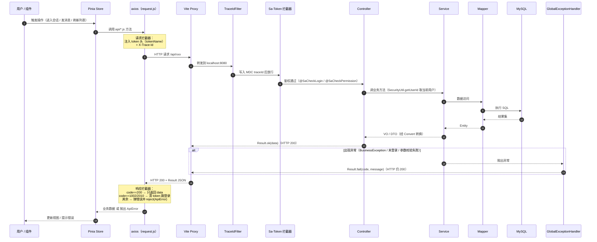
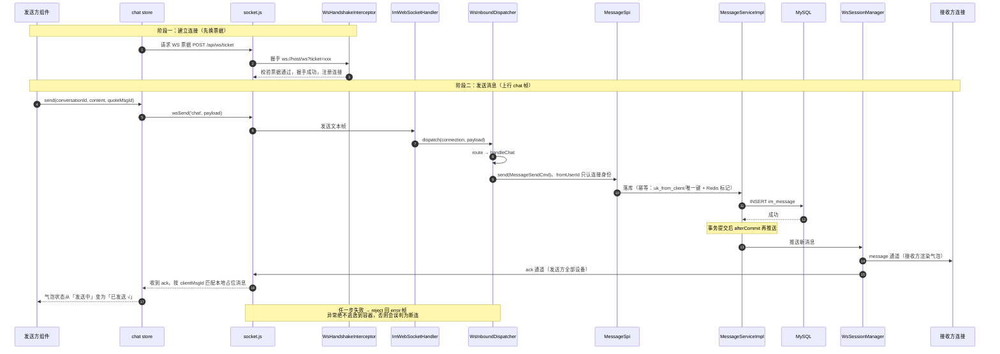

# IM 即时通讯系统

基于 **Spring Boot 4 + JDK 21** 的多模块即时通讯后端，配套 **Vue 3** 前端。
后端 11 个 Maven 模块最终打成**一个可执行 jar**（`im-bootstrap/target/im-server.jar`）；
被控端 Agent（`im-remote-agent`）是独立 fat jar，跑在被控机器上，不打进后端；
前端是独立工程，通过 Vite 代理与后端通信，不参与 Maven 构建。

功能覆盖：注册登录（图形/短信验证码）、JWT 鉴权与 RBAC 权限、好友申请与管理、
单聊/群聊会话、消息收发（幂等/撤回/已读回执/离线消息/历史分页）、群组权限与禁言、
文件上传（MinIO / 本地双实现，秒传 / 断点续传 / 大文件分片，单文件上限 2GB）、
WebSocket 实时推送（心跳/重连/多端踢下线）、
**远程桌面控制**（服务端中继 + AES-GCM 端到端加密 + 识别码跨账号，见「十二」）、
**AI 面试官**（本地知识库 BM25 RAG + SSE 流式，见「十三」）；
前端另可用 **Electron 打包为 Windows 桌面客户端**（安装包内置被控端 Agent 与裁剪 JRE）。

> 架构与请求链路的完整图集（三层架构、HTTP/WebSocket 链路、登录鉴权、文件上传下载）见 [`md/架构与请求链路图.md`](md/架构与请求链路图.md)。

---

## 一、技术栈与版本

版本全部锁定在根 `pom.xml` 的 `<properties>` 里，升级只需改一处。

| 类别 | 组件 | 版本 | 说明 |
|---|---|---|---|
| 运行时 | JDK | 21 | 实测路径 `D:\software\jdk\jdk21` |
| 框架 | Spring Boot | 4.0.8 | knife4j-next 基线 4.0.7、mybatis-plus 基线 4.0.1，取 4.0.8 兼容性最好 |
| 持久层 | MyBatis-Plus | 3.5.17 | 用 `mybatis-plus-spring-boot4-starter`；分页插件 3.5.9+ 已拆分，需显式引入 |
| 数据库 | MySQL | 8.x | 库名默认 `im_db` |
| 缓存 | Redis | 5+ | Sa-Token 会话、验证码、在线状态、消息序号 |
| 鉴权 | Sa-Token | 1.46.0 | `sa-token-spring-boot4-starter` + `sa-token-jwt` |
| 接口文档 | Knife4j | 5.6.0 | 官方停更于 4.5.0，Boot 4 用维护分支 `knife4j-next` |
| 对象存储 | MinIO | 8.6.0 | 可选，默认走本地磁盘 |
| HTTP 客户端 | OkHttp | 5.1.0 | **必须显式声明**，见下方「已知坑」 |
| JWT 工具 | Hutool | 5.8.47 | WS 连接票据、文件访问票据 |
| 密码加密 | spring-security-crypto | 7.0.7 | 只取加密算法，不引入整个 Spring Security |
| 加密算法 | BouncyCastle | 1.86 | Argon2id 依赖 |
| 前端 | Vue / Vite | 3.5.42 / 7.3.6 | |
| 前端 | Element Plus / Pinia / Vue Router | 2.14.5 / 3.0.4 / 4.6.4 | |

---

## 二、模块结构与依赖关系

```
im-parent (pom)
├── im-common        公共层：Result/异常/MP 配置/Sa-Token 拦截/Knife4j/日志 AOP/MDC
│                    /加密工具/JWT 工具/常量/过滤器/SPI 契约
├── im-user          用户中心：注册、登录、JWT 鉴权、资料、在线状态、角色权限
├── im-friend        好友关系：申请、同意/拒绝、列表、备注、分组、删除、拉黑
├── im-conversation  会话管理：会话列表、未读计数、置顶、免打扰、排序、单聊/群聊
├── im-message       消息核心：收发、状态流转、撤回、删除、离线消息、幂等、历史分页
├── im-group         群组管理：建群、改群、成员管理、群主/管理员权限、禁言、@提醒、解散
├── im-file          文件存储：图片/文件/语音上传、访问鉴权、元数据保存（MinIO + 本地双实现）
├── im-websocket     实时推送：连接管理、心跳、断线重连、消息路由分发、多端踢下线
├── im-ai            AI 面试官：知识库 BM25 检索（RAG）、DashScope SSE 客户端、面试会话与限流
├── im-remote        远程控制服务端：会话状态机、Agent/控制端双 WS 中继、审计与限流
├── im-bootstrap     启动模块：唯一的 main 类 + application.yml，repackage 成单 jar
├── im-remote-agent  被控端 Agent：独立 fat jar（纯 JDK 零依赖），不进上面那个单 jar，单独部署在被控机
└── im-ui            Vue 3 前端（独立工程，不在 Maven modules 里）
```

**依赖关系是星型而非网状**：

```
        im-user ─┐
       im-friend ┤
  im-conversation┤
      im-message ┼──► im-common ◄──┐   （SPI 契约 + 工具类）
        im-group ┤                 │
         im-file ┤                 │
    im-websocket ┤                 │
           im-ai ┤                 │
       im-remote ┘                 │
                                   │
              im-bootstrap ────────┴──► 依赖全部 11 个模块，负责装配启动
```

`im-remote-agent` 不在星型图里：它是跑在被控机器上的独立进程，与 `im-remote` 只通过
WS 协议通信，没有任何编译期依赖，所以能单独拷走运行。

业务模块之间**从不直接依赖**。跨模块调用一律走 `im-common` 里定义的 SPI 接口，
由目标模块提供实现，调用方用 `ObjectProvider` 注入（拿不到就降级，不报启动失败）：

| SPI 契约（im-common） | 实现方 | 用途 |
|---|---|---|
| `UserQuerySpi` | im-user | 按 ID 批量查用户、判断用户是否存在 |
| `UserProfileSpi` | im-user | 昵称/头像等展示信息，改资料时反向刷新会话快照 |
| `OnlineStatusSpi` | im-user | 在线状态的读写（Redis） |
| `PermissionProvider` | im-user | 供 `StpInterfaceImpl` 查角色与权限点 |
| `FriendRelationSpi` | im-friend | 是否好友、是否拉黑（会话创建的前置校验） |
| `ConversationSpi` | im-conversation | 建会话、刷未读数、更新最后一条消息 |
| `MessageSpi` | im-message | 系统消息落地（如「XX 撤回了一条消息」） |
| `GroupSpi` | im-group | 群成员查询、群内禁言校验 |
| `PushSpi` | im-websocket | 向指定用户/设备推送 WS 报文、踢下线 |
| `FileStorageSpi` | im-file | 文件元数据登记，供消息模块组装可访问 URL |

每个业务模块内部统一分层：
`controller` / `service`(+`impl`) / `mapper` / `entity` / `dto`(req+vo) / `convert` / `spi` / `config`。

---

## 三、环境准备

| 依赖 | 要求 | 检查命令 |
|---|---|---|
| JDK | 21 | `java -version` |
| Maven | 3.9+ | `mvn -v` |
| MySQL | 8.x，已建库或允许建库 | `mysql --version` |
| Redis | 5+，本地 6379 | `redis-cli ping` |
| Node.js | ≥ 20（实测 v24.16.0） | `node -v` |
| npm | ≥ 10（实测 11.13.0） | `npm -v` |
| MinIO | 可选，不装也能跑 | — |

---

## 四、环境变量

**数据库凭据只从环境变量读取，代码与配置文件里不含任何明文密码。**
所有变量都有默认值，本地开发只需设置 `MYSQL_USER` 和 `MYSQL_PASSWORD` 两个。

| 变量 | 默认值 | 说明 |
|---|---|---|
| `MYSQL_HOST` | `127.0.0.1` | |
| `MYSQL_PORT` | `3306` | |
| `MYSQL_DATABASE` | `im_db` | |
| `MYSQL_USER` | `root` | **建议显式设置** |
| `MYSQL_PASSWORD` | 空 | **必须设置**（除非本地 root 真的无密码） |
| `REDIS_HOST` | `127.0.0.1` | |
| `REDIS_PORT` | `6379` | |
| `REDIS_PASSWORD` | 空 | |
| `REDIS_DATABASE` | `0` | |
| `SERVER_PORT` | `8080` | |
| `SPRING_PROFILES_ACTIVE` | `dev` | `dev` 会在响应里回显验证码明文，**生产必须改成 `prod`** |
| `IM_JWT_SECRET` | 内置开发用长串 | Sa-Token 的 JWT 签名密钥，**生产必须替换** |
| `IM_TICKET_SECRET` | 内置开发用长串 | WS 连接票据 / 文件访问票据的签名密钥，**生产必须替换** |
| `IM_FILE_STORAGE` | `local` | `local` 或 `minio` |
| `IM_FILE_DIR` | `${user.home}/im-files` | 仅 `local` 模式生效 |
| `MINIO_ENDPOINT` | `http://127.0.0.1:9000` | 仅 `minio` 模式生效 |
| `MINIO_ACCESS_KEY` | `minioadmin` | |
| `MINIO_SECRET_KEY` | `minioadmin` | |
| `MINIO_BUCKET` | `im-files` | 启动时自动创建，无需手动建桶（桶名须≥3字符符合 S3 规范） |
| `LOG_PATH` | `logs` | 日志目录（相对启动路径） |
| `ALI_BABA_API_KEY` | 空 | AI 面试官的百炼（DashScope）API Key；未设置时仅面试功能不可用，其余功能照常 |
| `AI_MODEL_NAME` | `qwen-flash` | 百炼模型名（也可换 qwen-plus / qwen-max） |
| `IM_AI_KNOWLEDGE_DIR` | `D:/资料/知识库/面试官` | AI 面试知识库目录，递归扫 `.md`/`.txt`，内容增删改后自动重建索引 |

PowerShell 设置示例：

```powershell
$env:MYSQL_USER = 'root'
$env:MYSQL_PASSWORD = 'your-password'
$env:SPRING_PROFILES_ACTIVE = 'dev'
```

Bash 设置示例：

```bash
export MYSQL_USER=root
export MYSQL_PASSWORD=your-password
```

---

## 五、数据库初始化

两个脚本按顺序执行即可，都是幂等设计（`CREATE TABLE IF NOT EXISTS` / 固定主键 `INSERT`）。

```powershell
# 1. 建表（含索引、虚拟生成列、外键约束）
mysql -u $env:MYSQL_USER -p im_db < sql/im_schema.sql

# 2. 灌入演示数据（3 个用户、角色权限、一对好友、1 个会话、若干历史消息）
mysql -u $env:MYSQL_USER -p im_db < sql/im_data.sql
```

如果 `im_db` 库还不存在，先建：

```sql
CREATE DATABASE im_db DEFAULT CHARACTER SET utf8mb4 COLLATE utf8mb4_0900_ai_ci;
```

> 也可以直接 `source sql/im_schema.sql`，脚本头部已带 `CREATE DATABASE IF NOT EXISTS` 与 `USE`。

---

## 六、启动后端

```powershell
# 编译打包（跳过单元测试，本次交付不含测试用例）
mvn clean package -DskipTests

# 启动
java -jar im-bootstrap/target/im-server.jar
```

启动成功的标志是控制台打出这段横幅（由 `ImApplication#logStartupSummary` 打印，
端口、profile、存储实现都取自实际生效的配置，不靠猜）：

```
----------------------------------------------------------
  IM 即时通讯系统启动完成
  生效 Profile : dev
  接口文档     : http://localhost:8080/doc.html
  WebSocket    : ws://localhost:8080/ws
  文件存储     : local
----------------------------------------------------------
```

横幅之前还会有一条 `Sa-Token 启用 JWT 简单模式（StpLogicJwtForSimple），loginType=login`
——看到它说明鉴权用的是正确的 JWT 模式（详见「已知坑」第 2 条）。

| 地址 | 用途 |
|---|---|
| http://localhost:8080/doc.html | Knife4j 接口文档，按模块分成 9 个分组（01-09，含 AI 面试与远程控制） |
| http://localhost:8080/v3/api-docs | OpenAPI 3 原始 JSON |
| ws://localhost:8080/ws | WebSocket 端点（需先取票据） |
| http://localhost:8080/api/** | 全部 REST 接口 |

---

## 七、启动前端

前端是**完全独立的工程**，不参与 Maven 构建。

```powershell
cd im-ui
npm install
npm run dev
```

访问 **http://localhost:5173**。

Vite 会把 `/api` 与 `/ws` 代理到 `http://localhost:8080`，所以**必须先启动后端**。
`vite.config.js` 里设了 `strictPort: true`——5173 被占用时直接报错退出，
而不是悄悄换个端口，避免代理配置和浏览器书签对不上。

#### 手机真机访问（USB 共享网络 / 同一热点）

`vite.config.js` 里设了 `server.host: true`，dev server 监听所有网卡而不只是 localhost，
启动后控制台会多打一行 `Network: http://<电脑IP>:5173/`，**手机浏览器直接打开这个地址即可**。
电脑 IP 用 `ipconfig` 查（USB 共享网络时看「Remote NDIS Compatible Device」那块网卡）。

有两处配置是真机访问的前提，缺一不可：

1. **`server.host: true`**：Vite 默认只听 `localhost`，不改的话手机拿到 IP 也是「无法访问此网站」。
2. **`im.cors.allowed-origins` 里的 `http://*.*.*.*:5173`**：手机用 IP 打开页面后，Origin 变成
   `http://<电脑IP>:5173`。Vite 代理的 `changeOrigin` 只改 `Host` 头不改 `Origin` 头，而 Spring
   判定 CORS 请求只看有没有 `Origin` 头，所以照样会走白名单校验。不放行的表现很隐蔽——
   **页面能打开、GET 可能也正常，但登录这类 POST 全部 403 `Invalid CORS request`**，
   因为 Chrome 对同源 POST 也会带 `Origin` 头，而同源 GET 往往不带。

   写成 `*.*.*.*` 而不是 `*`：实测四段通配只匹配 IPv4 形式的 origin，
   `http://evil.example.com:5173` 这类域名仍被拒（403），端口也锁死在 5173/4173。
   **部署到公网前必须把这两条换成真实域名。**

WebSocket 不需要额外配置：`WebSocketConfig` 用的是 `setAllowedOriginPatterns("*")`，
而前端 `socket.js` 按 `window.location.host` 动态推导连接地址，手机访问时自动指向同一台机器。
Windows 防火墙方面，首次运行 `node.exe` 与 `java.exe` 时弹窗点了「允许访问」就已放行，
专用与公用两种网络配置文件都覆盖，热点网络无论被识别成哪种都能通。

> USB 共享网络下这个 IP 由手机分配，**重插 USB 或手机重启后可能变化**，届时以 Vite 控制台
> 打印的 `Network` 行为准。

#### 手机真机联调远程控制：需要 HTTPS

用手机浏览器以 `http://<电脑IP>:5173` 访问时，**远程控制会报「当前环境不支持 WebCrypto」**——
不是 bug，而是浏览器的**安全上下文**限制：`crypto.subtle`（远程控制做 AES-GCM 解密用）只在
localhost、https、Electron 下暴露，`http + 局域网IP` 拿不到它（普通聊天不碰 WebCrypto 所以照常）。
解法是给 dev server 上一张内网自签证书：

```powershell
cd im-ui
npm run gen:cert     # 纯 Node（node-forge）生成根 CA + 服务器证书到 im-ui/certs/，SAN 含本机全部 IP
npm run dev          # 证书存在即自动 https，Network 行变成 https://<电脑IP>:5173/
```

再把 `im-ui/certs/ca.pem` 传到手机装成受信任的 CA（Android：加密与凭据→安装 CA 证书；
iOS 装完描述文件后还需在「证书信任设置」里开启全信任），手机用 **`https://<电脑IP>:5173`** 打开即可。
WS 地址由前端按页面协议自动推导成 wss，`/api`、`/ws` 代理与后端都不用改。删掉 `certs/` 就回落 http，
不影响 Web 部署与 Electron 构建。根因、换网段重签、两系统装证书的分步操作与排错，
见 [`md/手机真机调试HTTPS配置指南.md`](md/手机真机调试HTTPS配置指南.md)。

生产构建：

```powershell
cd im-ui
npm run build      # 产物在 im-ui/dist
npm run preview    # 本地预览构建产物
```

前端详细说明见 [`im-ui/README.md`](im-ui/README.md)。

#### 打包为 Windows 桌面客户端（Electron）

前端可用 **Electron** 打包成独立的 Windows 桌面 exe（**只打前端**，后端仍远程部署、客户端连之）。
项目根 `electron/` 已配好主进程、preload 与 electron-builder；前端做了「浏览器 / Electron 两用」适配——
同一份代码，Web 部署走同源相对路径 + history 路由，桌面端自动切到后端绝对地址 + hash 路由 + 相对 `base`，
靠 `utils/env.js` 的 `isElectron()` 判断，互不影响。

```powershell
cd im-ui; npm run build:electron          # 相对 base './' + hash 路由
Copy-Item ".\dist\*" "..\electron\dist" -Recurse -Force
cd ..\electron; npm install; npm run build
# 产物：electron\release\IM通讯 Setup 1.0.0.exe（约 160MB，含内置裁剪 JRE 与被控端 Agent）
```

> ⚠️ 分发前先改 `electron/main.js` 的 `SERVER_BASE` 为实际后端地址。
> 安装包经 `extraResources` 内置 `im-remote-agent` 的 fat jar 与 jlink 裁剪 JRE，桌面端启动时
> 自动后台拉起被控端 Agent（双击 `resources\启动被控端.bat` 亦可），被控机**无需安装任何 Java**；
> 见 [`md/Electron打包指南.md`](md/Electron打包指南.md) 十二节。
> 完整的环境准备、打包流程图、踩坑（SSL 证书拦截、`file://` 白屏、大文件下载）与注意事项，
> 见 [`md/Electron打包指南.md`](md/Electron打包指南.md)。

---

## 八、演示账号

种子数据里 3 个账号，密码统一 **`123456`**（数据库存的是 Argon2id 哈希）。

| 账号 | 用户 ID | 昵称 | 角色 | 备注 |
|---|---|---|---|---|
| `admin` | 1000 | 系统管理员 | `admin` | 拥有全部权限点 |
| `alice` | 1001 | 爱丽丝 | `user` | 与 bob 互为好友，已有 1 个会话和若干历史消息 |
| `bob` | 1002 | Bob | `user` | alice 给他的备注是「Alice」，分组「同事」 |

登录页在 `dev` profile 下会**直接把图形验证码明文回显在表单下方**，不用眯着眼认图，短信验证码同理。
这两个开关（`im.captcha.expose-image-code` / `expose-sms-code`）**只在 `application-dev.yml` 里为 `true`**，
主配置 `application.yml` 与 `application-prod.yml` 一律 `false`——
这样即使哪天忘了切 profile，也不会把生产环境的验证码校验废掉。
前端不需要判环境：`debugCode` 字段为空时那段提示自然就不渲染。

> ⚠️ **同一个账号开两个浏览器标签页会互相顶下线。**
> 这是设计行为：`AuthServiceImpl#kickSameDevice` 按「用户 + 设备类型」顶号，
> 而两个标签页的 `deviceId` 都是 `web`，归一化后属于同一设备。
> 想同时挂 alice 和 bob，请用**两个不同的浏览器**或一个正常窗口 + 一个隐身窗口。
> 被顶下线的一方会收到 WS `kickout` 报文并看到明确的中文提示，不是莫名的「登录失效」。

---

## 九、接口一览

统一前缀 `/api`，统一返回体：

```json
{ "code": 200, "message": "操作成功", "data": {}, "success": true,
  "timestamp": 1789222068125, "traceId": "web-mtygmfe7-pxqigz4k" }
```

**所有失败也是 HTTP 200**，靠 `code` 区分（`GlobalExceptionHandler` 上没有 `@ResponseStatus`）。
鉴权失败 `code=1002`，权限不足 `code=403`，业务错误码见 `ResultCode` 枚举
（1xxx 通用 / 2xxx 用户 / 3xxx 好友 / 4xxx 会话 / 5xxx 消息 / 6xxx 群组 / 7xxx 文件 /
8xxx WS 票据 / 9xxx 远程控制）。

| 模块 | 前缀 | 放行 |
|---|---|---|
| 认证 | `/api/auth` | ✅ 免登录 |
| 验证码 | `/api/captcha` | ✅ 免登录 |
| 用户 | `/api/user` | |
| 好友 | `/api/friend`、`/api/friend/request` | |
| 会话 | `/api/conversation` | |
| 消息 | `/api/message` | |
| 群组 | `/api/group` | |
| 文件 | `/api/file` | 下载走一次性票据 |
| WS 票据 | `/api/ws` | |
| AI 面试 | `/api/ai` | 对话接口是 SSE 流，不走 Result JSON |
| 远程控制 | `/api/remote` | 凭识别码邀请也要求登录（控制方必须有自己的账号） |

token 通过请求头 `satoken: <JWT>` 传递（`is-read-header=true`，Cookie 与 body 读取都已关闭）。

### 请求链路：从前端发出到拿到响应

关键约定：**后端所有失败都返回 HTTP 200 + `Result` 体**，业务错误码放在 `code` 里，
所以前端的错误判定全在 axios 响应拦截器的「成功分支」，错误分支只处理网络问题。



> 更多链路图（三层架构、登录鉴权、文件上传下载）见 [`md/架构与请求链路图.md`](md/架构与请求链路图.md)。

---

## 十、WebSocket

连接流程是**两段式**的，因为浏览器原生 `WebSocket` 不能自定义请求头：

1. `POST /api/ws/ticket`（带 `satoken` 头）→ 拿到一个 60 秒有效的一次性 JWT 票据
2. `ws://localhost:8080/ws?ticket=<票据>&deviceId=web` → `WsHandshakeInterceptor` 验票后放行

票据 TTL 由 `im.jwt.ticket-ttl-seconds` 控制（默认 60 秒）。

远程控制的两条数据面端点 `/ws/remote/agent` 与 `/ws/remote/control` 与这个通用端点**相互独立**：
握手拦截器、票据体系、帧协议（文本信封 + 定长头二进制帧）都是另一套，见「十二、远程控制」。

报文类型定义在 `im-common` 的 `WsMessageType` 枚举里，客户端发与服务端推是两套：

| 方向 | 类型 | 含义 |
|---|---|---|
| 客户端 → 服务端 | `ping` | 心跳 |
| | `chat` | 发消息（也可走 HTTP `/api/message/send`） |
| | `delivered` / `read` | 上报送达 / 已读 |
| | `recall` | 撤回 |
| | `pull-offline` | 拉取离线消息 |
| 服务端 → 客户端 | `pong` | 心跳响应 |
| | `ack` | 对客户端报文的确认 |
| | `message` | 新消息推送 |
| | `delivered-notify` / `read-notify` | 把送达/已读状态推回发送方 |
| | `recall-notify` | 撤回通知 |
| | `notify` | 系统/业务通知（好友申请、入群等） |
| | `kickout` | 多端登录被顶下线 |
| | `online-state` | 好友在线状态变更 |
| | `unread` | 会话未读数变更 |
| | `error` | 错误响应 |

断线后前端按指数退避重连，重连时会重新取票据（旧票据 60 秒就过期了，不可能复用）。

### 消息链路：实时收发

连接建立走「先 HTTP 换票据、再握手」；发消息是上行 `chat` 帧，落库后由**写库的那一方**
在事务提交后推送：接收方走 `message` 通道、发送方走 `ack` 通道（推给发送者的全部设备，实现多端同步）。



---

## 十一、文件存储：local / MinIO 切换

默认 `IM_FILE_STORAGE=local`，文件落在 `${user.home}/im-files`，**不装 MinIO 也能完整跑通上传下载**。

切到 MinIO 只需两步：

```powershell
# 1. 启动 MinIO（Windows）
minio.exe server D:\minio\data --console-address ":9001"
# 控制台 http://127.0.0.1:9001，默认账号 minioadmin / minioadmin

# 2. 改一个环境变量后重启后端
$env:IM_FILE_STORAGE = 'minio'
$env:MINIO_ENDPOINT  = 'http://127.0.0.1:9000'
java -jar im-bootstrap/target/im-server.jar
```

**桶不需要手动创建**：`MinioFileStorage#ensureBucket` 在初始化时会检查 `MINIO_BUCKET`（默认 `im-files`），
不存在就自动建。这里刻意让「连不上 MinIO」直接导致启动失败——
既然显式选了 MinIO，继续启动只会把问题推迟到第一次上传，那时更难排查。

无论哪种实现，对外暴露的都是 `/api/file/download/{id}` 这种**受控地址**：
下载时校验登录态与访问权限，再签发一个 30 分钟有效的文件票据
（`im.jwt.file-ticket-ttl-seconds`），不存在裸的对象存储直链。

前端下载**不把整文件读成 blob**（大文件在手机上会超时 + 撑爆内存，表现为「点了没反应」），
而是先用 `/api/file/{id}/url` 换取带票据的直链，再交给 `<a download>` 让浏览器 / Electron
原生下载器流式接管——不占内存、不受 axios 超时限制，1GB 大文件也能正常下（见 `utils/media.js`）。

### 秒传与断点续传（分片上传）

大文件不再走单请求 `/api/file/upload`（受 `byte[]` 与 multipart 内存上限约束，默认 100MB），
而是走三段式分片通道，前端 `uploadFileSmart` 按 **5MB 阈值**自动选路，对上层透明：

| 端点 | 作用 |
|---|---|
| `POST /api/file/upload/init` | 上报整文件 MD5：命中**秒传**直接返回文件记录（零字节上传）；否则下发权威分片大小、会话 ID 与已收分片下标（**断点续传**） |
| `POST /api/file/upload/chunk` | 逐片上传，「临时文件 + 原子改名」落盘，重复投递同一分片幂等 |
| `POST /api/file/upload/merge` | 合并落库：服务端**重读全部分片、重算 MD5 与大小并与声明值核对**，对不上直接拒绝 |

- 会话状态落在临时目录 `im.file.upload.tmp-dir`（默认 `${user.home}/im-upload-tmp`），
  **不引入 Redis**：断点续传要的就是「进程重启后分片还在」，磁盘天然满足。
  `uploadId = userId + "-" + md5`，天然幂等；每个写操作都核对 meta 里的 `uploaderId`，别人拿到 ID 也无法操作。
- 走分片通道的整体上限由 `im.file.upload.max-size` 控制（默认 **2GB**），与普通上传的 `im.file.max-size`（100MB）刻意分开。
- 过期会话（默认 24 小时未更新）由 `ChunkUploadServiceImpl#cleanExpiredSessions` 定时回收。
- 合并出的可信内容仍交回 `FileService#storeMerged`，走与普通上传**完全相同**的类型白名单 / 大小 / 秒传校验，不存在「分片能绕过白名单」的口子。

> ⚠️ 秒传会采信客户端上报的 MD5（能报出某文件 MD5 的前提是本地真的持有它），
> 且要求 `size` 与已有记录一致才判定命中，以此收窄碰撞与谎报空间。
> 前端计算 MD5 依赖 `spark-md5`，首次拉取代码后需在 `im-ui` 下 `npm install`。

**前端体验**：`uploadFileSmart` 的进度条按阶段渲染——「计算文件中」（MD5，0~15%）、「上传中 N/M 片」
（分片并发上传，15~95%）、「合并中…」（96~100%），命中秒传时直接显示「秒传完成」。
前端选文件的总上限已对齐后端的 2GB（`ChatWindow.vue` 的 `MAX_UPLOAD_BYTES`）；类型白名单覆盖常见
文档 / 图片 / 音视频 / 压缩包与 Windows 安装包（exe/msi）。要传更大文件，需同时调大后端
`im.file.upload.max-size`、`max-chunks` 与前端这个常量。

---

## 十二、远程控制（远程桌面）

类 ToDesk 的分工：**服务端只中继、不解密**，画面与输入流在控制端与被控端之间端到端加密。三个部件：

| 部件 | 位置 | 职责 |
|---|---|---|
| 中继服务端 | `im-remote` | 会话状态机、两条 WS 端点、脏块转发、只读策略、审计与限流 |
| 被控端 Agent | `im-remote-agent` | 独立 fat jar（纯 JDK 零依赖）：截屏、输入注入、文件操作、授权弹窗 |
| 控制端 | `im-ui` 的 `Remote.vue` | 画面渲染（关键帧定尺寸 + 脏块按坐标贴图）、输入采集、工具面板 |

**连接链路**（控制方必须登录；被控方可免账号走识别码模式）：

1. Agent 长连 `/ws/remote/agent`：带账号 token 则绑定该账号的设备；不带 token 则进入**识别码模式**
   （userId=0，凭 6-12 位大写字母数字识别码跨账号路由），被控机无需注册账号；
2. 控制端发起邀请（`/api/remote/session/invite` 或凭识别码 `invite-by-code`，后者限流 5 次/分/用户）→
   Agent 弹确认框（可把 operate 降档为 readonly）→ 同意后会话 `inviting → active`；
3. 控制端轮询 `/api/remote/session/{id}` 拿一次性 ticket → 连 `/ws/remote/control` 发 `control-ready`
   消费票据 → 中继双向绑定，并经各自已鉴权通道下 `session-start` 帧下发会话 AES 密钥；
4. 画面走二进制帧 `[1B 类型][8B 会话ID][4B 元数据长度][元数据JSON][载荷]`，载荷为 AES-256-GCM 密文
   （12B IV + 密文 + 16B Tag，与 WebCrypto 互相兼容）；中继只解析信封头做路由与策略，**看不到画面内容**。

会话状态机 `inviting → active → ended / rejected`，库里的状态是唯一事实，WS 帧只是它的投影；
超时巡检收尾悬空的 inviting 会话。流量在内存绑定里计数，收尾时一次性落库。

**本机识别码面板**：Agent 在 `127.0.0.1:18923/local-info`（`local.infoPort` 可配）绑一个只读回环接口，
浏览器「远程」页探测到就展示绿色「本机识别码」面板——本机跑着 Agent 就能直接看到码，不用去 Agent 窗口抄。

**被控机零 Java**：桌面安装包经 `extraResources` 内置 `agent/im-remote-agent.jar` 与 jlink 裁剪 JRE（约 74MB），
桌面端启动时自动后台拉起 Agent（已在运行则跳过），或双击 `resources\启动被控端.bat`；详见
[`md/Electron打包指南.md`](md/Electron打包指南.md) 十二节与 [`md/远程控制Agent使用说明.md`](md/远程控制Agent使用说明.md)。

主要配置（`im.remote.*`）：`enabled` 总开关、`aes` 端到端加密开关、`invite-timeout-seconds` 授权超时、
`control-ticket-ttl-seconds` 票据 TTL、`max-frame-bytes` 单帧上限。

---

## 十三、AI 面试官（知识库 RAG）

基于本地知识库 RAG 的「后端 Java 全栈」模拟面试，前端是 `Interview.vue`「面试」页。

**模型接入**：阿里云百炼 DashScope（OpenAI 兼容协议），配置复用 `spring.ai.openai.*` 坐标
（im-ai 模块未引入 Spring AI 依赖，用自己的 `AiProperties` 读取，将来切真 Spring AI 时 yml 不用改）：

| 配置 | 环境变量 | 默认 | 说明 |
|---|---|---|---|
| `spring.ai.openai.api-key` | `ALI_BABA_API_KEY` | 空 | 未设置时面试接口返回明确的「API Key 未配置」，**不影响其余功能** |
| `spring.ai.openai.chat.options.model` | `AI_MODEL_NAME` | `qwen-flash` | 百炼模型名 |
| `im.ai.knowledge-dir` | `IM_AI_KNOWLEDGE_DIR` | `D:/资料/知识库/面试官` | 知识库目录，递归扫 `.md`/`.txt` |

**接口**：`POST /api/ai/interview/chat` 返回 **SSE 流**（事件 `delta`/`done`/`error`；模型逐 token 生成，
等全文再返回意味着候选人盯着空屏等十几秒），请求体携带完整对话历史（空数组 = 开始新面试）；
按用户限流 20 次/分钟——每次调用都是一次真实的大模型计费请求。进入流之前的失败仍走全局异常处理器的
HTTP 200 + Result JSON，前端按 Content-Type 区分两条路径。`GET /api/ai/interview/status` 返回知识库
目录、文件数、片段数，供前端状态条展示。

**RAG 的 R 用 BM25 关键词检索而非向量检索**，是几百文件规模下的刻意取舍：不依赖 embedding 模型
（少一个网络调用、少一份计费、少一种失败模式）、索引纯内存构建、文件变更后秒级重建（热更新不用重启）；
面试查询与文档用词高度重合，正是关键词检索最擅长的分布。实现要点（`KnowledgeBaseService`）：
中文不引分词器、按二元组切，英文/数字按连续词切；分块目标 500 字、超 900 硬切、Markdown 标题强制开新块；
每轮检索前对比目录签名（相对路径+大小+修改时间），变了才重建并受 30 秒限频；每轮注入 top-4 片段、
总计 ≤6000 字进提示词，历史消息防御性裁剪 30 条 / 单条 4000 字。知识库为空时面试照常进行，只是没有检索增强。

---

## 十四、已知坑（踩过的，别再踩）

**1. OkHttp 5.x 必须显式声明**
`minio:8.6.0` 依赖 `com.squareup.okhttp3:okhttp:5.1.0`，但 OkHttp 从 5.x 起改成了 Gradle 多平台产物，
Maven 仓库里那个 jar 只有几百字节、**不含任何 class**（POM 里还标着 `do_not_remove: published-with-gradle-metadata`），
真正的 JVM 实现被拆到了 `okhttp-jvm`。纯 Maven 构建必须在父 POM 里显式补上，
否则编译期报 `cannot access okhttp3.HttpUrl`，运行期直接 `NoClassDefFoundError`。

**2. Sa-Token JWT 不能用 Mixin 模式**
`StpLogicJwtForMixin` 把 `_logout` / `_logoutByTokenValue` / `replaced` / `searchTokenValue`
四个方法重写成了无条件 `throw new ApiDisabledException()`（默认文案 `this api is disabled`）。
而 `StpUtil.kickout(userId, device)`、`StpUtil.logout(userId)`、`StpUtil.logoutByTokenValue(token)`
最终都汇聚到这几个方法上。

用 Mixin 的症状非常隐蔽：**首次登录成功**（此时该设备的 token 列表为空，`kickSameDevice` 提前 return），
但只要 Redis 里留下了同设备的旧 token，**之后每一次登录都必然报错**。
本项目改用 `StpLogicJwtForSimple`——它只重写 token 的生成方式和 `getExtra`，
不禁用任何有状态 API，多端管理、顶号、注销、踢人全部正常，同时 token 依然是可离线验签的 JWT。

配套约束：`sa-token.is-share` 必须为 `false`（Simple 模式的 `isSupportShareToken()` 返回 false），
`sa-token.is-concurrent` 保持 `true`（同设备顶号由 `AuthServiceImpl#kickSameDevice` 自己实现，
这样能先推 `kickout` 报文让客户端拿到明确原因，再注销服务端会话）。

**3. 依赖树里会同时出现 Jackson 2 和 Jackson 3，这是正常的，不要排除**
Spring Boot 4 的 HTTP 消息转换器用的是 Jackson 3（`tools.jackson.core:jackson-databind:3.1.5`），
但 `mvn dependency:tree` 里依然能看到 Jackson 2（`com.fasterxml.jackson.core:jackson-databind:2.21.5`），
它只从两条第三方链进来，两条都不可缺：

```
im-common ─► knife4j-openapi3-boot4-spring-boot-starter:5.6.0
              └─► io.swagger.core.v3:swagger-core-jakarta:2.2.47 ─► Jackson 2
im-file    ─► io.minio:minio:8.6.0 ──────────────────────────── ─► Jackson 2
```

`swagger-core` 是构建 OpenAPI 文档模型的库，目前没有 Jackson 3 版本；MinIO 客户端内部也用 Jackson 2
做 XML/JSON 编解码。两者与 Jackson 3 的**包名完全不同**（`com.fasterxml.jackson` vs `tools.jackson`），
在同一个 classpath 上共存不会有任何类冲突；加 `<exclusion>` 反而会把 knife4j 和文件上传直接弄坏。

需要注意的是**注解包的归属**：Jackson 3 刻意把 `jackson-annotations` 留在 2.x 命名空间
（`tools.jackson.core:jackson-databind:3.1.5` 自己就依赖 `com.fasterxml.jackson.core:jackson-annotations:2.21`）。
所以本项目里 `@JsonValue` / `@JsonInclude` / `@JsonIgnore` 一律从
`com.fasterxml.jackson.annotation` 导入是**正确写法**，而 `ObjectMapper`、自定义序列化器、
`TypeReference` 这些则必须从 `tools.jackson.*` 导入。判断标准很简单：
**注解用 `com.fasterxml`，运行时类用 `tools.jackson`；整个项目里不应该出现 `com.fasterxml.jackson.databind`。**

**4. Knife4j 官方已停更**
最后一个官方版是 4.5.0，不支持 Spring Boot 4。Boot 4 要用维护分支
`com.baizhukui:knife4j-openapi3-boot4-spring-boot-starter:5.6.0`（groupId 不是 `com.github.xiaoymin`）。

---

## 十五、目录结构

```
spring-boot-duomokuia/
├── pom.xml                  父 POM：版本统一管理、12 个 module、编译插件配置
├── README.md                本文件
├── sql/
│   ├── im_schema.sql        建库建表 DDL（索引、虚拟生成列、约束）
│   └── im_data.sql          演示数据（用户/角色/权限/好友/会话/消息）
├── md/                      专项文档（架构与请求链路图、Electron 打包指南、远程控制 Agent 使用说明、手机真机调试 HTTPS 配置、MinIO 部署指南等）
├── im-common/               公共层 + SPI 契约
├── im-user/                 用户中心
├── im-friend/               好友关系
├── im-conversation/         会话管理
├── im-message/              消息核心
├── im-group/                群组管理
├── im-file/                 文件存储（MinIO + 本地）
├── im-websocket/            实时推送
├── im-ai/                   AI 面试官（BM25 知识库检索 + DashScope SSE 客户端）
├── im-remote/               远程控制服务端（会话状态机 + 双 WS 中继）
├── im-bootstrap/            启动模块
│   ├── src/main/java/.../ImApplication.java     唯一的 main 类 + 启动横幅
│   ├── src/main/resources/application.yml       主配置（16 KB，逐项带注释）
│   ├── src/main/resources/application-dev.yml   开发环境：回显验证码、打开 SQL 日志
│   ├── src/main/resources/application-prod.yml  生产环境：关闭全部回显与 DEBUG 日志
│   ├── src/main/resources/logback-spring.xml    控制台 + 按天滚动文件（pattern 含 traceId/userId）
│   └── target/im-server.jar                     打包产物（单 jar）
├── im-remote-agent/         被控端 Agent（独立 fat jar，纯 JDK 零依赖，Swing UI + 回环识别码接口）
├── im-ui/                   Vue 3 前端（独立工程，浏览器 / Electron 两用）
│   ├── README.md            前端专项说明
│   ├── vite.config.js       含 /api 与 /ws 代理；--mode electron 时 base 切 './'；检测到 certs 则自动 https
│   ├── scripts/gen-cert.cjs 内网自签证书生成（node-forge，纯 Node 免 OpenSSL，手机真机联调远程控制用）
│   ├── certs/               自签 HTTPS 证书产物（ca/server 的 pem+key，已 gitignore，含私钥）
│   └── src/
│       ├── api/             9 个接口模块
│       ├── components/      9 个可复用组件
│       ├── layout/          主框架（左侧导航 + 路由出口）
│       ├── stores/          7 个 Pinia store
│       ├── router/          路由与登录守卫（Electron 用 hash 模式）
│       ├── styles/          全局样式与 CSS 变量
│       ├── utils/           格式化、ID 归一化、媒体地址/下载、标题、token、env（环境适配）
│       ├── views/           10 个页面（含远程控制 Remote 与面试 Interview）
│       └── ws/              WebSocket 客户端（连接管理 + 报文分发）
└── electron/                Electron 桌面端（前端壳 + electron-builder，连远程后端）
    ├── main.js              主进程：窗口 / 下载处理 / 跨域 / 注入后端地址 / Agent 自启
    ├── preload.js           contextBridge 注入 window.__IM_SERVER__
    ├── package.json         electron-builder 配置（electronDist 指向本地 electron；extraResources 内置 agent/jre/bat）
    ├── launch/              启动被控端.bat（双击用内置 JRE 拉起 Agent）
    ├── jre/                 jlink 裁剪 JRE（随安装包分发，被控机免装 Java）
    ├── dist/                从 im-ui/dist 复制来的前端产物
    └── release/             打包产物（IM通讯 Setup 1.0.0.exe）
```

---

## 十六、验证清单

按顺序执行，每步都有明确的通过标志：

1. **构建** — `mvn clean package -DskipTests` → `BUILD SUCCESS`，12 个模块全部通过，
   生成 `im-bootstrap/target/im-server.jar` 与 `im-remote-agent/target/*-jar-with-dependencies.jar`
2. **依赖抽查** — `mvn dependency:tree` → 确认 30 个 `org.springframework.boot:*` 构件全部是 4.0.8、
   Spring Framework 一致为 7.0.9，无 Boot 3 残留；Jackson 2 只允许从 knife4j 与 minio 两条链进来
   （见「已知坑」第 3 条）
3. **建库** — 执行 `sql/im_schema.sql` 与 `sql/im_data.sql`，无报错
4. **启动** — `java -jar im-bootstrap/target/im-server.jar` → 8080 端口起来了，
   控制台打出上述横幅，`logs/im-server.log` 里没有 `ERROR`
5. **文档** — 浏览器打开 http://localhost:8080/doc.html，左侧 9 个分组齐全
   （也可以直接请 `GET /v3/api-docs/swagger-config`，返回的 `urls` 数组应当是 9 项）
6. **接口串测** — 注册 → 登录取 token → `/api/user/profile` → 搜索用户 →
   发起好友申请 → 对方登录同意 → `/api/conversation/single` → `/api/message/send` 双向收发 →
   `/api/message/history` 分页 → 撤回 → `/api/conversation/list` 看未读数 →
   `/api/file/upload` + `/api/file/download/{id}` → 建群/加人/禁言/解散 →
   用无权限账号访问管理接口，确认返回权限错误码
7. **WebSocket** — 取 ticket → 连接 → ping/pong → 双端实时收发 →
   断网重连 → 同设备二次登录触发 `kickout`
8. **前端** — `cd im-ui; npm install; npm run dev` → 用 alice / bob
   开两个不同浏览器，验证 10 个页面的交互闭环
9. **远程控制** — `java -jar im-remote-agent/target/im-remote-agent-jar-with-dependencies.jar` 起 Agent →
   网页「远程」页出现绿色「本机识别码」面板 → 另一个登录账号凭识别码发起连接 →
   Agent 弹窗点同意 → 控制端看到画面；降档为仅观看后输入操作被拒
10. **AI 面试** — 设置 `ALI_BABA_API_KEY` 后打开「面试」页开始新面试 → SSE 逐 token 流式输出；
    不设 Key 时返回明确的「API Key 未配置」，其余功能不受影响

已实测通过的项：1、2、3、4、5（9 个分组已核实）、6/7 中的
「登录 → WS 握手 → 双向收发 → 未读数 → 已读回执 → 顶下线」主链路，
以及 9 的远程控制主链路（Agent 识别码注册 → 凭码跨账号邀请 → 弹窗同意 →
票据消费 → 中继绑定 → 出画面，含桌面端自启 Agent 与内置 JRE）。
第 10 项需自备 `ALI_BABA_API_KEY` 实测。

> 群聊后端功能完整实现，前端聊天页以单聊交互为主，**群聊 UI 不在交付范围内**。
> 单元测试不纳入本次交付，验证以真实启动 + 接口/WebSocket 串测为准。
>
> **桌面端（可选）**：`cd im-ui; npm run build:electron` → 复制 dist 到 `electron/` →
> `npm install; npm run build` 生成 `release\IM通讯 Setup 1.0.0.exe`；双击 `win-unpacked\IM通讯.exe`
> 应能登录、收发、上传、下载大文件（前提：`main.js` 的 `SERVER_BASE` 指向的后端已启动）；
> 启动后还会自动后台拉起内置的被控端 Agent（回环接口 `127.0.0.1:18923/local-info` 可验证）。
