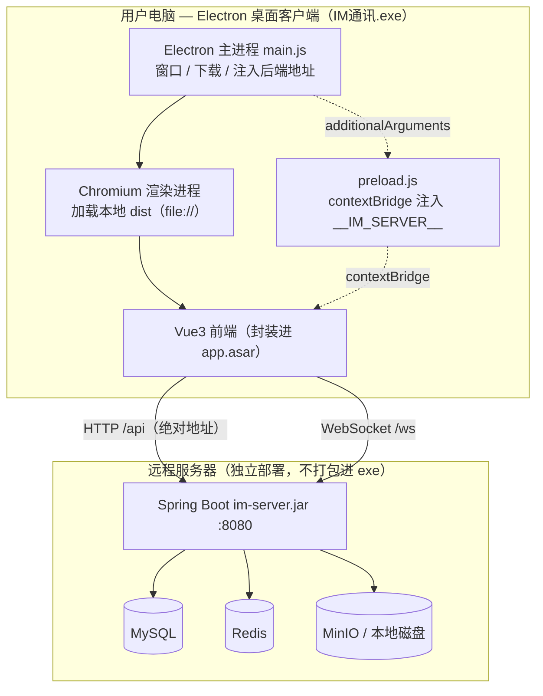
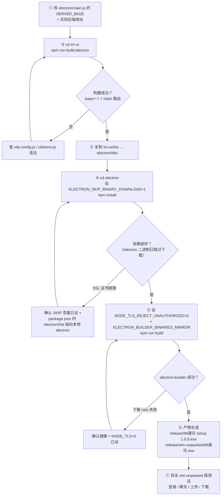
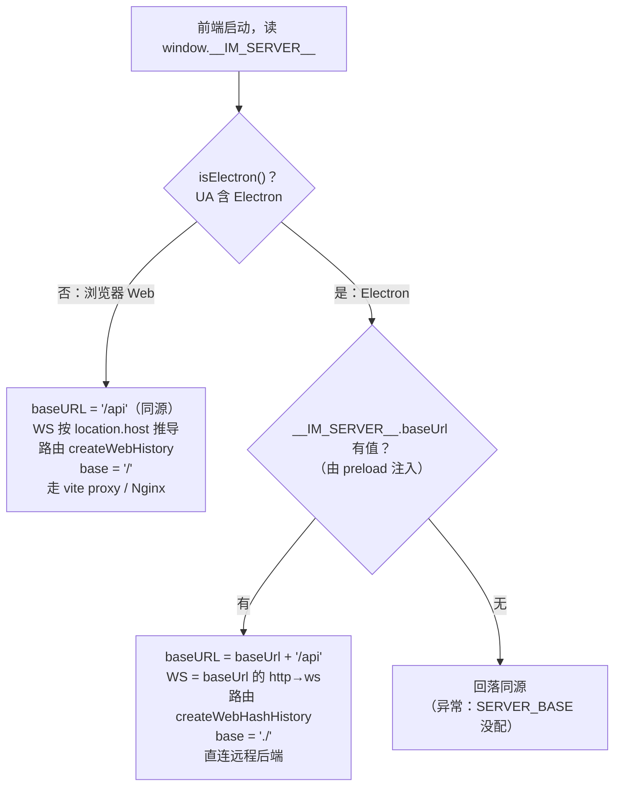

# IM 桌面端 — Electron 打包指南（实操版）

> **事实来源**：`electron/main.js`、`electron/preload.js`、`electron/package.json`；
> `im-ui/src/utils/env.js`、`router/index.js`、`api/request.js`、`ws/socket.js`、`vite.config.js`。
> **图形语法**：Mermaid（GitHub、VS Code Mermaid 插件、Typora 均可直接渲染）。
> 本文基于本项目在 **Windows 上实际打包成功**的完整流程整理，含踩过的坑与解决办法，可照抄复现。

---

## 目录

- [一、方案概览：前端壳 + 远程后端](#一方案概览前端壳--远程后端)
- [二、打包全流程图](#二打包全流程图)
- [三、环境准备](#三环境准备)
- [四、目录与文件结构](#四目录与文件结构)
- [五、前端「浏览器 / Electron 两用」适配](#五前端浏览器--electron-两用适配)
- [六、Electron 主进程做的三件关键事](#六electron-主进程做的三件关键事)
- [七、打包步骤（完整命令）](#七打包步骤完整命令)
- [八、踩坑与解决](#八踩坑与解决)
- [九、注意事项](#九注意事项)
- [十、产物与验证](#十产物与验证)
- [十一、重新打包速查](#十一重新打包速查)

---

## 一、方案概览：前端壳 + 远程后端

Electron 只把 **Vue 前端**（`im-ui` 构建出的 `dist`）打进一个原生窗口壳里，用自带的
Chromium 渲染；**后端 Spring Boot 与 MySQL / Redis / MinIO 不进 exe**，仍独立部署在服务器上。
桌面客户端通过网络连远程后端——这和微信 PC 版连腾讯服务器是同一个道理。



> **为什么不把后端也打进去？** 后端要 JVM + 三个中间件，塞进单个 exe 既臃肿又不现实。
> 真要「单机版」，得让 exe 启动时拉起后端 sidecar 子进程，且用户机器仍要装 MySQL/Redis/MinIO，
> 得不偿失。**桌面端 = 前端壳，后端远程部署**是最合理的架构。

---

## 二、打包全流程图



---

## 三、环境准备

| 需要 | 说明 | 本项目取值 |
|---|---|---|
| **Node.js + npm** | 构建前端、跑 electron-builder | 已装（v24） |
| **Electron 二进制** | 桌面运行时，可**本地准备**免下载 | `D:\software\electron-37.10.3\electron-v37.10.3-win32-x64` |
| **electron-builder** | 打包成 exe 的核心，`npm i -D` 装 | `^25.1.8` |
| NSIS / winCodeSign | electron-builder **首次打包自动下载** | 走镜像（见第七节） |

> ❌ **不需要**：GCC / MinGW、Rust、Visual Studio。
> Electron 打包是纯资源打包，**不编译任何原生代码**。网上教程让你装 C++ 工具链的，那是 Tauri（Rust）的要求，与本方案无关。

**关于本地 Electron 二进制**：`electronDist` 已指向 `D:\software\electron-37.10.3\...`，
electron-builder 打包时直接复制它，**不联网下载 electron**（既快又避开了 SSL 拦截）。
换电脑打包时，把这个目录改成你本地的 electron 路径即可。

---

## 四、目录与文件结构

```
spring-boot-duomokuia/
├── electron/                          # ★ 桌面端项目（本次新增）
│   ├── main.js                        # 主进程：窗口 + 下载处理 + 跨域 + 注入后端地址
│   ├── preload.js                     # 预加载：contextBridge 暴露 __IM_SERVER__
│   ├── package.json                   # electron-builder 配置（含 electronDist）
│   ├── dist/                          # 从 im-ui/dist 复制来的前端产物
│   └── release/                       # ★ 打包产物输出目录
│       ├── IM通讯 Setup 1.0.0.exe      #   NSIS 安装包（分发用）
│       └── win-unpacked/IM通讯.exe     #   免安装版（可直接双击测试）
│
└── im-ui/
    ├── src/
    │   ├── utils/env.js               # ★ 新增：环境与后端地址解析（两用核心）
    │   ├── router/index.js            # 改：Electron 用 hash 路由
    │   ├── api/request.js             # 改：baseURL 用 apiBaseURL()
    │   └── ws/socket.js               # 改：ws 地址用 wsBaseURL()
    └── vite.config.js                 # 改：base 按 mode 区分（electron → './'）
```

---

## 五、前端「浏览器 / Electron 两用」适配

**核心目标**：同一份前端代码，既能在浏览器里跑（现有 Web 部署，走同源），又能打进 Electron
（走远程绝对地址）——**两套互不影响，Web 部署零改动**。

判断依据是 `utils/env.js` 的 `isElectron()`（Electron 的 UA 固定含 `Electron` 字样）：



| 维度 | 浏览器 Web 部署 | Electron 桌面端 |
|---|---|---|
| 页面来源 | `http://域名`（同源） | `file://`（本地 dist） |
| 构建命令 | `npm run build` | `npm run build:electron`（`--mode electron`） |
| vite `base` | `/` | `./`（相对路径，否则 file:// 下资源 404 白屏） |
| 路由模式 | `createWebHistory` | `createWebHashHistory`（file:// 无 URL 重写） |
| API 地址 | `/api`（同源相对） | `SERVER_BASE + /api`（远程绝对） |
| WebSocket | 按 `location.host` | `SERVER_BASE` 的 `http→ws` |
| 地址来源 | 无需配置 | 主进程 `SERVER_BASE` → preload 注入 |

**后端地址是怎么进到前端的**（关键链路）：

```
main.js: const SERVER_BASE = 'http://localhost:8080'
   │  webPreferences.additionalArguments: ['--server-base=' + SERVER_BASE]
   ▼
preload.js: 从 process.argv 取出 → contextBridge.exposeInMainWorld('__IM_SERVER__', { baseUrl })
   ▼
utils/env.js: serverBase() 读 window.__IM_SERVER__.baseUrl → apiBaseURL() / wsBaseURL()
   ▼
request.js / socket.js: 用绝对地址请求远程后端
```

> Web 部署没有 preload，`window.__IM_SERVER__` 不存在，`serverBase()` 返回空串，
> 所有判断自动回落到同源逻辑——**这就是「两用」能成立的原因**。

---

## 六、Electron 主进程做的三件关键事

`electron/main.js` 里有三处不能省的处理，直接关系到能不能正常用：

**① 注入后端地址**（`additionalArguments`）——见上一节链路。

**② 绕过跨域**（`webSecurity: false`）：

```js
webPreferences: {
  preload: path.join(__dirname, 'preload.js'),
  contextIsolation: true,
  nodeIntegration: false,
  // file:// 页面跨源访问远程后端（含带自定义头 satoken/X-Trace-Id 的预检请求），
  // 关掉同源策略免去后端 CORS 配置与预检失败。若后端已正确配 CORS，可改回 true。
  webSecurity: false,
  additionalArguments: [`--server-base=${SERVER_BASE}`]
}
```

**③ 处理文件下载**（`will-download`）——**否则点下载没反应**（和手机端大文件下载 bug 同源）：

```js
// Electron 渲染进程不会像浏览器那样自动接管 <a download> / 直链下载
session.defaultSession.on('will-download', (event, item) => {
  const savePath = dialog.showSaveDialogSync({
    title: '保存文件',
    defaultPath: item.getFilename() || 'download'
  })
  if (!savePath) { item.cancel(); return }
  item.setSavePath(savePath)   // 交给 Chromium 下载器流式写盘，1GB 大文件也不占内存
})
```

---

## 七、打包步骤（完整命令）

**PowerShell**（注意本机 PowerShell 不支持 `&&`，用 `;` 分隔）：

```powershell
# ① 构建前端（Electron 模式：base './' + hash 路由）
cd d:\daima\Lianshi\spring-boot-duomokuia\im-ui
npm run build:electron

# ② 复制前端产物到 electron 项目
New-Item -ItemType Directory -Path "..\electron\dist" -Force | Out-Null
Copy-Item ".\dist\*" "..\electron\dist" -Recurse -Force

# ③ 安装依赖（跳过 electron 二进制下载，用本地 electronDist）
cd ..\electron
$env:ELECTRON_SKIP_BINARY_DOWNLOAD=1
npm install

# ④ 打包（放行被拦截的 HTTPS + 用国内镜像下 nsis/winCodeSign）
$env:NODE_TLS_REJECT_UNAUTHORIZED=0
$env:ELECTRON_BUILDER_BINARIES_MIRROR="https://npmmirror.com/mirrors/electron-builder-binaries/"
npm run build
```

**环境变量作用**：

| 变量 | 作用 | 何时需要 |
|---|---|---|
| `ELECTRON_SKIP_BINARY_DOWNLOAD=1` | 让 `npm install` **跳过 electron 二进制下载**（改用 `electronDist` 本地目录） | 装依赖时（网络有 SSL 拦截必设） |
| `NODE_TLS_REJECT_UNAUTHORIZED=0` | 关闭 Node 的 TLS 证书校验，放行被中间人代理拦截的 HTTPS | 打包时下载 nsis/winCodeSign |
| `ELECTRON_BUILDER_BINARIES_MIRROR` | electron-builder 工具的国内镜像，下载更快 | 打包时 |

> ⚠️ **`ELECTRON_OVERRIDE_DIST_PATH` ≠ `ELECTRON_SKIP_BINARY_DOWNLOAD`**：
> 前者只影响**运行时**定位 electron，**不阻止** `install.js` 下载；要跳过下载必须用后者。
> 另外，cmd 里用 `set` 设的变量是**会话级**，PowerShell 不继承——所以每个 shell 都要重新 `$env:xxx=` 设置。

---

## 八、踩坑与解决

| 现象 | 根因 | 解决 |
|---|---|---|
| `unable to verify the first certificate` | 网络有 HTTPS 中间人拦截（代理/杀软自签证书），下载 electron/nsis 失败 | `NODE_TLS_REJECT_UNAUTHORIZED=0` + `ELECTRON_BUILDER_BINARIES_MIRROR` 镜像 |
| electron 二进制反复下载失败 | 用了 `ELECTRON_OVERRIDE_DIST_PATH` 想跳过下载（无效） | 改用 `ELECTRON_SKIP_BINARY_DOWNLOAD=1` + `electronDist` 指向本地 electron |
| 打包后窗口**白屏** | `file://` 下资源用了绝对路径 `/assets`（base 默认 `/`） | `--mode electron` 让 `base='./'`；产物 `index.html` 引用应为 `./assets/...` |
| 刷新/深链**页面丢失** | Electron 是 `file://`，无服务器做 history 路由的 URL 重写 | Electron 环境用 `createWebHashHistory` |
| 点下载**没反应** | Electron 渲染进程不自动接管下载 | 主进程监听 `will-download` + `setSavePath`（见第六节③） |
| 请求后端**跨域被拦** | `file://` 页面访问 `http://后端` 非同源 | `webSecurity: false`（或后端配 CORS） |
| PowerShell 读不到刚设的环境变量 | cmd 的 `set` 是会话级，不跨 shell | 每个 shell 用 `$env:xxx=` 重设，或 `setx` 设系统级 |
| `mvn clean` 报「另一个程序正在使用此文件」删不掉 target | 删不掉的是 target **根目录**：被 IDE 文件监视/资源管理器/杀软的目录 watch 句柄占用（子文件都能删、唯独根目录删不掉） | 用 `Remove-Item <模块>\target\* -Recurse -Force` 清**内容**留根目录（效果等同 clean，还能防旧 class 残留），或直接关掉占用方再 clean |

---

## 九、注意事项

### ⚠️ 分发前必做：改后端地址

`electron/main.js` 顶部的 `SERVER_BASE` 默认是 `http://localhost:8080`（本机联调用）。
**分发给别人前，必须改成实际后端地址**（如 `http://192.168.1.10:8080` 或 `https://im.example.com`），
然后**重新打包**（第七节 ①②④，`npm install` 可跳过）。否则客户端连不上后端。

### 后端侧唯一注意点：WebSocket 的 Origin

HTTP 已用 `webSecurity: false` 绕过 CORS，后端不用改。
但 **WebSocket 握手若校验 `Origin`**，需放行 `file://`（Electron 页面的 Origin 是 `file://`）。
若聊天连不上、但登录（HTTP）正常，八成是这里。

### 应用图标

当前用**默认 Electron 图标**（打包日志会提示 `default Electron icon is used`）。
换自己的图标：放一个 `electron/build/icon.ico`（256×256），再重新打包即可
（`package.json` 的 `directories.buildResources` 已指向 `build`）。

### 代码签名与 SmartScreen

未签名的 exe，用户首次运行会看到 **Windows SmartScreen 蓝色警告**
（点「更多信息 → 仍要运行」即可）。正式发布可购买代码签名证书消除警告。

### app.asar 打包后不可直接改

前端资源封进了 `win-unpacked/resources/app.asar`，**改前端要重新构建 + 重新打包**，
不能像改 `dist/app-config.js` 那样热改。要「运行时可配后端地址」，需把配置外部化
（extraResources + 读外部 json），本项目当前用编译期 `SERVER_BASE`，够用且简单。

### 体积预期

NSIS 安装包约 **90 MB**、免安装版约 **195 MB**（Electron 自带 Chromium）。
这是 Electron 的固有代价（Tauri 可小到 5~10 MB，但要 Rust 工具链）。

---

## 十、产物与验证

**产物位置**：`electron/release/`

| 文件 | 体积 | 用途 |
|---|---|---|
| `IM通讯 Setup 1.0.0.exe` | ~90 MB | NSIS 安装包，分发用户安装 |
| `win-unpacked/IM通讯.exe` | ~195 MB | 免安装绿色版，**可直接双击测试** |
| `win-unpacked/resources/app.asar` | ~1.7 MB | 封装的前端 dist + main.js + preload.js |
| `*.blockmap` | ~0.1 MB | 增量更新用（可忽略） |

**验证步骤**：

1. 确认后端已在 `SERVER_BASE` 指向的地址启动；
2. 双击 `electron\release\win-unpacked\IM通讯.exe`（免安装版最快）；
3. 依次测：登录 → 收发消息 → 图片显示 → 上传文件 → **下载大文件**（验证 `will-download`）；
4. F12 打不开是正常的（生产包默认禁用 DevTools），要看日志用免安装版 + 命令行启动。

---

## 十一、重新打包速查

**只改了前端代码**（没动 electron 配置）：

```powershell
cd d:\daima\Lianshi\spring-boot-duomokuia\im-ui; npm run build:electron
Copy-Item ".\dist\*" "..\electron\dist" -Recurse -Force
cd ..\electron
$env:NODE_TLS_REJECT_UNAUTHORIZED=0
$env:ELECTRON_BUILDER_BINARIES_MIRROR="https://npmmirror.com/mirrors/electron-builder-binaries/"
npm run build
```

**改了 `SERVER_BASE`**：同上（`SERVER_BASE` 在 main.js，`npm run build` 会重新封装）。

**换了电脑 / 清了 node_modules**：补一步装依赖（带跳过下载）：

```powershell
cd d:\daima\Lianshi\spring-boot-duomokuia\electron
$env:ELECTRON_SKIP_BINARY_DOWNLOAD=1; npm install
# 再执行上面的「只改了前端代码」流程
```

> 记得把 `electron/package.json` 里的 `electronDist` 改成新电脑上本地 electron 的路径。

---

## 十二、安装包内置被控端 Agent + 免装 JRE（全量一键包）

安装包除控制端外还携带三样东西（`electron/package.json` 的 `extraResources`），
装完即是「控制端 + 被控端」二合一，被控机**无需安装任何 Java**：

| 安装包内位置（`<安装目录>\resources\`） | 来源 | 用途 |
|---|---|---|
| `agent\im-remote-agent.jar` | `im-remote-agent/target/*-jar-with-dependencies.jar` | 被控端程序 |
| `jre\` | jlink 裁剪的 JRE 21（约 74MB，仅含 Agent 所需模块） | 免装 Java 运行被控端 |
| `启动被控端.bat` | `electron/launch/启动被控端.bat` | 双击即用内置 JRE 拉起被控端，配置落在 `%USERPROFILE%\im-remote-agent` |

桌面端启动时会**自动后台拉起 Agent**（main.js 的 `setupAgentAutostart`）：先探测回环接口
`127.0.0.1:18923/local-info`，无响应才用内置 JRE 起 jar（工作目录同 bat），已在运行则跳过；
Agent 生命周期独立于 IM 窗口，关窗口不杀它，被控机才能保持可远程。bat 留给不想开 IM 主程序
只跑被控端的场景。

jlink 模块集与 Agent 依赖一一对应：`java.desktop`（Swing/Robot 截屏）、
`java.net.http`（WS 长连接）、`jdk.httpserver`（本机识别码回环接口）、
`jdk.charsets`（cmd 输出 GBK 解码）、`java.base`（含 javax.crypto）、
`jdk.crypto.ec`（https/wss 的 ECDHE 套件）、`jdk.crypto.mscapi`（Windows 系统证书库，
宿主机设了 `JAVA_TOOL_OPTIONS=-Djavax.net.ssl.trustStoreType=WINDOWS-ROOT` 时缺它会
让 Agent 起身即死：SSLContext 初始化抛 NoSuchAlgorithmException，表现是一直不在线）。

**全量一键打包命令**（PowerShell，`;` 分隔）：

```powershell
cd d:\daima\Lianshi\spring-boot-duomokuia
# ① 被控端 fat jar：清 target 内容而非 mvn clean（根目录常被 IDE 文件监视的目录句柄占用删不掉；
#    清内容既绕开锁，又避免增量编译留下已删源文件的旧 .class 被装进 jar）
Remove-Item im-remote-agent\target\* -Recurse -Force -ErrorAction SilentlyContinue
mvn -q -pl im-remote-agent -am package -DskipTests
# ② jlink 裁剪 JRE（输出目录必须不存在，先删）
Remove-Item electron\jre -Recurse -Force -ErrorAction SilentlyContinue
& "D:\software\jdk\jdk21\bin\jlink.exe" --add-modules java.base,java.desktop,java.net.http,jdk.charsets,jdk.httpserver,jdk.crypto.ec,jdk.crypto.mscapi --strip-debug --no-man-pages --no-header-files --output electron\jre
# ③ 前端 Electron 模式构建；拷入前先清空 electron/dist（Copy-Item 只覆盖不删除，
#    不清会堆积历代哈希 chunk 并被打进 asar）
cd im-ui; npm run build:electron
Remove-Item "..\electron\dist" -Recurse -Force -ErrorAction SilentlyContinue
New-Item -ItemType Directory -Force "..\electron\dist" | Out-Null
Copy-Item ".\dist\*" "..\electron\dist" -Recurse -Force
# ④ 打安装包
cd ..\electron
$env:ELECTRON_SKIP_BINARY_DOWNLOAD=1; $env:NODE_TLS_REJECT_UNAUTHORIZED=0; $env:ELECTRON_BUILDER_BINARIES_MIRROR="https://npmmirror.com/mirrors/electron-builder-binaries/"
npm run build
```

验证：`release\win-unpacked\resources\` 下应同时有 `app.asar`、`agent\im-remote-agent.jar`、
`jre\bin\javaw.exe`、`启动被控端.bat`。jar 或 jre 目录缺失时 electron-builder 会直接报错，
所以①②两步不能省。
