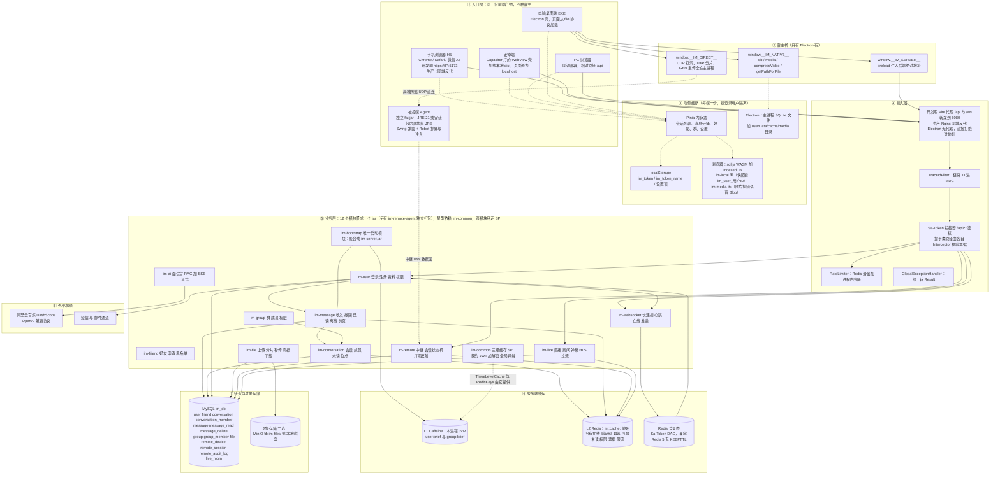
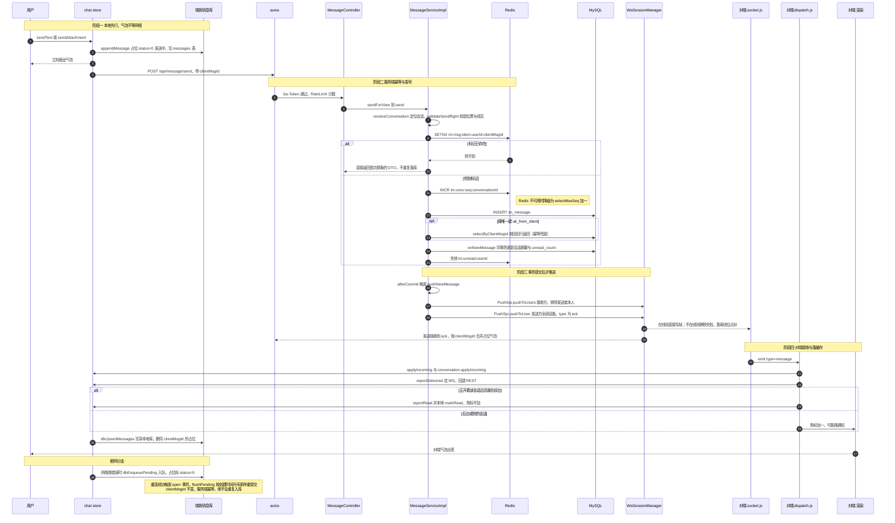
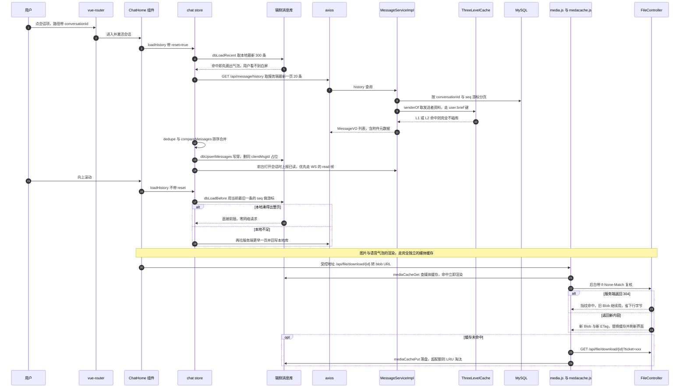
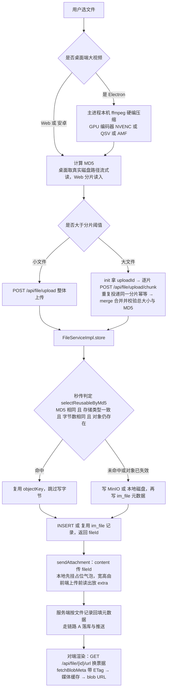
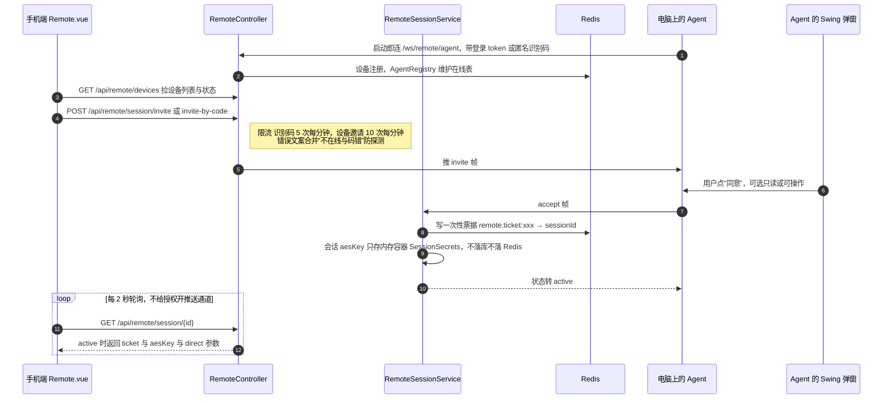
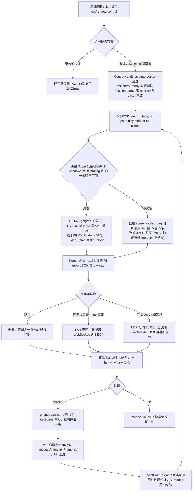
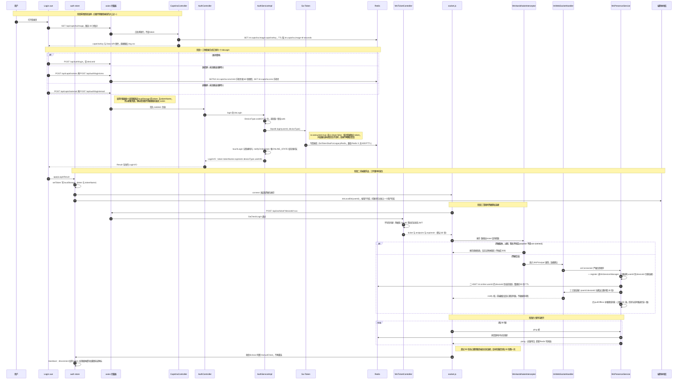
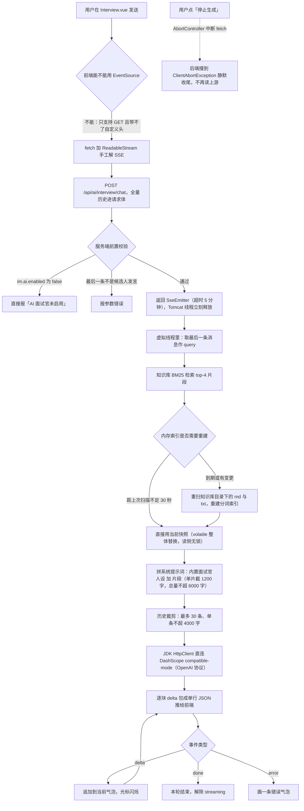

# 多端入口与缓存全链路图

> 事实来源（每张图都能在下列文件里对上号）：
> `im-ui/src/utils/env.js`、`utils/token.js`、`utils/localdb/*`、`utils/medacache.js`、`utils/media.js`、
> `ws/socket.js`、`ws/dispatch.js`、`stores/chat.js`、`electron/main.js`、`electron/preload.js`、
> `im-common` 的 `ThreeLevelCache` / `RedisKeys` / `ImConstants` / `DeviceType` / `RateLimiter`、
> `im-websocket` 的 `WsTicketService` / `WsHandshakeInterceptor` / `WsPresenceService` / `WsSessionManager` /
> `WsInboundDispatcher` / `PushSpiImpl`、`im-message` 的 `MessageServiceImpl` / `MessageSequenceServiceImpl`、
> `im-conversation` 的 `ConversationServiceImpl`、`im-file` 的 `FileController` / `FileServiceImpl`、
> `im-user` 的 `AuthServiceImpl` / `OnlineStatusSpiImpl` / `PermissionProviderImpl`、
> `im-remote` 与 `im-remote-agent` 全部、`im-ai` 的 `InterviewController` / `KnowledgeBaseService`、
> `im-live` 的 `LiveRoomServiceImpl` / `LiveDanmakuService` / `LiveCheckTask` 与 `RedisKeys` 的 `live:*` 键。
>
> 姊妹文档：《[架构与请求链路图](架构与请求链路图.md)》讲三层架构、通用 HTTP/WS 链路、登录与文件上传下载；
> 本篇专注在**多端入口差异**、**各级缓存**与**从点击到数据接收的完整链路**。
> 已知缺陷与修复模式另见《[已踩坑](已踩坑.md)》。
>
> **目录**：一 入口全景 · 二 四种入口差异 · 三 缓存全景 · 四 发送链路 · 五 打开会话链路 ·
> 六 文件链路 · 七 远程控制链路 · 八 登录与长连接 · 九 AI 面试链路 ·
> 十 缓存清单速查 · 十一 排障速查 · 十二 三句总结

---

## 一、三端入口全景

同一份 Vue 产物（`im-ui/dist`）跑在四种宿主里，加上一个独立 JVM 的被控端 Agent。
差异只发生在**「地址怎么拼」「设备位报什么」「原生能力有没有桥」**这三件事上，后端与存储层完全共用。

**读图三句话**

1. **入口只影响三件事**：地址怎么拼（`utils/env.js`）、设备位报什么（`utils/token.js` 的 `getDeviceId`）、
   有没有原生桥（`electron/preload.js`）。业务代码与后端完全不知道自己在哪种宿主里。
2. **缓存是四段链路**：端侧内存（Pinia）→ 端侧持久（IndexedDB / 主进程 SQLite）→ 服务端 L1 Caffeine →
   服务端 L2 Redis → 才是 MySQL。任何一跳挂了都设计成「降级而不是失败」。
3. **Agent 是第二个入口而不是后端的一部分**：它自己连 `/ws/remote/agent`，和手机上的控制端互为两端，
   服务器只做中继与鉴权，永远看不到明文画面（`im.remote.aes=true` 时是 AES-256-GCM 端到端）。

---

## 二、四种入口的差异对照

| 维度 | 手机浏览器 H5 | 安卓 APK（Capacitor） | PC 浏览器 | Electron 桌面端 EXE |
|---|---|---|---|---|
| 产物来源 | `npm run build` 后由 Nginx 提供，或开发期 `dev:lan` / https 直连局域网 IP | 同一份 dist 打进原生壳 | 同手机浏览器 | `npm run build:electron`（`base` 为相对路径、路由用 hash） |
| API 地址 | 同源相对路径 `/api` | 同源（壳内为 localhost，需配 server 指向后端） | 同源相对路径 `/api` | `window.__IM_SERVER__.baseUrl` + `/api` |
| WS 地址 | 按页面协议推导 `ws` 或 `wss` + `location.host` | 同左 | 同左 | 把后端 `http(s)` 换成 `ws(s)` |
| deviceId（后端归一化） | `web` | `web`（`isElectron()` 为 false，**不会报 android**） | `web` | `pc` |
| 多端共存 | 登录**不再顶号**（`is-concurrent: true` + `is-share: false`），同设备位多标签页各自拿独立 token | 同 `web` 设备位，与浏览器互不踢 | 同左 | 占 `pc` 设备位，与同机浏览器共存 |
| 端侧消息库 | sql.js WASM + IndexedDB（`im-local`）快照 | 同浏览器（WebView 支持 IDB） | 同浏览器 | 主进程 SQLite，渲染进程只发 SQL 语句 |
| 媒体二进制缓存 | IndexedDB `im-media` | 同浏览器 | 同浏览器 | 主进程 `userData/cache/media`，命中顺手 touch 时间戳供 LRU |
| WebCrypto（AES 端到端） | 仅 https / localhost 可用；纯 http 局域网 IP 不可用 | localhost 属安全上下文，一般可用 | 同浏览器 | 可用 |
| 原生全屏 + 方向锁 | https 下可请求，X5 类内核拒绝 `orientation.lock` | 取决于 WebView 内核 | 桌面浏览器正常 | 正常（不需要旋转） |
| LAN 直连（WebSocket 打局域网 TCP 口） | https 页面下被混合内容拦死，只能中继 | 同左 | 纯 http 页面可用 | 可用 |
| UDP 打洞直连 | ❌ 浏览器开不了原始 UDP | ❌ | ❌ | ✅ `__IM_DIRECT__` 桥到主进程 |
| 视频硬件压缩 | ❌（前端不压缩，直传原片） | ❌ | ❌ | ✅ 主进程本机 ffmpeg（NVENC / QSV / AMF） |
| 直播（推流 / 观看） | ❌ 不能开播；✅ 观看 HLS | ❌ 不能开播；✅ 观看 | ❌ 不能开播；✅ 观看 | ✅ 主进程 ffmpeg 采集推流（**唯一能开播的入口**）；观看同其他端 |
| 被控端 Agent | ❌ 不能被控 | 一般不做 | ✅ 同机随安装包自启 | ✅ 随安装包 `extraResources` 内置 jar + 裁剪 JRE |

> 已知取舍：**安卓端目前报 `web` 设备位**，与手机浏览器、PC 浏览器共用同一个位置。
> 不会互相顶号（登录已不踢旧会话），但在设备管理里分不出谁是谁，在线列表也只有一行。
> 要区分只需在 `im-ui/src/utils/token.js` 的 `getDeviceId()` 里按 UA/`capacitor` 标记返回 `android`，
> 后端 `DeviceType` 已支持该取值，无需改动其他代码。

> **直播是唯一「只有桌面端能开播」的能力**：开播依赖主进程 `spawn` ffmpeg 采集本机屏幕/摄像头，浏览器沙箱开不了；
> 观看则四端一致（都是 `hls.js` 拉 HLS）。完整直播链路（上行 HTTP PUT 上传切片、下行 HLS、弹幕 `/ws/live`、
> ENDED 聊天模式、abort 撤销僵尸房）见姊妹篇《[架构与请求链路图](架构与请求链路图.md)》第十一节。

---

## 三、缓存全景

```mermaid
graph LR
    subgraph CLIENT["端侧（按登录用户分库，切账号先关再开）"]
        C1["第 0 层：Pinia 内存<br/>消息按会话 ID 分桶，切会话不清数据"]
        C2["第 1 层：localStorage<br/>token 与 tokenName、设置项、缓存开关与配额"]
        C3["第 2 层：消息库<br/>表 messages 与 pending_queue<br/>Web：sql.js WASM 整库字节快照进 IndexedDB 的 im-local<br/>桌面：主进程 SQLite 事务后原子落盘"]
        C4["第 2 层：媒体缓存<br/>key 为受控下载地址，value 为 Blob 加 ETag<br/>与消息库物理隔离，独立配额与 LRU"]
    end

    subgraph SERVER["服务端（im-common 的 ThreeLevelCache）"]
        S1["L1 Caffeine<br/>maximumSize 与 expireAfterWrite 取自 im.cache.*<br/>存 NULL_MARKER 哨兵"]
        S2["L2 Redis<br/>键统一加前缀 im:cache:<br/>空值写 __NULL__ 且用短 null-ttl"]
        S3["L3 MySQL"]
    end

    subgraph REDISKEY["Redis 业务键（不走三级缓存，各自带 TTL）"]
        K1["im:captcha:image:key<br/>短信 与 邮箱码同理，另有 limit 频控键"]
        K2["im:online:userId<br/>Hash:deviceId 到心跳毫秒，整键 90 秒 TTL"]
        K3["im:conv:seq:conversationId<br/>INCR 发号，挂了降级取库最大值加一"]
        K4["im:msg:idem:userId:clientMsgId<br/>SETNX 占位标记，重复时回库取首条"]
        K5["im:unread:userId<br/>未读总数，变更即失效，读时回源"]
        K6["im:auth:perm:userId 与 im:auth:role:userId"]
        K7["im:at:userId<br/>Set:被 at 的会话 ID"]
        K8["remote:ticket:ticket<br/>控制端一次性握手票据"]
        K9["im:ratelimit:维度:标识"]
        K10["Sa-Token 登录态<br/>JWT 简单模式，顶号 踢人 注销全靠它"]
        K11["im:live:online 在线数 / im:live:hb 推流心跳 / im:live:pushed 推流标记<br/>均按 roomId 分键，不进三级缓存"]
    end

    C1 -->|"写穿 dbUpsertMessages"| C3
    C1 -->|"渲染时回读"| C4
    C3 -->|"本地缺页才发请求"| SERVER
    S1 -->|"未命中查 L2"| S2
    S2 -->|"L2 也未命中才回源"| S3
    S2 -->|"命中回填 L1"| S1
    S3 -->|"loader 结果逐层回填"| S1
    S1 -.->|"evict 时 L1 与 L2 一起失效，不回填"| S2
    SERVER -.->|"另一批键不走三级缓存"| REDISKEY
```

### 3.1 服务端三级缓存的确切行为

| 行为 | 实现 | 为什么这么选 |
|---|---|---|
| 读路径 | `get(key, type, loader)`：L1 → L2 → `loader` 回源，命中逐层回填 | 与架构图的 alt 嵌套一致，业务侧只需给一个 lambda |
| 批量读 | `peek(key, type)` 只查 L1/L2 不回源；未命中的 ID 攒起来一次 `selectByIds` | 否则会退化成 N 次单行查询 |
| 写路径 | 更新库之后 `evict(key)`（L1+L2 一起失效），**不回填** | 回填值要和并发写赛跑，容易把旧值写回去 |
| 失效时机 | 群资料、转让、解散在 `afterCommit` 里 evict；用户改资料/换头像在更新后 evict | 事务内失效会被并发读回填成旧值 |
| 穿透防护 | loader 返回 null 也记一笔：L1 存 `NULL_MARKER`、L2 写 `__NULL__`，用 `null-ttl-seconds` 短 TTL | 恶意 ID 不会每次打到库，新建数据最多隐身这么久 |
| 降级 | `ObjectProvider<StringRedisTemplate>`，Redis 读写全部 try/catch | L2 挂了退化成「L1 + 库」两级，功能不受影响，只是回源变多 |
| 反序列化失败 | 按未命中处理并回源覆盖 | DTO 字段变更后残留的旧格式数据不该让整个读路径抛异常 |
| 多节点 | `evict` 只失效本节点 L1，其他节点靠 L1 短 TTL 收敛 | 资料类脏读窗口以分钟计，不值得引入 pub/sub 广播 |
| 关闭开关 | `im.cache.enabled=false` 时 `get` 直接跑 loader | 排障时能一行配置把缓存整个摘掉 |

**当前只有两类数据进三级缓存**（key 前缀收口在 `ImConstants`，读方与失效方分散在不同类，
手打错前缀会表现为「改了资料但缓存永远不失效」）：

| key 前缀 | 读方 | 失效方 |
|---|---|---|
| `user:brief:{userId}` | `UserQuerySpiImpl.getById` / `getByIds` | `UserServiceImpl.updateProfile`、`updateAvatar` |
| `group:brief:{groupId}` | `GroupSpiImpl.getBrief` / `getBriefs` | `GroupServiceImpl` 改群资料、转让群主、解散群（均在 `afterCommit`） |

> 在线状态是**读缓存值之后再现场覆盖**的（`toBuilder().online(isOnline(userId))`）：
> 静态资料可缓存，`online` 恰恰是 90 秒 TTL 的 Redis 键算出来的，绝不能被缓存冻住。

### 3.2 端侧缓存的确切行为

| 层 | 位置 | 内容 | 失效策略 | 挂了会怎样 |
|---|---|---|---|---|
| Pinia 内存 | `stores/chat.js` 的 `messages[convId]` | 已加载消息、发送中占位、分页游标 `hasMore` | 切会话不清；登出 `reset()` | 从本地库重建 |
| localStorage | `utils/token.js`、`stores/settings.js` | `im_token`、`im_token_name`、设置与缓存开关/配额 | 登录态失效由 axios 拦截器清 token 跳登录 | 退回登录页 |
| 消息库 | Web：`sql.js` WASM + IndexedDB `im-local`（快照键 `im_user_{userId}`）；桌面：主进程 SQLite 文件 | `messages` 表（含 `raw_json` 原文）与 `pending_queue`；多标签页靠 `BroadcastChannel` + `navigator.locks` 互斥 | 服务端「清空聊天记录」、单端删除、撤回都同步改本地；Settings 可一键清缓存（**保留待发送队列**） | `enabled=false`，所有方法变空操作，聊天照常，只是每次走服务端拉历史 |
| 媒体缓存 | Web：IndexedDB `im-media`；桌面：`userData/cache/media` | Blob + ETag，key 是后端存的受控下载地址 | **stale-while-revalidate**：先渲染旧图，后台带 `If-None-Match` 复核，304 继续用、200 换新的；配额上限 `mediaCacheMaxMb`（默认约 200MB），超限按最久未访问 LRU 淘汰 | 只丢一次优化机会，展示照常，断网时仍能翻旧图 |

**本地库合并规则**：服务端权威消息带 `messageId` 落库时，顺手删掉同 `clientMsgId` 的本地占位行
（`msg_id` 从 `local:{clientMsgId}` 升级成真实 ID），气泡不会分裂成两个。

### 3.3 从点击到数据接收经过的所有缓存点

```mermaid
flowchart LR
    A["1 用户点击或回车"] --> B["2 组件调用 store action"]
    B --> C{"3 Pinia 里有吗"}
    C -->|"有：立即渲染"| E
    C -->|"没有"| D["4 读端侧持久库<br/>IndexedDB 或 主进程 SQLite"]
    D --> D2{"5 本地凑得出整页吗"}
    D2 -->|"能：零网络请求"| E["6 视图更新"]
    D2 -->|"不能"| F["7 发 HTTP 或 WS 到后端"]
    F --> G["8 接入层：链路 ID、鉴权、限流"]
    G --> H["9 Service：L1 Caffeine"]
    H --> I["10 L2 Redis：im:cache: 前缀或业务键"]
    I --> J["11 MySQL 回源"]
    J --> K["12 逐层回填 L2 再 L1"]
    K --> L["13 结果回前端"]
    L --> M["14 写穿端侧库与媒体缓存"]
    M --> E
    N["15 服务端事务提交后主动推 WS 帧"] -.->|"message 或 ack 或 notify"| O["16 socket.js onmessage"]
    O --> P["17 dispatch.js 按 type 分给 store"]
    P --> B
```

第 15~17 步是**第二条入口**：数据不是等请求回来，而是被服务端推下来。
所以下面每条链路都要同时读「请求-响应」和「推送-分发」两半。

---

## 四、链路 A：点击「发送」→ 对方屏幕上气泡出现

发送走 **HTTP**（`stores/chat.js` 的 `send` 注释即「HTTP 通道」），
只有**已读/送达上报**走 WS 上行帧（连不上就自动回退等价 REST 接口）。
这样发消息能拿到明确的错误码，而高频小报文不必各开一次 HTTP 往返。

**离线消息怎么补**（没有独立离线表，`im_message` 本身就是持久队列）：

| 触发点 | 动作 | 位点 |
|---|---|---|
| 对端不在线 | `PushSpiImpl` 静默失败，**不写离线表** | 不动 |
| 连接建立 | `WsPresenceService.pullOffline` 逐条推 `MESSAGE` 帧（形状与实时推送完全一致） | 返回即推进 `last_ack_seq` |
| 重连成功 | 前端 `dispatch.js` 调 `chat.pullOffline()` → `GET /api/message/offline` | 同上，两条路径幂等，谁先跑谁拿到 |
| 打开会话 | `GET /api/message/history` 直接查库 | 推进 `last_read_seq`，未读清零 |

---

## 五、链路 B：点击一个会话 → 首屏出现历史消息

目标就一个：**本地能凑出来的一律不等网络**。进入会话拉本地最新 300 条预渲染，
向上滚动时本地凑得出整页（20 条）就一个请求都不发。

**为什么头像和图片不直接用 `img src` 指后端**：浏览器渲染 `` 时带不上自定义请求头，
而项目关掉了 Sa-Token 的 Cookie 读取（防 CSRF），所以地址必须是**签过名的短时票据**。
`utils/media.js` 把受控地址换成 `blob:` 地址的同时，顺手把字节存进媒体缓存——
缓存 key 用**原始受控地址**，这样权限模型变了自然就不会命中旧缓存。

---

## 六、链路 C：发一条图片 / 文件消息（缓存触点最密的一条）

**顺序上的两条铁律**

1. **先写字节、再写元数据**：反过来会留下「记录已存在但对象不在」的永久坏死记录。
2. **`store` 不加 `@Transactional`**：写字节是可能持续数秒的 I/O，包进事务会占着数据库连接，
   并发上传时直接抽干连接池。

**MD5 由服务端重算，客户端上报值一律不信**：否则谎报一个 MD5 就能让两个不同文件指向同一对象。
秒传命中后仍要**校验对象存在性并清失效哈希**，否则会复用一个已被删掉的 objectKey。

---

## 七、链路 D：手机远程控制电脑 —— 从点击「连接」到画面帧上屏

三方中继：手机（控制端）与电脑上的 Agent（被控端）各连一条 WebSocket，服务器只做转发与鉴权。
**控制面**是 REST（邀请、轮询授权、结束），**数据面**是专用 WebSocket + 二进制帧。

### 7.1 控制面：握手前的一切

### 7.2 数据面：帧为什么能上屏，以及每一级回落

**三档直连阶梯与端差异**

| 档 | 端口 | 能用的入口 | 失败时的表现 |
|---|---|---|---|
| 中继 WS | 8080 的 `/ws/remote/control` | 全平台，永远常开做兜底 | 不存在失败，它是默认档 |
| LAN 直连 | 被控端 18924，走局域网 WebSocket | PC 浏览器与桌面端；**https 页面下被混合内容拦死** | 退回中继，日志记“直连未生效” |
| UDP 打洞 | 18925，经服务器反射公网地址 | **仅 Electron**（需 `__IM_DIRECT__` 桥） | 退回上一档 |

**这张链路图上独有的三个坑**（详见《[已踩坑](已踩坑.md)》第 5~7 条）

- 自签证书下 **REST 全通、wss 全挂**：https 页面能点“继续访问”，同源 wss 被静默拒绝，
  后端一行日志都不会多；表现就是“授权成功但一闪即退”。
- HTTPS 页面里开不了局域网直连：混合内容策略直接拦，所以手机只能走中继。
- “进了全屏”不等于“页面转横”：X5 内核 `requestFullscreen` 成功但 `orientation.lock` 被拒，
  必须按实测视口宽高补一层 CSS 旋转，否则画面仍是竖着一条。

---

## 八、链路 E：打开 App → 登录 → 长连接建立（三端差异最大的一段）

这一段是**所有其他链路的前置**：没有 token 就没有票据，没有票据就没有 WebSocket，
没有本地库初始化就谈不上「本地优先」。

### 8.1 四种入口在这条链路上的差异

| 环节 | 手机浏览器 | 安卓 APK | PC 浏览器 | Electron 桌面端 |
|---|---|---|---|---|
| 登录请求的基址 | 同源 `/api` | 壳内同源，需把 server 指向后端 | 同源 `/api` | `__IM_SERVER__.baseUrl` 绝对地址 |
| 握手地址 | `ws(s)://location.host/ws` | 同左 | 同左 | 后端 `http(s)` 换成 `ws(s)` |
| 报的 deviceId | `web` | `web` | `web` | `pc` |
| 本地库 | IndexedDB `im-local` 快照 | 同左 | 同左 | 主进程 SQLite 文件 |
| 登录后才能用的能力 | 无差异 | 无差异 | 无差异 | 多一个：主进程能开原始 UDP、能跑 ffmpeg |

### 8.2 票据为什么不直接复用登录 token

| 票据 | 获取方式 | 默认有效期 | 为什么不复用登录 token |
|---|---|---|---|
| WS 连接票据 `purpose=ws-connect` | `POST /api/ws/ticket`（要 `satoken` 头） | 60 秒 | URL 会进浏览器历史、代理日志、Nginx access log；7 天的 token 挂上去泄露就是直接丢账号 |
| 文件访问票据 `purpose=file-access` | `GET /api/file/{id}/url` | 1800 秒（`file-ticket-ttl-seconds`） | `` 带不上请求头，图片全靠 URL 上的签名；但太短会整屏碎片，所以它比 WS 票据长得多 |
| 远程控制票据 `remote:ticket:xxx` | 会话转 active 时随轮询返回 | 60 秒，**存 Redis 且握手成功即消费** | 它绑定了会话与临时密钥，不一次性就会被人重放出同一个会话 |

> 三类票据共用 `JwtUtil`，所以**校验时必须比对 purpose**：否则一张 30 分钟有效的文件票据
> 就能拿来建立 WebSocket 连接——签名合法、userId 有效，只是被签来做另一件事的。
> 另外 WS 票据刻意**不做一次性消费**，否则每次握手都硬依赖 Redis 可用性。

---

## 九、链路 F：AI 面试官——唯一走 SSE 而不走 WS 的流式链路

**为什么这里不用向量检索**：知识库是本地目录里的几百个 `.md`/`.txt`，这个量级 BM25 召回质量够用，
而且少一个 embedding 网络调用、少一份计费、少一种失败模式；更关键的是**索引纯内存构建，
文件变更后秒级重建**，天然满足「题库会持续补充」的热更新诉求。

**按轮检索而不是会话级一次**：面试是渐进深挖的，第 10 分钟谈的「转码队列」和第 1 分钟谈的
「整体架构」需要的知识片段完全不同。

---

## 十、全链路缓存清单速查表

从用户手指到磁盘，数据一共可能被缓存在 25 个地方。“脏数据最大窗口”是排障时最有用的那一列。

| # | 层 | 位置与键 | 有效期 / 上限 | 谁写 | 谁失效 | 脏数据最大窗口 |
|---|---|---|---|---|---|---|
| 1 | 端内存 | Pinia `messages[convId]` | 页面存活期 | store action | 登出 `reset()`；切会话不清 | 0（就是它自已在显） |
| 2 | 端凭证 | localStorage `im_token` / `im_token_name` | 跟随后端 token | `setToken` | 401 拦截器、`teardown()`（**tokenName 故意保留**） | 0 |
| 3 | 端设置 | localStorage 缓存开关与配额 | 永久 | Settings 页 | 用户手动 | 0 |
| 4 | 端消息库 | `messages` 表，主键 `(conv_id, msg_id)` | 直到主动清 | `dbUpsertMessages` 写穿 | 清空聊天记录 / 单端删除 / 撤回同步改 | 一条推送的延迟 |
| 5 | 端待发队列 | `pending_queue` 表 | 直到重提交成功 | 断网时 `dbEnqueuePending` | `flushPending` 逐条出队 | 清缓存也**不删**它 |
| 6 | 端媒体库 | IndexedDB `im-media`（key=受控地址，索引 `by_ts`）或 `userData/cache/media` | 配额 `mediaCacheMaxMb`（默认约 200MB） | `mediaCachePut` | LRU 淘汰、登出 `clearMediaCache` | **一个 SWR 周期**（先显旧图再后台复核） |
| 7 | sql.js 内存库 | WASM 堆内整库，靠 `im-local`/`db-snapshots` 存字节快照 | 页面存活期 | 每次写后快照 | `navigator.locks` 与 `BroadcastChannel` 跨标签页互斥 | 快照未落盘就崩：丢最后几条（服务端会重拉） |
| 8 | 浏览器 HTTP | `Cache-Control` 与 ETag | 按响应头 | 后端 | `If-None-Match` 命中回 304 | 按头设定 |
| 9 | 接入层 | Nginx 反代（生产）/ Vite 代理（开发） | 无状态 | — | — | 0 |
| 10 | 服务 L1 | Caffeine，本 JVM | `l1-ttl-seconds: 120`，`l1-max-size: 10000` | 回源后回填 | `evict`（只失效本节点） | **120 秒**（多节点靠这个收敛，不要调大） |
| 11 | 服务 L2 | Redis `im:cache:` 前缀 | `l2-ttl-seconds: 1800`，空值 `null-ttl-seconds: 60` | 回源后回填 | 业务更新后 `evict`，`afterCommit` | 同请求内 0；异常残留最长 30 分钟 |
| 12 | 登录态 | Sa-Token Redis 键（JWT Simple 模式） | `timeout: 604800`（7 天），`active-timeout: -1` | `StpUtil.login` | `logout` / `kickOut` / 改密码全端下线 | 0 |
| 13 | 在线状态 | `im:online:{userId}` Hash（deviceId 到心跳毫秒） | 整键 **90 秒** | `onConnected` 与每次 `ping` | 过期即视为离线 | ≤ 90 秒；必须与心跳超时保持同步 |
| 14 | 会话序号 | `im:conv:seq:{convId}` | **永不过期**（只在缺失时用库里的 `MAX(seq)` 落初值） | `INCR` | 不失效（它是单调计数器） | 不适用；Redis 不可用降级 `selectMaxSeq + 1` |
| 15 | 幂等标记 | `im:msg:idem:{userId}:{clientMsgId}` | 5 分钟（`IDEMPOTENT_TTL`） | 首次发送 SETNX | 异常路径主动 `delete`（否则客户端改完内容重发会被误判重复） | 防重窗口内的重复请求直接拿回首次结果 |
| 16 | 未读总数 | `im:unread:{userId}` | 30 分钟（**仅作兜底**） | 读时回源 | 未读变更即 `delete` | 0；失效失败才退化为最长 30 分钟 |
| 17 | 角色权限 | `im:auth:perm:{userId}` 与 `im:auth:role:{userId}` | 30 分钟 | Sa-Token 的权限/角色查询回调 | `PermissionProvider.evictCache` 已实现但**目前无调用方** | **角色变更后最长 30 分钟才生效**（已知的现实缺口） |
| 18 | 被 @ 提醒 | `im:at:{userId}` 为 Set(conversationId) | 7 天 | 收到 at 时写入 | 打开会话时移除元素；TTL 防长期堆积 | 不适用（它是“红点”事实源之一） |
| 19 | 登录验证码 | `im:captcha:image:{captchaKey}`（TTL 取 `im.captcha.image-ttl-seconds`）与 `im:captcha:sms:{phone}`、`im:captcha:email:{email}` | 图片短码、短信/邮箱各自 TTL；limit 键为 60 秒频控 | 发送时 SET / SETNX | **`getAndDelete` 取出即删**（一次一用，防重放） | 0 |
| 20 | 远程与文件票据 | `remote:ticket:{ticket}`（Redis，60 秒）；WS/文件票据**不落 Redis**（无状态 JWT） | 60 秒 / 60 秒 / 1800 秒 | 会话转 active 时 | 握手成功即消费（仅远程票据） | 0 |
| 21 | 秒传索引 | `RedisKeys.fileMd5` 已定义但**尚未接入**；真正的秒传判定走 MySQL `selectReusableByMd5` | — | — | 命中前必验对象存在性 | 不适用（它就是权威数据） |
| 22 | 知识库索引 | `KnowledgeBaseService` 内存 `volatile Index` | 无 TTL | 首次使用时构建 | `ensureFresh` 每 30 秒重扫目录 | ≤ 30 秒 |
| 23 | 直播在线数 | `im:live:online:{roomId}` | 关播即删（聊天模式保留） | 观众进出房 incr/decr | 关播 / 聊天到期 `closeRoom` 删 | 实时；不进库（每秒变多次，库值只关播定格一次） |
| 24 | 直播心跳 | `im:live:hb:{roomId}`（TTL 即超时判定） | 心跳 TTL（15s×4） | 推流端每 15s 续期 | 关播删；TTL 到期即判超时 | ≤ 一个 TTL；巡检只 `EXISTS` 不逐个算差值 |
| 25 | 直播推流标记 | `im:live:pushed:{roomId}` | 24h 兜底 | 推流端**首次** `heartbeat()` 时 `setIfAbsent` | 关播删 | `abort` 护栏：无此键=从未推流，可直接删房 |

> 一句判断法：**能缓存的都是“改一次看万次”的静态资料**（用户简介、群简介、知识库分词索引）；
> **不能缓存的都是状态**（在线、未读、序号、已读位点）。在线状态更特殊：
> 它是读 `user:brief` 缓存之后**现场覆盖**上去的，否则一个人下线了别人还看到绿点。

---

## 十一、按症状排障速查

| 症状 | 先查哪里 | 定位依据 |
|---|---|---|
| 点发送，气泡永远是“发送中” | `socketState.status` → Network 面板 → `pending_queue` | `status=5` 代进入待发队列（网络层失败）；401 代登录态没了；两者都不是就看后端错码 |
| 同一条消息两个气泡 | 本地库归并 | 服务端行与占位行的 `client_msg_id` 有一个为空，`local:前缀` 就拆不掉 |
| 刷新后历史一片空白 | `dbInfo().enabled` | 本地库初始化失败会是 `false`（降级为空操作）；再看 `initLocalDb(userId)` 是否被执行 |
| 别人看到的昵称/头像还是旧的 | L1 的 120 秒 TTL | 改资料没走 `evict` 时，最多 120 秒自然收敛；一直不收敛就是前缀打错了 |
| 头像与图片转圈不显示 | 票据是否过期 → 是否混合内容 | `is-read-cookie: false`，`img src` 只能靠 URL 签名票据；http 页面嵌 https 资源会被掩掉 |
| 明明在线却显示离线 | `im:online:{userId}` 的 TTL 与心跳间隔 | 90 秒与 30 秒必须同步改；多实例时 `isUserOnline` 只查本进程注册表 |
| 改了角色但权限没变 | `im:auth:perm:{userId}` | 30 分钟 TTL 自然收敛；`evictCache` 已实现但没人调 |
| 未读角标不消 | 上行 `read` 帧是否发出 | WS 不通会回退 REST；两条都没跑成功时服务端 `last_read_seq` 不会推 |
| Redis 挂了会怎样 | 三级缓存退化 | 资料读退成“L1 加库”；序号走 `selectMaxSeq` 降级；**但登录态在 Redis，挂了会全线 401** |
| 登录报 `this api is disabled` | Sa-Token 模式 | 用了 `StpLogicJwtForMixin`，它禁用了 `logout`/`replaced` 系列 API；必须用 Simple |
| 手机上连上但无画面 | 画面区是否被挤成 0 高 | 不是链路问题，是布局塌陷；见《[已踩坑](已踩坑.md)》第 6 条 |
| 微信里点全屏不转横 | 实测视口宽高 | X5 内核 `orientation.lock` 被拒；见《[已踩坑](已踩坑.md)》第 7 条 |
| 远程会话“一闪即退” | 同源 wss 能否握手 | 自签证书 SAN 落后于当前 IP：REST 通、wss 静默拒，后端一行日志也不会多 |
| 大文件上传 500 | `spring.servlet.multipart.max-file-size`（100MB）与 `im.file.max-size` | 这是一对必须一起改的值；走 init/chunk/merge 分片通道后上限是 2GB，不受那道 100MB 限制 |
| 面试无回复 | `ALI_BABA_API_KEY` 与 `im.ai.knowledge-dir` | `GET /api/ai/interview/status` 一次看完：目录不存在、文件数 0、Key 未配置都会直接报出来 |
| 设备列表看不出哪个是安卓 | `getDeviceId()` 返回值 | APK 里 `isElectron()` 为假，目前统一报 `web` |
| 桌面端开播报 `An object could not be cloned` | Electron IPC 结构化克隆 | 传了 Vue Proxy 过 `invoke`；只传 `displayId` 纯量，见《[已踩坑](已踩坑.md)》第 8 条 |
| 重装包还报已修复的旧 bug | 解包 asar 比对代码 | 打包产物是旧 bundle，`electron/dist` 新 ≠ asar 新，见《[已踩坑](已踩坑.md)》第 9 条 |
| 开播了但观众端一直转圈 | ffmpeg spawn 的 `cwd` / `init.mp4` 是否落进切片目录 | 相对名 init.mp4 落到进程工作目录，上传泵漏传，见《[已踩坑](已踩坑.md)》第 10 条 |
| 大厅多出「未开播成功」的 ENDED 房 | `abort` 是否被调 / `live:pushed` 护栏 | 建房成功但 startPush 抛错，catch 应调 abort 删房而非 stopLive |

---

## 十二、三句总结

1. **入口不同，缓存同构**：四种宿主共用一套 `localdb` 驱动抽象（桌面递 SQL 给主进程，Web 跑 sql.js），
   上层 store 代码不知道底下是 SQLite 还是 WASM；驱动整体可缺省，拿不到就降级成空操作。
2. **每一层缓存都有人写、有人失效**：没有配对失效方的缓存一律不允许存在——
   这就是为什么只敢缓存 `user:brief` 与 `group:brief` 两类数据。
3. **从点击到数据接收只分两种情形**：本地能凑出来就一个请求也不发；本地凑不出来就走
   「Pinia → 端库 → L1 → L2 → MySQL」五级，然后由推送从反方向把结果补回到端。

