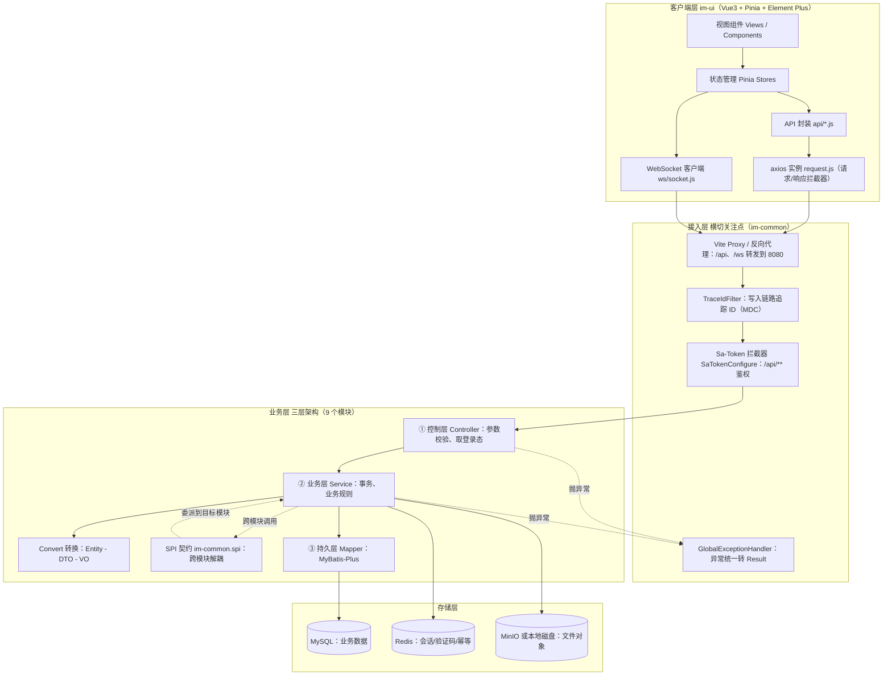
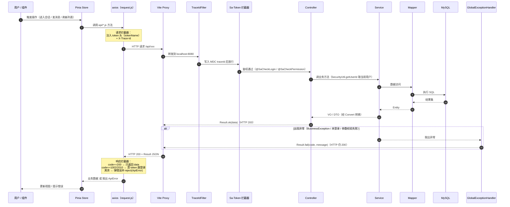
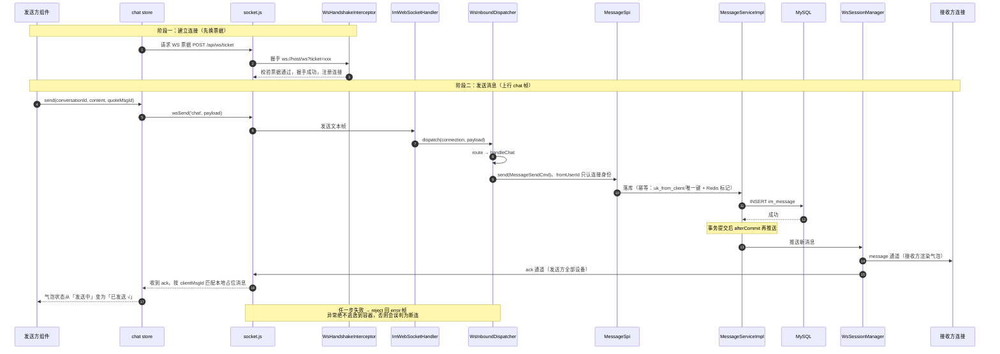
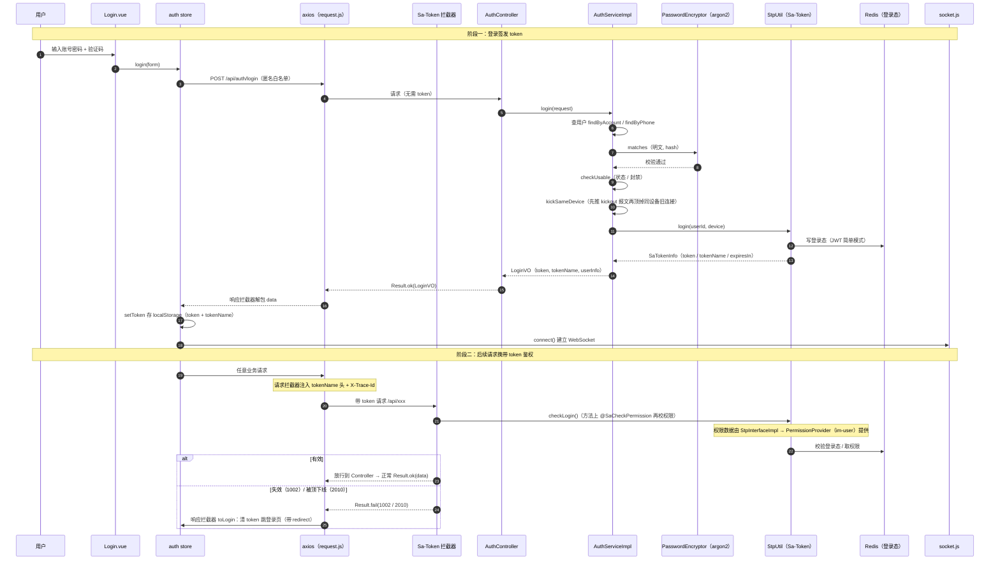
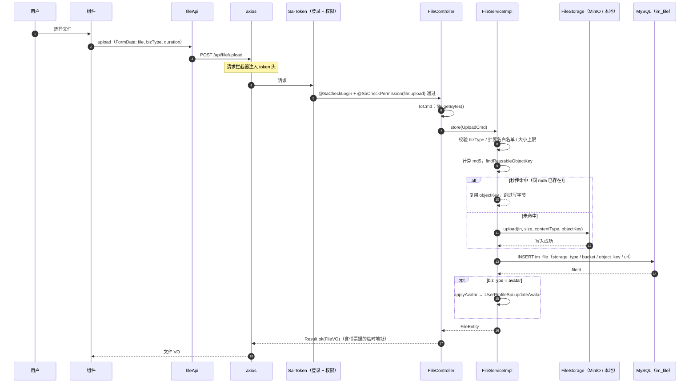
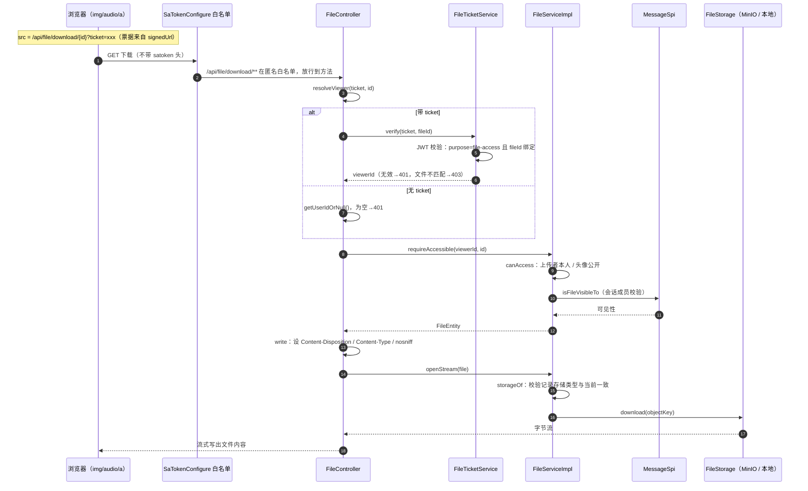

# 架构与请求链路图

> 事实来源：`im-ui/src/api/request.js`（axios 拦截器）、`im-ui/src/ws/socket.js`（长连接）、
> `im-common` 的 `SaTokenConfigure` / `TraceIdFilter` / `GlobalExceptionHandler` / `Result`、
> `im-websocket` 的 `WsInboundDispatcher`、各业务模块的 `Controller → Service → Mapper` 与 `spi` 契约。
> 图形语法：Mermaid（GitHub、VS Code Mermaid 插件、Typora 均可直接渲染）。

---

## 一、三层架构

后端采用经典的 **控制层（Controller）→ 业务层（Service）→ 持久层（Mapper）** 三层，
外面再包一层客户端与接入层（横切关注点），底下是存储层。9 个业务模块通过 `im-common.spi`
契约互相调用（星型架构），模块之间不直接依赖对方的实现。

**三层职责边界**

| 层 | 组件 | 只做 | 不做 |
|---|---|---|---|
| ① 控制层 | `*Controller` | 参数校验、从 `SecurityUtil` 取登录态、包装 `Result` | 不写业务规则、不碰 SQL |
| ② 业务层 | `*ServiceImpl` | 事务、业务校验、跨模块 SPI 调用、Convert 转换 | 不解析 HTTP、不返回视图对象 |
| ③ 持久层 | `*Mapper` | MyBatis-Plus 数据访问 | 不含业务判断 |

---

## 二、HTTP 请求链路：从前端发出到拿到响应

以任意业务请求（查会话列表、发消息 REST 兜底、上传等）为例。关键约定：
**后端所有失败都返回 HTTP 200 + `Result` 体**，业务错误码放在 `code` 里，
所以前端的错误判定全在 axios 响应拦截器的「成功分支」，错误分支只处理网络问题。

**要点**
- 请求头 `X-Trace-Id` 由前端生成，后端 `TraceIdFilter` 原样回写并放进 MDC，`Result.traceId`
  再带回前端——浏览器控制台与服务器日志能用同一个 ID 对上，方便排查。
- 未登录（1002）、被顶下线（2010）由响应拦截器统一跳登录页，业务代码不用各写一遍。
- 二进制下载走 `fetchBlob`：按 `Content-Type` 判别，拿到 JSON 说明失败，避免把错误体当成图片字节。

---

## 三、WebSocket 消息链路：实时收发

IM 的核心通道。连接建立走「先 HTTP 换票据、再握手」；发消息是上行 `chat` 帧，
落库后由**写库的那一方**在事务提交后推送：接收方走 `message` 通道、发送方走 `ack` 通道
（推给发送者的全部设备，实现多端同步）。

**要点**
- 握手路径 `/ws` 不在 `/api/**` 下，Sa-Token 拦截器管不到，鉴权由 `WsHandshakeInterceptor`
  校验一次性票据完成。
- 发送者身份 `fromUserId` 只取连接身份（握手票据里的 userId），客户端无法伪造，是整条链路
  唯一不可被前端影响的字段。
- 上行处理的所有异常都收在 `WsInboundDispatcher.dispatch` 的 try 里翻译成 `error` 帧——
  一旦逃逸回容器，连接会被直接关闭，导致「发条空消息就掉线重连」的死循环。
- 撤回、送达、已读同样走这条长连接（`recall` / `delivered` / `read` 帧），由对应 handler 委派给 `MessageSpi`。

---

## 四、两条通道的分工

| 维度 | HTTP（REST） | WebSocket |
|---|---|---|
| 适用 | 查询、登录、文件上传、需要明确错误归因的操作 | 实时收发消息、心跳、在线状态、撤回/已读回执 |
| 鉴权 | Sa-Token 拦截器 + `@SaCheckPermission` | 握手票据（一次性、短 TTL） |
| 返回 | `Result<T>`（HTTP 200 + code 表达业务结果） | `WsPacket`（message / ack / error 帧） |
| 失败处理 | 响应拦截器统一转 `ApiError` | `dispatch` 收口转 `error` 帧，不断连 |

> 撤回等操作**刻意走 HTTP 而非 WS**：撤回有时限与权限限制，失败原因需要明确回给调用方；
> WS 的 error 帧只能靠 clientMsgId 反查，对不上时无法归因。

---

## 五、登录鉴权专项链路

登录走匿名白名单（`/api/auth/login` 等）签发 JWT token，前端存进 `localStorage`；
之后每个请求由 axios 拦截器注入 token 头，后端 Sa-Token 拦截器 + 注解鉴权。
登录态失效（1002）/ 被顶下线（2010）由响应拦截器统一清 token 并跳登录页。

**要点**
- `tokenName` 不写死，随 `LoginVO` 下发并存本地（对应 `sa-token.token-name`），改名也不会全线 401。
- 续签 `refresh` 采用「先签发新 token、再注销旧 token」，中间无无凭证窗口（JWT 模式下过期时间写死在 token 里）。
- 同设备重复登录会顶掉旧连接：先推 `kickout` 报文让客户端收到明确原因，再注销服务端会话（顺序不能反）。

---

## 六、文件上传 / 下载专项链路

### 6.1 上传（POST /api/file/upload）

**要点**
- 存储顺序是「先写字节、再写元数据」：反过来会出现「记录已存在但对象不在」的永久坏死记录。
- md5 秒传：相同文件不重复写存储，但 md5 由服务端重算，忽略客户端上报值（防止谎报让两个文件指向同一对象）。
- `store` 刻意不加 `@Transactional`：写字节是可能持续数秒的 I/O，包进事务会占着数据库连接，并发上传时抽干连接池。

### 6.2 下载（GET /api/file/download/{id}）

浏览器渲染 `` / `<audio src>` / `<a download>` 时**带不上自定义请求头**，
而项目又关掉了 Sa-Token 的 Cookie 读取（防 CSRF），因此下载改用 **URL 上的短时 JWT 票据**认证。

**要点**
- 票据与文件 ID 绑定，一张票据只能取一个文件；带 `purpose=file-access` 标识，防止 WS 握手票据被挪用来下载。
- 票据优先于登录头：URL 可能来自另一台设备的分享，票据里写的才是被授权的人。
- 鉴权全部发生在写第一个字节之前，失败时响应未提交，全局异常处理器照样能返回标准 JSON 错误体。
- **预签名直链模式**（`im.file.use-presigned-url=true`）：`temporaryUrl` 直接返回 MinIO 预签名 URL，浏览器绕过应用服务器直连 MinIO（适用于桶可控、需给后端/CDN 减压的场景）。
