# 架构与请求链路图

> 事实来源：`im-ui/src/api/request.js`（axios 拦截器）、`im-ui/src/ws/socket.js`（长连接）、
> `im-common` 的 `SaTokenConfigure` / `TraceIdFilter` / `GlobalExceptionHandler` / `Result`、
> `im-websocket` 的 `WsInboundDispatcher`、各业务模块的 `Controller → Service → Mapper` 与 `spi` 契约；
> 第七节另取 `im-remote` 的 `RemoteSessionService` / `RemoteRelayService` 与 `im-remote-agent` 的 `AgentClient`，
> 录屏审计部分（7.3）另取桌面端的 `electron/recorder.js` / `preload.js` 与 `im-ui/src/utils/recorder.js`，
> 第八节取 `im-ai` 的 `InterviewService` / `KnowledgeBaseService` / `DashScopeChatClient`，
> 第九、十节取 `im-file` 的 `FileController`、`im-message` 的 `MessageServiceImpl` / `AttachmentContentHandler`
> 与 `im-ui` 的 `ChatWindow.vue` / `stores/chat.js` / `api/file.js` / `ws/dispatch.js`；
> 第十一节取 `im-live` 的 `LiveController` / `LiveRoomServiceImpl` / `LiveDanmakuService` /
> `LiveDanmakuHandler` / `LiveCheckTask`、`im-common` 的 `RedisKeys`（`live:*`），
> 以及桌面端 `electron/live.js`（ffmpeg 推流）与 `electron/live-media-server.js`（切片上传/HLS 下发）。
> 图形语法：Mermaid（GitHub、VS Code Mermaid 插件、Typora 均可直接渲染）。
> 姊妹篇：《[多端入口与缓存全链路图](多端入口与缓存全链路图.md)》——手机/安卓/电脑三种入口的差异、
> 端侧与服务端各级缓存、以及从点击到数据接收的六条完整链路与排障速查。

---

## 一、三层架构

后端采用经典的 **控制层（Controller）→ 业务层（Service）→ 持久层（Mapper）** 三层，
外面再包一层客户端与接入层（横切关注点），底下是存储层。10 个业务模块通过 `im-common.spi`
契约互相调用（星型架构），模块之间不直接依赖对方的实现。

> 10 个业务模块指 `im-user` / `im-friend` / `im-conversation` / `im-message` / `im-group` /
> `im-file` / `im-websocket` / `im-ai` / `im-remote` / `im-live`；`im-common` 是公共依赖，`im-bootstrap`
> 只负责装配启动，`im-remote-agent` 是**独立的被控端桌面程序**（不进 Spring 容器）。

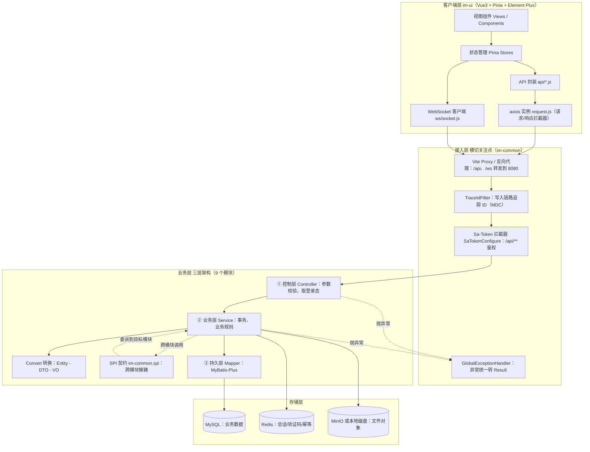
```mermaid
graph TD
    subgraph L0["客户端层 im-ui（Vue3 + Pinia + Element Plus）"]
        VIEW["视图组件 Views / Components"]
        STORE["状态管理 Pinia Stores"]
        API["API 封装 api/*.js"]
        AXIOS["axios 实例 request.js（请求/响应拦截器）"]
        SOCK["WebSocket 客户端 ws/socket.js"]
    end

    subgraph L1["接入层 横切关注点（im-common）"]
        PROXY["Vite Proxy / 反向代理：/api、/ws 转发到 8080"]
        TRACE["TraceIdFilter：写入链路追踪 ID（MDC）"]
        AUTHT["Sa-Token 拦截器 SaTokenConfigure：/api/** 鉴权"]
        EXH["GlobalExceptionHandler：异常统一转 Result"]
    end

    subgraph L2["业务层 三层架构（9 个模块）"]
        CTRL["① 控制层 Controller：参数校验、取登录态"]
        SVC["② 业务层 Service：事务、业务规则"]
        CONV["Convert 转换：Entity - DTO - VO"]
        SPIC["SPI 契约 im-common.spi：跨模块解耦"]
        MAP["③ 持久层 Mapper：MyBatis-Plus"]
    end

    subgraph L3["存储层"]
        MYSQL[("MySQL：业务数据")]
        REDIS[("Redis：会话/验证码/幂等")]
        MINIO[("MinIO 或本地磁盘：文件对象")]
    end

    VIEW --> STORE
    STORE --> API --> AXIOS
    STORE --> SOCK
    AXIOS --> PROXY
    SOCK --> PROXY
    PROXY --> TRACE --> AUTHT --> CTRL
    CTRL --> SVC
    SVC --> CONV
    SVC --> MAP
    SVC -.跨模块调用.-> SPIC
    SPIC -.委派到目标模块.-> SVC
    MAP --> MYSQL
    SVC --> REDIS
    SVC --> MINIO
    CTRL -.抛异常.-> EXH
    SVC -.抛异常.-> EXH
```

**三层职责边界**

| 层 | 组件 | 只做 | 不做 |
|---|---|---|---|
| ① 控制层 | `*Controller` | 参数校验、从 `SecurityUtil` 取登录态、包装 `Result` | 不写业务规则、不碰 SQL |
| ② 业务层 | `*ServiceImpl` | 事务、业务校验、跨模块 SPI 调用、Convert 转换 | 不解析 HTTP、不返回视图对象 |
| ③ 持久层 | `*Mapper` | MyBatis-Plus 数据访问 | 不含业务判断 |

---

## 二、HTTP 请求链路：从前端发出到拿到响应

以任意业务请求（查会话列表、发消息 REST 兜底、上传等）为例。关键约定：
**后端所有失败都返回 HTTP 200 + `Result` 体**，业务错误码放在 `code` 里，
所以前端的错误判定全在 axios 响应拦截器的「成功分支」，错误分支只处理网络问题。

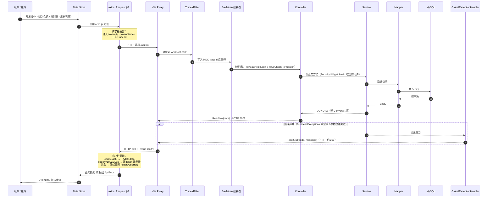
```mermaid
sequenceDiagram
    autonumber
    participant U as 用户 / 组件
    participant ST as Pinia Store
    participant AX as axios（request.js）
    participant PX as Vite Proxy
    participant TF as TraceIdFilter
    participant SA as Sa-Token 拦截器
    participant CT as Controller
    participant SV as Service
    participant MP as Mapper
    participant DB as MySQL
    participant GEH as GlobalExceptionHandler

    U->>ST: 触发操作（进入会话 / 发消息 / 刷新列表）
    ST->>AX: 调用 api/*.js 方法
    Note over AX: 请求拦截器：<br/>注入 token 头（tokenName）<br/>+ X-Trace-Id
    AX->>PX: HTTP 请求 /api/xxx
    PX->>TF: 转发到 localhost:8080
    TF->>SA: 写入 MDC traceId 后放行
    SA->>CT: 鉴权通过（@SaCheckLogin / @SaCheckPermission）
    CT->>SV: 调业务方法（SecurityUtil.getUserId 取当前用户）
    SV->>MP: 数据访问
    MP->>DB: 执行 SQL
    DB-->>MP: 结果集
    MP-->>SV: Entity
    SV-->>CT: VO / DTO（经 Convert 转换）
    CT-->>PX: Result.ok(data)（HTTP 200）

    alt 出现异常（BusinessException / 未登录 / 参数校验失败）
        SV-->>GEH: 抛出异常
        GEH-->>PX: Result.fail(code, message)（HTTP 仍 200）
    end

    PX-->>AX: HTTP 200 + Result JSON
    Note over AX: 响应拦截器：<br/>code==200 → 只返回 data<br/>code==1002/2010 → 清 token 跳登录<br/>其余 → 弹错误并 reject(ApiError)
    AX-->>ST: 业务数据 或 抛出 ApiError
    ST-->>U: 更新视图 / 提示错误
```

**要点**
- 请求头 `X-Trace-Id` 由前端生成，后端 `TraceIdFilter` 原样回写并放进 MDC，`Result.traceId`
  再带回前端——浏览器控制台与服务器日志能用同一个 ID 对上，方便排查。
- 未登录（1002）、被顶下线（2010）由响应拦截器统一跳登录页，业务代码不用各写一遍。
- 二进制下载走 `fetchBlob`：按 `Content-Type` 判别，拿到 JSON 说明失败，避免把错误体当成图片字节。

---

## 三、WebSocket 消息链路：实时收发

IM 的核心通道。连接建立走「先 HTTP 换票据、再握手」；下图以**上行 `chat` 帧**为例，
说明一条上行报文的完整形态——这条路径后端一直保留（桌面端与兜底可用），而当前 im-ui 的
文本提交走 HTTP `POST /api/message/send`，两条路径在 `MessageServiceImpl.send` 汇流，
详见[第十节](#十消息发送链路http-提交--服务端落库--ws-下行与多端同步)。
落库后由**写库的那一方**在事务提交后推送：接收方走 `message` 通道、发送方走 `ack` 通道
（推给发送者的全部设备，实现多端同步）。

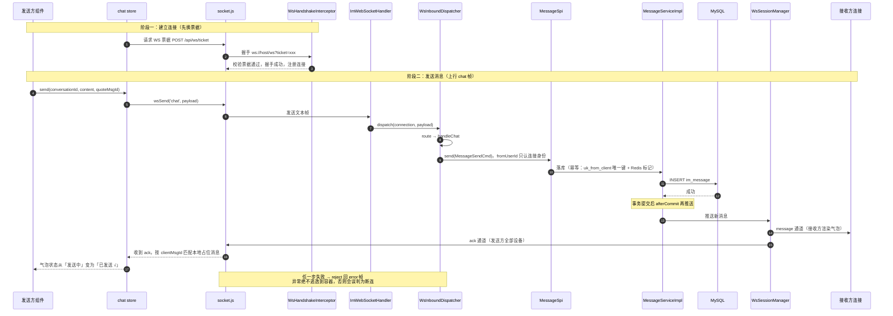
```mermaid
sequenceDiagram
    autonumber
    participant U as 发送方组件
    participant CS as chat store
    participant SK as socket.js
    participant HS as WsHandshakeInterceptor
    participant HD as ImWebSocketHandler
    participant DP as WsInboundDispatcher
    participant SPI as MessageSpi
    participant MS as MessageServiceImpl
    participant DB as MySQL
    participant SM as WsSessionManager
    participant RC as 接收方连接

    Note over U,HS: 阶段一：建立连接（先换票据）
    CS->>SK: 请求 WS 票据 POST /api/ws/ticket
    SK->>HS: 握手 ws://host/ws?ticket=xxx
    HS-->>SK: 校验票据通过，握手成功，注册连接

    Note over U,RC: 阶段二：发送消息（上行 chat 帧）
    U->>CS: send(conversationId, content, quoteMsgId)
    CS->>SK: wsSend('chat', payload)
    SK->>HD: 发送文本帧
    HD->>DP: dispatch(connection, payload)
    DP->>DP: route → handleChat
    DP->>SPI: send(MessageSendCmd)，fromUserId 只认连接身份
    SPI->>MS: 落库（幂等：uk_from_client 唯一键 + Redis 标记）
    MS->>DB: INSERT im_message
    DB-->>MS: 成功
    Note over MS: 事务提交后 afterCommit 再推送
    MS->>SM: 推送新消息
    SM->>RC: message 通道（接收方渲染气泡）
    SM->>SK: ack 通道（发送方全部设备）
    SK-->>CS: 收到 ack，按 clientMsgId 匹配本地占位消息
    CS-->>U: 气泡状态从「发送中」变为「已发送 √」

    Note over DP,SK: 任一步失败 → reject 回 error 帧<br/>异常绝不逃逸到容器，否则会误判为断连
```

**要点**
- 握手路径 `/ws` 不在 `/api/**` 下，Sa-Token 拦截器管不到，鉴权由 `WsHandshakeInterceptor`
  校验一次性票据完成。
- 发送者身份 `fromUserId` 只取连接身份（握手票据里的 userId），客户端无法伪造，是整条链路
  唯一不可被前端影响的字段。
- 上行处理的所有异常都收在 `WsInboundDispatcher.dispatch` 的 try 里翻译成 `error` 帧——
  一旦逃逸回容器，连接会被直接关闭，导致「发条空消息就掉线重连」的死循环。
- 撤回、送达、已读同样走这条长连接（`recall` / `delivered` / `read` 帧），由对应 handler 委派给 `MessageSpi`。

---

## 四、两条通道的分工

| 维度 | HTTP（REST） | WebSocket |
|---|---|---|
| 适用 | 查询、登录、文件上传、需要明确错误归因的操作 | 实时收发消息、心跳、在线状态、撤回/已读回执 |
| 鉴权 | Sa-Token 拦截器 + `@SaCheckPermission` | 握手票据（一次性、短 TTL） |
| 返回 | `Result<T>`（HTTP 200 + code 表达业务结果） | `WsPacket`（message / ack / error 帧） |
| 失败处理 | 响应拦截器统一转 `ApiError` | `dispatch` 收口转 `error` 帧，不断连 |

> 撤回等操作**刻意走 HTTP 而非 WS**：撤回有时限与权限限制，失败原因需要明确回给调用方；
> WS 的 error 帧只能靠 clientMsgId 反查，对不上时无法归因。

---

## 五、登录鉴权专项链路

登录走匿名白名单（`/api/auth/login` 等）签发 JWT token，前端存进 `localStorage`；
之后每个请求由 axios 拦截器注入 token 头，后端 Sa-Token 拦截器 + 注解鉴权。
登录态失效（1002）/ 被顶下线（2010）由响应拦截器统一清 token 并跳登录页。

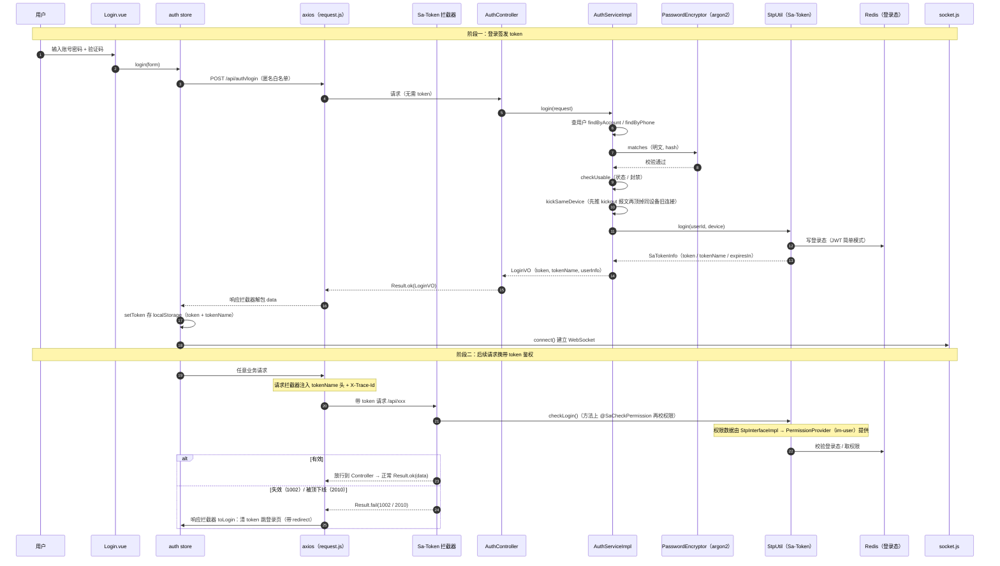
```mermaid
sequenceDiagram
    autonumber
    participant U as 用户
    participant LG as Login.vue
    participant AS as auth store
    participant AX as axios（request.js）
    participant SA as Sa-Token 拦截器
    participant AC as AuthController
    participant SV as AuthServiceImpl
    participant PE as PasswordEncryptor（argon2）
    participant STP as StpUtil（Sa-Token）
    participant RD as Redis（登录态）
    participant SK as socket.js

    Note over U,SK: 阶段一：登录签发 token
    U->>LG: 输入账号密码 + 验证码
    LG->>AS: login(form)
    AS->>AX: POST /api/auth/login（匿名白名单）
    AX->>AC: 请求（无需 token）
    AC->>SV: login(request)
    SV->>SV: 查用户 findByAccount / findByPhone
    SV->>PE: matches（明文, hash）
    PE-->>SV: 校验通过
    SV->>SV: checkUsable（状态 / 封禁）
    SV->>SV: kickSameDevice（先推 kickout 报文再顶掉同设备旧连接）
    SV->>STP: login(userId, device)
    STP->>RD: 写登录态（JWT 简单模式）
    STP-->>SV: SaTokenInfo（token / tokenName / expiresIn）
    SV-->>AC: LoginVO（token, tokenName, userInfo）
    AC-->>AX: Result.ok(LoginVO)
    AX-->>AS: 响应拦截器解包 data
    AS->>AS: setToken 存 localStorage（token + tokenName）
    AS->>SK: connect() 建立 WebSocket

    Note over U,SK: 阶段二：后续请求携带 token 鉴权
    AS->>AX: 任意业务请求
    Note over AX: 请求拦截器注入 tokenName 头 + X-Trace-Id
    AX->>SA: 带 token 请求 /api/xxx
    SA->>STP: checkLogin()（方法上 @SaCheckPermission 再校权限）
    Note over STP: 权限数据由 StpInterfaceImpl → PermissionProvider（im-user）提供
    STP->>RD: 校验登录态 / 取权限
    alt 有效
        SA-->>AX: 放行到 Controller → 正常 Result.ok(data)
    else 失效（1002）/ 被顶下线（2010）
        SA-->>AX: Result.fail(1002 / 2010)
        AX->>AS: 响应拦截器 toLogin：清 token 跳登录页（带 redirect）
    end
```

**要点**
- `tokenName` 不写死，随 `LoginVO` 下发并存本地（对应 `sa-token.token-name`），改名也不会全线 401。
- 续签 `refresh` 采用「先签发新 token、再注销旧 token」，中间无无凭证窗口（JWT 模式下过期时间写死在 token 里）。
- 同设备重复登录会顶掉旧连接：先推 `kickout` 报文让客户端收到明确原因，再注销服务端会话（顺序不能反）。

---

## 六、文件上传 / 下载专项链路

### 6.1 上传（POST /api/file/upload）

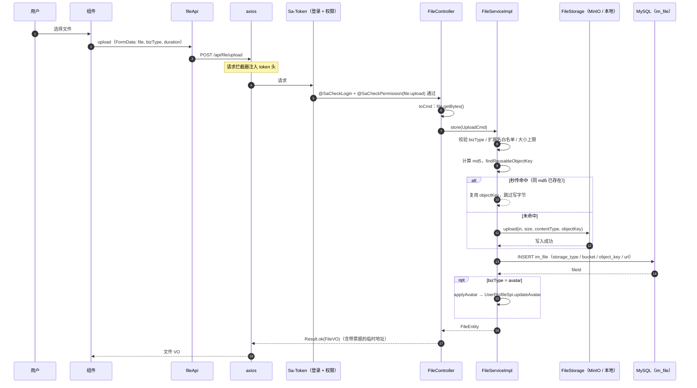
```mermaid
sequenceDiagram
    autonumber
    participant U as 用户
    participant CP as 组件
    participant FA as fileApi
    participant AX as axios
    participant SA as Sa-Token（登录 + 权限）
    participant FC as FileController
    participant FS as FileServiceImpl
    participant ST as FileStorage（MinIO / 本地）
    participant DB as MySQL（im_file）

    U->>CP: 选择文件
    CP->>FA: upload（FormData: file, bizType, duration）
    FA->>AX: POST /api/file/upload
    Note over AX: 请求拦截器注入 token 头
    AX->>SA: 请求
    SA->>FC: @SaCheckLogin + @SaCheckPermission(file:upload) 通过
    FC->>FC: toCmd：file.getBytes()
    FC->>FS: store(UploadCmd)
    FS->>FS: 校验 bizType / 扩展名白名单 / 大小上限
    FS->>FS: 计算 md5，findReusableObjectKey
    alt 秒传命中（同 md5 已存在）
        FS-->>FS: 复用 objectKey，跳过写字节
    else 未命中
        FS->>ST: upload(in, size, contentType, objectKey)
        ST-->>FS: 写入成功
    end
    FS->>DB: INSERT im_file（storage_type / bucket / object_key / url）
    DB-->>FS: fileId
    opt bizType = avatar
        FS->>FS: applyAvatar → UserProfileSpi.updateAvatar
    end
    FS-->>FC: FileEntity
    FC-->>AX: Result.ok(FileVO)（含带票据的临时地址）
    AX-->>CP: 文件 VO
```

**要点**
- 存储顺序是「先写字节、再写元数据」：反过来会出现「记录已存在但对象不在」的永久坏死记录。
- md5 秒传：相同文件不重复写存储，但 md5 由服务端重算，忽略客户端上报值（防止谎报让两个文件指向同一对象）。
- `store` 刻意不加 `@Transactional`：写字节是可能持续数秒的 I/O，包进事务会占着数据库连接，并发上传时抽干连接池。

### 6.2 下载（GET /api/file/download/{id}）

浏览器渲染 `` / `<audio src>` / `<a download>` 时**带不上自定义请求头**，
而项目又关掉了 Sa-Token 的 Cookie 读取（防 CSRF），因此下载改用 **URL 上的短时 JWT 票据**认证。

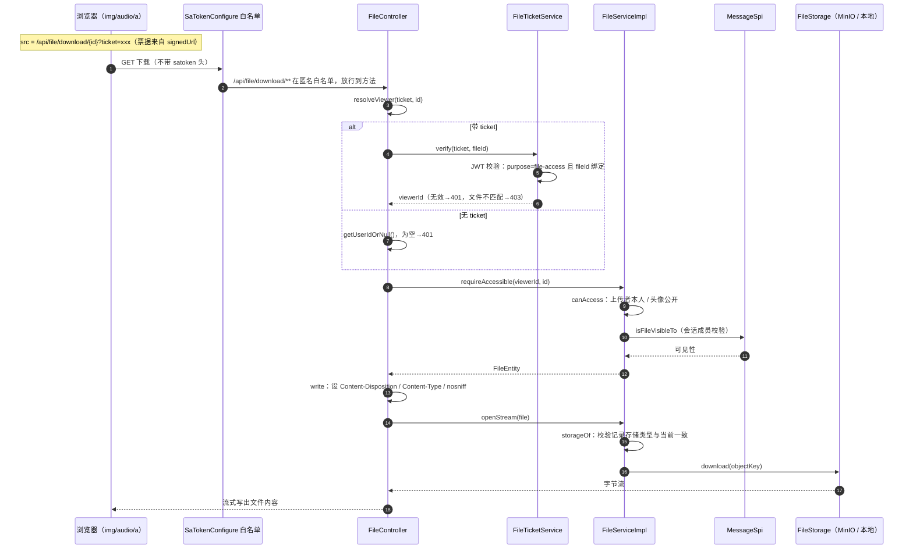
```mermaid
sequenceDiagram
    autonumber
    participant BR as 浏览器（img/audio/a）
    participant WH as SaTokenConfigure 白名单
    participant FC as FileController
    participant TS as FileTicketService
    participant FS as FileServiceImpl
    participant MS as MessageSpi
    participant ST as FileStorage（MinIO / 本地）

    Note over BR: src = /api/file/download/{id}?ticket=xxx（票据来自 signedUrl）
    BR->>WH: GET 下载（不带 satoken 头）
    WH->>FC: /api/file/download/** 在匿名白名单，放行到方法
    FC->>FC: resolveViewer(ticket, id)
    alt 带 ticket
        FC->>TS: verify(ticket, fileId)
        TS->>TS: JWT 校验：purpose=file-access 且 fileId 绑定
        TS-->>FC: viewerId（无效→401，文件不匹配→403）
    else 无 ticket
        FC->>FC: getUserIdOrNull()，为空→401
    end
    FC->>FS: requireAccessible(viewerId, id)
    FS->>FS: canAccess：上传者本人 / 头像公开
    FS->>MS: isFileVisibleTo（会话成员校验）
    MS-->>FS: 可见性
    FS-->>FC: FileEntity
    FC->>FC: write：设 Content-Disposition / Content-Type / nosniff
    FC->>FS: openStream(file)
    FS->>FS: storageOf：校验记录存储类型与当前一致
    FS->>ST: download(objectKey)
    ST-->>FC: 字节流
    FC-->>BR: 流式写出文件内容
```

**要点**
- 票据与文件 ID 绑定，一张票据只能取一个文件；带 `purpose=file-access` 标识，防止 WS 握手票据被挪用来下载。
- 票据优先于登录头：URL 可能来自另一台设备的分享，票据里写的才是被授权的人。
- 鉴权全部发生在写第一个字节之前，失败时响应未提交，全局异常处理器照样能返回标准 JSON 错误体。
- **预签名直链模式**（`im.file.use-presigned-url=true`）：`temporaryUrl` 直接返回 MinIO 预签名 URL，浏览器绕过应用服务器直连 MinIO（适用于桶可控、需给后端/CDN 减压的场景）。

---

## 七、远程控制链路：控制面授权 + 数据面双通道

三个角色：**被控端 Agent**（`im-remote-agent`，独立 Java 桌面程序，带 Swing 授权弹窗）、
**控制端**（`im-ui` 的 `Remote.vue`，浏览器与 Electron 桌面端同一套代码）、**服务端**（`im-remote`）。
控制面是极薄的 REST 加 Agent 常驻 WS；数据面是两条**专用** WS：`/ws/remote/agent`、`/ws/remote/control`。
不复用聊天 `/ws` 的原因：屏幕块是几十 KB 的二进制，发送缓冲区、心跳节奏、凭证校验方式与 JSON 信令完全不同。

### 7.1 控制面：Agent 上线 → 邀请 → 人工授权 → 轮询取凭证

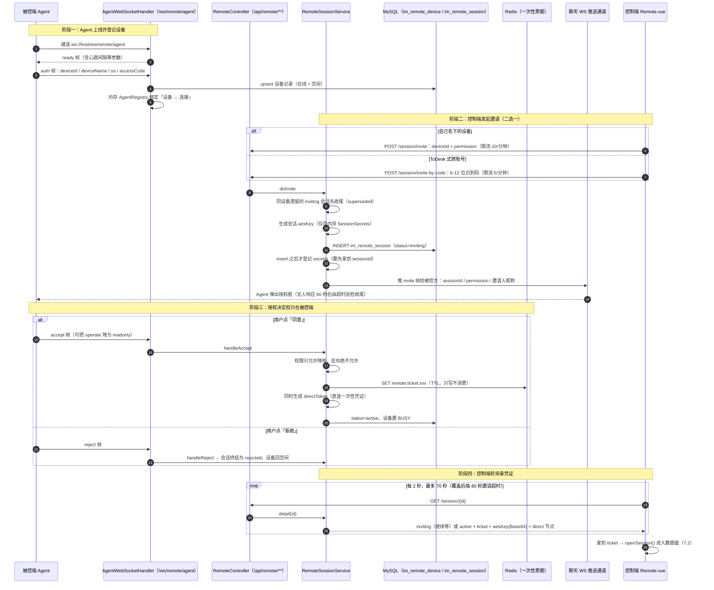
```mermaid
sequenceDiagram
    autonumber
    participant AG as 被控端 Agent
    participant AW as AgentWebSocketHandler（/ws/remote/agent）
    participant RC as RemoteController（/api/remote/**）
    participant SS as RemoteSessionService
    participant DB as MySQL（im_remote_device / im_remote_session）
    participant RD as Redis（一次性票据）
    participant PU as 聊天 WS 推送通道
    participant CV as 控制端 Remote.vue

    Note over AG,AW: 阶段一：Agent 上线并登记设备
    AG->>AW: 建连 ws://host/ws/remote/agent
    AW-->>AG: ready 帧（含心跳间隔等参数）
    AG->>AW: auth 帧：deviceId / deviceName / os / accessCode
    AW->>DB: upsert 设备记录（在线 + 空闲）
    AW->>AW: 内存 AgentRegistry 绑定「设备 ↔ 连接」

    Note over CV,SS: 阶段二：控制端发起邀请（二选一）
    alt 自己名下的设备
        CV->>RC: POST /session/invite：deviceId + permission（限流 10/分钟）
    else ToDesk 式跨账号
        CV->>RC: POST /session/invite-by-code：6-12 位识别码（限流 5/分钟）
    end
    RC->>SS: doInvite
    SS->>SS: 同设备遗留的 inviting 会话先收尾（superseded）
    SS->>SS: 生成会话 aesKey（仅存内存 SessionSecrets）
    SS->>DB: INSERT im_remote_session（status=inviting）
    SS->>SS: insert 之后才登记 secrets（要先拿到 sessionId）
    SS->>PU: 推 invite 帧给被控方：sessionId / permission / 邀请人昵称
    PU-->>AG: Agent 弹出授权框（无人响应 60 秒后由超时巡检收尾）

    Note over AG,RD: 阶段三：授权决定权只在被控端
    alt 用户点「同意」
        AG->>AW: accept 帧（可把 operate 降为 readonly）
        AW->>SS: handleAccept
        SS->>SS: 权限只允许降档，反向绝不允许
        SS->>RD: SET remote:ticket:xxx（TTL，只写不消费）
        SS->>SS: 同时生成 directToken（直连一次性凭证）
        SS->>DB: status=active、设备置 BUSY
    else 用户点「拒绝」
        AG->>AW: reject 帧
        AW->>SS: handleReject → 会话终结为 rejected，设备回空闲
    end

    Note over CV,SS: 阶段四：控制端轮询拿凭证
    loop 每 2 秒，最多 70 秒（覆盖后端 60 秒邀请超时）
        CV->>RC: GET /session/{id}
        RC->>SS: detail(id)
        SS-->>CV: inviting（继续等）或 active + ticket + aesKey(Base64) + direct 节点
    end
    CV->>CV: 拿到 ticket → openSession() 进入数据面（7.2）
```

**要点**
- `aesKey` **不落库也不进 Redis**：只存在于服务端内存与 `session-start` 帧里。数据库被拖库也拿不到会话明文密钥。
- ticket 的生成与消费刻意分离：生成时只写 Redis，真正消费在控制端首帧 `control-ready`。握手即消费会让一次失败连接（代理截断、页面刷新）烧掉一整轮人工授权。
- 跨账号邀请的错误文案合并了「不在线」与「识别码错误」，避免被人拿码表枚举探测。
- 控制端用轮询而非推送取凭证：2 秒 × 70 秒的代价极低，换来状态机始终以服务端为准，多开标签也不会漏状态。
- `detail` 里的流量字节从内存 `Binding` 实时取，不查库——会话结束前库里的计数总是滞后的。

### 7.2 数据面：票据消费 → 会话绑定 → 直连阶梯 → 帧中继与记账

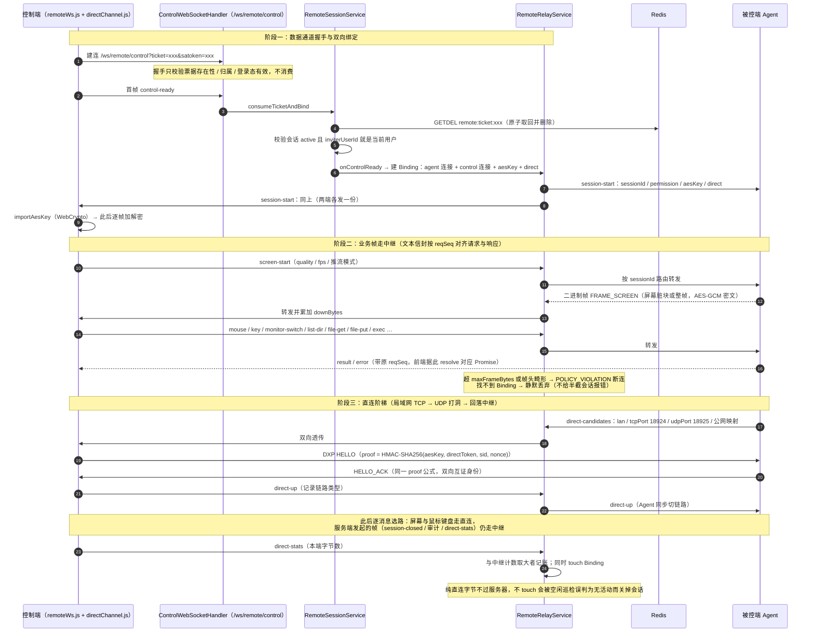
```mermaid
sequenceDiagram
    autonumber
    participant CV as 控制端（remoteWs.js + directChannel.js）
    participant CW as ControlWebSocketHandler（/ws/remote/control）
    participant SS as RemoteSessionService
    participant RL as RemoteRelayService
    participant RD as Redis
    participant AG as 被控端 Agent

    Note over CV,RL: 阶段一：数据通道握手与双向绑定
    CV->>CW: 建连 /ws/remote/control?ticket=xxx&satoken=xxx
    Note over CW: 握手只校验票据存在性 / 归属 / 登录态有效，不消费
    CV->>CW: 首帧 control-ready
    CW->>SS: consumeTicketAndBind
    SS->>RD: GETDEL remote:ticket:xxx（原子取回并删除）
    SS->>SS: 校验会话 active 且 inviterUserId 就是当前用户
    SS->>RL: onControlReady → 建 Binding：agent 连接 + control 连接 + aesKey + direct
    RL->>AG: session-start：sessionId / permission / aesKey / direct
    RL->>CV: session-start：同上（两端各发一份）
    CV->>CV: importAesKey（WebCrypto）→ 此后逐帧加解密

    Note over CV,AG: 阶段二：业务帧走中继（文本信封按 reqSeq 对齐请求与响应）
    CV->>RL: screen-start（quality / fps / 推流模式）
    RL->>AG: 按 sessionId 路由转发
    AG-->>RL: 二进制帧 FRAME_SCREEN（屏幕脏块或整帧，AES-GCM 密文）
    RL->>CV: 转发并累加 downBytes
    CV->>RL: mouse / key / monitor-switch / list-dir / file-get / file-put / exec …
    RL->>AG: 转发
    AG-->>CV: result / error（带原 reqSeq，前端据此 resolve 对应 Promise）
    Note over RL: 超 maxFrameBytes 或帧头畸形 → POLICY_VIOLATION 断连<br/>找不到 Binding → 静默丢弃（不给半截会话报错）

    Note over CV,AG: 阶段三：直连阶梯（局域网 TCP → UDP 打洞 → 回落中继）
    AG->>RL: direct-candidates：lan / tcpPort 18924 / udpPort 18925 / 公网映射
    RL->>CV: 双向透传
    CV->>AG: DXP HELLO（proof = HMAC-SHA256(aesKey, directToken, sid, nonce)）
    AG->>CV: HELLO_ACK（同一 proof 公式，双向互证身份）
    CV->>RL: direct-up（记录链路类型）
    RL->>AG: direct-up（Agent 同步切链路）
    Note over CV,AG: 此后逐消息选路：屏幕与鼠标键盘走直连，<br/>服务端发起的帧（session-closed / 审计 / direct-stats）仍走中继
    CV->>RL: direct-stats（本端字节数）
    RL->>RL: 与中继计数取大者记账；同时 touch Binding
    Note over RL: 纯直连字节不过服务器，不 touch 会被空闲巡检误判为无活动而关掉会话
```

**要点**
- 三种凭证各管一段，互不替换：`ticket` 管「控制端能否接入这个会话」（Redis、一次性），`aesKey` 管「会话内字节加密」，`directToken` 管「直连对端是不是同一会话的另一端」。
- 直连是**尽力而为的加速**而不是必需路径：任何一档失败只做 `linkPath='relay'` 加一行日志，用户永远看不到报错；强制中继 / 仅局域网由工具栏 `directMode` 控制，用于打洞异常时排除变量。
- 直连握手用「一次性 token + 会话密钥的 HMAC」而非明文 token：token 泄露也无法伪造，且 `dxp.js` 的 proof 里带 nonce，重放无效。
- 与聊天 WS 的关系仅在于复用登录态：远程控制的两条 WS 各自有独立握手拦截器，`satoken` 只是握手期校验身份用，业务凭证是 ticket。
- 敏感操作（`file-rm` / `file-rename` / `file-mkdir` / `file-get` / `file-put` / `ps-kill` / `ps-run` / `exec` / `power` / `clip-sync` / 输入拦截）全部落 `im_remote_audit_log`，只增不改不删；每条带 `actor` 标明触发方（`inviter` 控制端 / `invitee` 被控端 Agent / `system` 服务端流程事件）——超时巡检、对端掉线、被新邀请顶替这类系统收尾记 `system`，不往任何用户头上安。`GET /session/{id}/audit` 可按 `action` 模糊过滤，前端把 detail 解析成键值对（裸命令文本不拆）并支持导出 CSV。
- `GET /session/page` 返回的不是裸实体而是补齐过的展示视图（`RemoteSessionVO`）：设备名（批量查 `im_remote_device`）、我的角色、对端昵称（批量走 `UserQuerySpi`）、时长、平均码率、审计条数都在一次分页里算完，列表不逐行回查；进行中会话的流量从内存绑定取实时值，库里那一行到收尾才写。

### 7.3 录屏审计：画面取流 → 分片串行落盘 → sidecar（仅桌面端，全程不经过服务端）

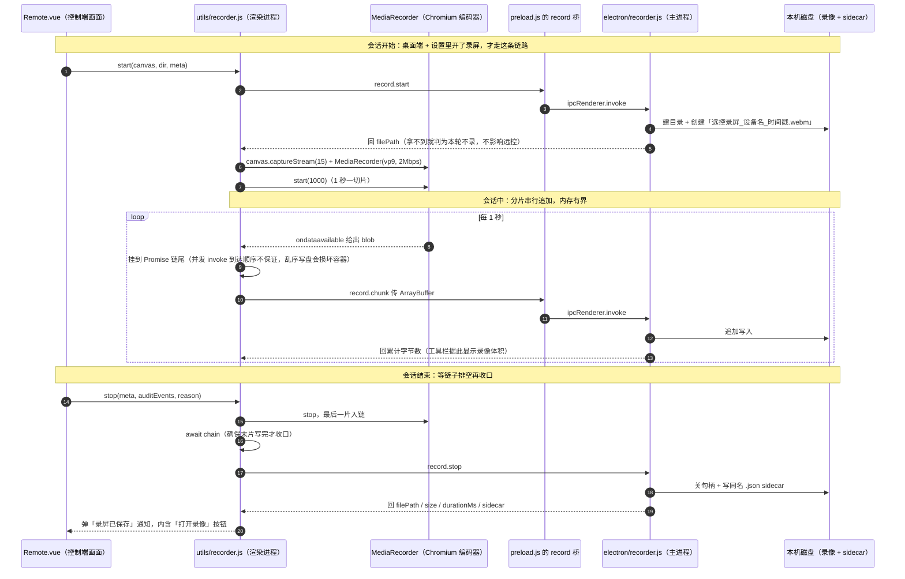
```mermaid
sequenceDiagram
    autonumber
    participant RM as Remote.vue（控制端画面）
    participant RU as utils/recorder.js（渲染进程）
    participant MR as MediaRecorder（Chromium 编码器）
    participant PB as preload.js 的 record 桥
    participant RC as electron/recorder.js（主进程）
    participant FS as 本机磁盘（录像 + sidecar）

    Note over RM,FS: 会话开始：桌面端 + 设置里开了录屏，才走这条链路
    RM->>RU: start(canvas, dir, meta)
    RU->>PB: record.start
    PB->>RC: ipcRenderer.invoke
    RC->>FS: 建目录 + 创建「远控录屏_设备名_时间戳.webm」
    RC-->>RU: 回 filePath（拿不到就判为本轮不录，不影响远控）
    RU->>MR: canvas.captureStream(15) + MediaRecorder(vp9, 2Mbps)
    RU->>MR: start(1000)（1 秒一切片）

    Note over RU,FS: 会话中：分片串行追加，内存有界
    loop 每 1 秒
        MR-->>RU: ondataavailable 给出 blob
        RU->>RU: 挂到 Promise 链尾（并发 invoke 到达顺序不保证，乱序写盘会损坏容器）
        RU->>PB: record.chunk 传 ArrayBuffer
        PB->>RC: ipcRenderer.invoke
        RC->>FS: 追加写入
        RC-->>RU: 回累计字节数（工具栏据此显示录像体积）
    end

    Note over RM,FS: 会话结束：等链子排空再收口
    RM->>RU: stop(meta, auditEvents, reason)
    RU->>MR: stop，最后一片入链
    RU->>RU: await chain（确保末片写完才收口）
    RU->>RC: record.stop
    RC->>FS: 关句柄 + 写同名 .json sidecar
    RC-->>RU: 回 filePath / size / durationMs / sidecar
    RU-->>RM: 弹「录屏已保存」通知，内含「打开录像」按钮
```

**要点**
- 采集点选 canvas 而不是录窗口：中继的 JPEG 脏块与直连的 H.264 整帧最终都画到同一块 canvas 上，这是唯一能覆盖全部链路的取流位置；`desktopCapturer` 要弹系统级屏幕共享授权，还会把工具栏、侧边栏一起录进去。
- 只用 WebM 不用 MP4：实测 Chromium 的 MP4 muxer 不按 timeslice 吐片，整段攒到 `stop()` 才一次性给出（6 秒录像的 1.27MB 全在最后一刻到达），与「分片到了就追加写盘」直接冲突——两小时会话按 2Mbps 算要在渲染进程堆 ~1.8GB。WebM 每秒稳定吐一片，vp9 优先（1920x1080@15 下比 vp8 小 43% 且不丢帧）。代价是 `.webm` 不能用 Windows 自带播放器直接打开。
- 录制是旁路能力：取流失败、编码器报错、写盘失败一律收敛成一次 `onError` + 工具栏红点消失，绝不往外抛；画面未就绪（canvas 宽高为 0）直接判为本轮不录，不打扰用户。
- sidecar 与录像同名同目录，存会话元信息（sessionId / 设备名 / 权限 / 链路类型 / 编码 / 操作者 / 起止时间）与本次会话的敏感操作审计快照。录像证明「看到了什么」，sidecar 才回答「谁在什么时候对哪台机器做了什么」。
- 与服务端审计的分工：录像只落本机磁盘、不上传，跨端可查的审计源仍是 `im_remote_audit_log`；两者互补，前者是操作者本地的举证材料，后者是企业侧的统一台账。
- 浏览器端整体禁用：Web 部署没有 preload，`recordSupported()` 返回 false，设置页三个控件置灰，会话里也不会启动录制。
- 「打开录像」入口挂在结束通知上而不是工具栏：会话一收尾 `session` 就置空，工作区连同工具栏一起卸载，而「录完马上去看」恰恰是最常见的动作（手动停录、会话继续时工具栏也留一个同样入口）。按钮走主进程 `shell.showItemInFolder` 直接选中文件，文件已被移走则退回开目录。

---

## 八、AI 面试官链路：BM25 检索增强 + SSE 流式

`im-ai` 提供逐 token 流式的面试对话。三个关键选型：**SSE 而不是 WebSocket**（一问一答的单向流，
不需要双向）、**BM25 而不是向量库**（知识库是几百个 `.md`/`.txt`，引向量检索纯属给自己加依赖）、
**`fetch + ReadableStream` 而不是 axios/EventSource**（axios 要等整个响应体收完才回调，
EventSource 只支持 GET 且带不了自定义请求头）。

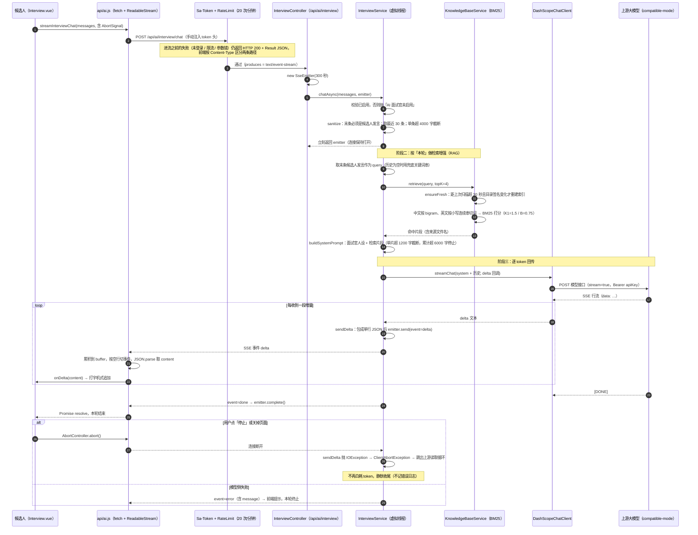
```mermaid
sequenceDiagram
    autonumber
    participant U as 候选人（Interview.vue）
    participant AJ as api/ai.js（fetch + ReadableStream）
    participant SA as Sa-Token + RateLimit（20 次/分钟）
    participant IC as InterviewController（/api/ai/interview）
    participant IS as InterviewService（虚拟线程）
    participant KB as KnowledgeBaseService（BM25）
    participant DC as DashScopeChatClient
    participant LLM as 上游大模型（compatible-mode）

    U->>AJ: streamInterviewChat(messages, 含 AbortSignal)
    AJ->>SA: POST /api/ai/interview/chat（手动注入 token 头）
    Note over SA: 进流之前的失败（未登录 / 限流 / 参数错）仍返回 HTTP 200 + Result JSON，<br/>前端按 Content-Type 区分两条路径
    SA->>IC: 通过（produces = text/event-stream）
    IC->>IC: new SseEmitter(300 秒)
    IC->>IS: chatAsync(messages, emitter)
    IS->>IS: 校验已启用，否则抛「AI 面试官未启用」
    IS->>IS: sanitize：末条必须是候选人发言；取最近 30 条；单条超 4000 字截断
    IS-->>IC: 立刻返回 emitter（连接保持打开）

    Note over IS,KB: 阶段二：按「本轮」做检索增强（RAG）
    IS->>IS: 取末条候选人发言作为 query（历史为空时用兜底关键词串）
    IS->>KB: retrieve(query, topK=4)
    KB->>KB: ensureFresh：距上次扫描超 30 秒且目录签名变化才重建索引
    KB->>KB: 中文按 bigram、英文按小写连续串切词 → BM25 打分（K1=1.5 / B=0.75）
    KB-->>IS: 命中片段（含来源文件名）
    IS->>IS: buildSystemPrompt：面试官人设 + 检索片段（单片超 1200 字截断，累计超 6000 字停止）

    Note over IS,LLM: 阶段三：逐 token 回传
    IS->>DC: streamChat(system + 历史, delta 回调)
    DC->>LLM: POST 模型接口（stream=true，Bearer apiKey）
    LLM-->>DC: SSE 行流（data: …）
    loop 每收到一段增量
        DC-->>IS: delta 文本
        IS->>IS: sendDelta：包成单行 JSON 后 emitter.send(event=delta)
        IS-->>AJ: SSE 事件 delta
        AJ->>AJ: 累积到 buffer，按空行切事件，JSON.parse 取 content
        AJ->>U: onDelta(content) → 打字机式追加
    end
    LLM-->>DC: [DONE]
    IS-->>AJ: event=done → emitter.complete()
    AJ-->>U: Promise resolve，本轮结束

    alt 用户点「停止」或关掉页面
        U->>AJ: AbortController.abort()
        AJ-->>IS: 连接断开
        IS->>IS: sendDelta 抛 IOException → ClientAbortException → 跳出上游读取循环
        Note over IS: 不再白耗 token，静默收尾（不记错误日志）
    else 模型侧失败
        IS-->>AJ: event=error（含 message）→ 前端提示，本轮终止
    end
```

**要点**
- 参数校验在调用线程做完再进虚拟线程：进线程池后 Servlet 上下文就没了，`@RateLimit`、鉴权、异常翻译都必须已在身后。
- 检索**按轮进行**而不是会话级一次性：面试是逐题深挖，每轮都按当前候选人发言重新取片段，才不会问了三道题还拿着第一题的资料。
- 增量必须包成单行 JSON：SSE 的 `data` 按行拆分，裸文本里的换行会被前端误判成多个事件。
- 索引是 `volatile` 不可变快照，重建时整体替换，读侧无锁；目录签名是「文件名 + 大小 + 修改时间」排序拼接，改一个文件就能感知。
- 上游客户端不引官方 SDK，用 JDK `HttpClient` + `BodyHandlers.ofLines()` 自己解 `data:` 行——一条 SSE 协议两条链路，少一个重型依赖。
- `apiKey` 为空时 `status` 接口返回 `apiKeyConfigured=false`，前端状态条直接说明原因，而不是等对话报 500。

---

## 九、文件发送链路：添加到待发送 → 智能上传 → 附件消息

聊天里的图片 / 语音 / 文件都是**两步**：先把字节传到 `im-file` 拿到 `fileId`，再发一条
`content` 为 `fileId` 的附件消息（`MsgType` 的 IMAGE / VOICE / FILE 三种，落库结构一致）。
选择文件或粘贴后先进「待发送」托盘，由用户手动点发送才真正上传，而不是 `change` 事件里直接发。

### 9.1 上传（单请求与分片双轨）

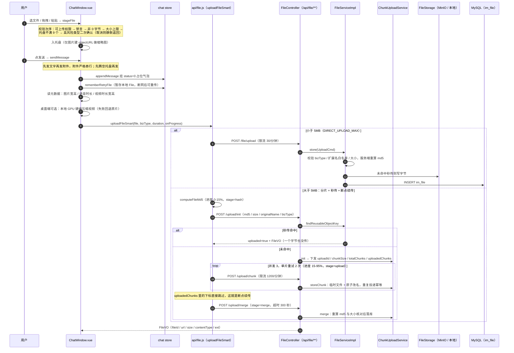
```mermaid
sequenceDiagram
    autonumber
    participant U as 用户
    participant CW as ChatWindow.vue
    participant CS as chat store
    participant FJ as api/file.js（uploadFileSmart）
    participant FC as FileController（/api/file/**）
    participant FS as FileServiceImpl
    participant CU as ChunkUploadService
    participant ST as FileStorage（MinIO / 本地）
    participant DB as MySQL（im_file）

    U->>CW: 选文件 / 拖拽 / 粘贴 → stageFile
    Note over CW: 校验次序：可上传权限 → 禁言 → 非 0 字节 → 大小上限 →<br/>托盘不满 9 个 → 高风险类型二次确认（取消则静默返回）
    CW->>CW: 入托盘（仅图片建 objectURL 做缩略图）
    U->>CW: 点发送 → sendMessage
    Note over CW: 先发文字再发附件，附件严格串行；先腾空托盘再发

    CW->>CS: appendMessage 挂 status=0 占位气泡
    CW->>CS: rememberRetryFile（暂存本地 File，断网后可重传）
    CW->>CW: 读元数据：图片宽高 / 语音时长 / 视频时长宽高
    CW->>CW: 桌面端可选：本地 GPU 硬编压缩视频（失败回退原片）
    CW->>FJ: uploadFileSmart(file, bizType, duration, onProgress)

    alt 小于 5MB（DIRECT_UPLOAD_MAX）
        FJ->>FC: POST /file/upload（限流 30/分钟）
        FC->>FS: store(UploadCmd)
        FS->>FS: 校验 bizType / 扩展名白名单 / 大小，服务端重算 md5
        FS->>ST: 未命中秒传则写字节
        FS->>DB: INSERT im_file
    else 大于 5MB：分片 + 秒传 + 断点续传
        FJ->>FJ: computeFileMd5（进度 0-15%，stage=hash）
        FJ->>FC: POST /upload/init（md5 / size / originalName / bizType）
        FC->>FS: findReusableObjectKey
        alt 秒传命中
            FS-->>FJ: uploaded=true + FileVO（一个字节也没传）
        else 未命中
            FC->>CU: init → 下发 uploadId / chunkSize / totalChunks / uploadedChunks
            loop 并发 3，单片重试 2 次（进度 15-95%，stage=upload）
                FJ->>FC: POST /upload/chunk（限流 1200/分钟）
                FC->>CU: storeChunk：临时文件 + 原子改名，重复投递幂等
            end
            Note over FJ: uploadedChunks 里的下标直接跳过，这就是断点续传
            FJ->>FC: POST /upload/merge（stage=merge，超时 300 秒）
            FC->>CU: merge：重算 md5 与大小核对后落库
        end
    end
    FC-->>CW: FileVO（fileId / url / size / contentType / ext）
```

**要点**
- 小文件走单请求、大文件才开分片：为一个 200KB 的图片算一遍全文件 MD5 再多两次往返，是负优化。
- 进度分段（hash 0-15 / upload 15-95 / merge 96 / instant 100）与 `stage` 一起上报，UI 才能区分「正在计算 / 正在上传 / 合并中 / 秒传」。
- md5 由**服务端重算**，客户端上报值只当提示；merge 时再核对一次，防谎报 md5 让两个文件指向同一个对象。
- `store` 不加 `@Transactional`（写字节可能持续数秒，包进事务会占死数据库连接），顺序是「先写字节、再写元数据」。
- 上传链路全部 `silent: true`：失败由占位气泡与重发机制呈现，不弹全局 toast。

### 9.2 附件消息落库与接收端渲染

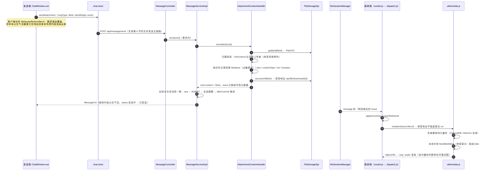
```mermaid
sequenceDiagram
    autonumber
    participant CW as 发送端 ChatWindow.vue
    participant CS as chat store
    participant MC as MessageController
    participant MS as MessageServiceImpl
    participant AH as AttachmentContentHandler
    participant FSPI as FileStorageSpi
    participant SM as WsSessionManager
    participant RW as 接收端（socket.js → dispatch.js）
    participant MD as utils/media.js

    CW->>CS: sendAttachment（msgType, fileId, clientMsgId, extra）
    Note over CW: 客户端也传 fileName/fileSize/fileUrl：服务端会覆盖，<br/>但本地占位气泡要靠它在响应回来前先把内容渲染出来
    CS->>MC: POST /api/message/send（复用第十节的文本发送主链路）
    MC->>MS: send(cmd)（事务内）
    MS->>AH: normalize(cmd)
    AH->>FSPI: getById(fileId) → FileDTO
    AH->>AH: 归属校验：fromUserId 必须是上传者（转发场景例外）
    AH->>AH: 按文件记录回填 fileName（过敏感词）/ size / contentType / ext / duration
    AH->>FSPI: accessUrl(fileId) → 受控地址 /api/file/download/{id}
    AH-->>MS: cmd.content = fileId，extra 已换成可信元数据
    MS->>MS: 后续与文本消息一致：seq → INSERT → 会话摘要 → afterCommit 推送
    MS-->>CW: MessageVO（就地升级占位气泡，status 发送中 → 已发送）
    SM-->>RW: message 帧（带回填后的 extra）
    RW->>RW: applyIncoming + reportDelivered
    RW->>MD: mediaUrl(extra.fileUrl) → 受控地址不能直接当 src
    MD->>MD: 先查媒体持久缓存（IndexedDB / Electron 目录）
    MD->>MD: 未命中则 fetchBlobMeta（带登录头）取成 blob
    MD-->>RW: objectURL → img / audio 渲染（命中缓存时断网也可看旧图）
```

**要点**
- **不信客户端**是这一节的核心：`normalize` 按 `fileId` 回查并覆盖全部元数据。客户端可以把 `fileSize` 报成 1KB 污染展示，也可以把别人的 `fileId` 填进来越权广播——两者都由服务端按真值覆盖。
- 文件名必须在这里过敏感词：上传接口不碰内容只存原名，不在这里遮蔽，“发个带脏字文件名的文件”就能绕过整条过滤链。
- 存的是**受控地址**而不是预签名直链：预签名 1800 秒后失效，长会话里翻旧图会集体裂掉；受控地址长期有效，且每次访问会再校验一次会话成员身份。
- 接收端渲染走 blob 而不是直接 `src`：`` 带不上 `satoken` 头，直接用受控地址必然 401（详见 6.2）。
- 上传成功后 `forgetRetryFile` 释本地字节：文件已在服务器上，后续失败由离线队列与手动重发接管（不必再传一遍）。

---

## 十、消息发送链路：HTTP 提交 + 服务端落库 + WS 下行与多端同步

当前 im-ui 的**提交走 HTTP**、**接收与回执走 WS**。拆开的原因很实际：发送失败需要明确归因
（被拉黑 / 禁言 / 无权限），HTTP 的 `Result.code` 能直接给到调用方；而 WS 的 `error` 帧只能靠
`clientMsgId` 反查，对不上时无法归因。两条路径最终都在 `MessageServiceImpl.send` 汇流。

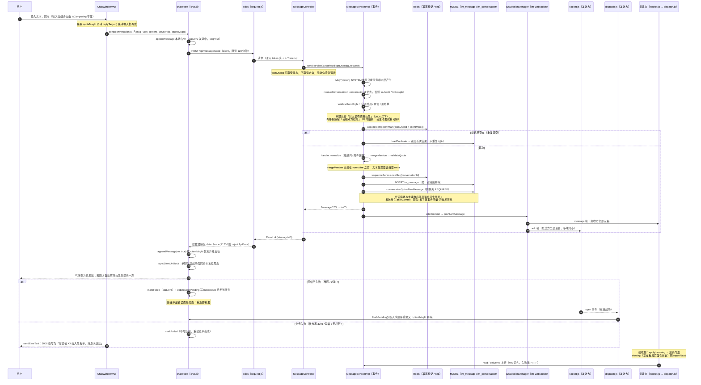
```mermaid
sequenceDiagram
    autonumber
    participant U as 用户
    participant CW as ChatWindow.vue
    participant CS as chat store（chat.js）
    participant AX as axios（request.js）
    participant MC as MessageController
    participant MS as MessageServiceImpl（事务）
    participant RD as Redis（幂等标记 / seq）
    participant DB as MySQL（im_message / im_conversation）
    participant SM as WsSessionManager（im-websocket）
    participant SK as socket.js（发送方）
    participant DP as dispatch.js（发送方）
    participant RC as 接收方（socket.js → dispatch.js）

    U->>CW: 输入文本，回车（输入法组合态由 isComposing 守住）
    Note over CW: 先取 quoteMsgId 再清 replyTarget；先清输入框再发
    CW->>CS: send(conversationId, 含 msgType / content / atUserIds / quoteMsgId)
    CS->>CS: appendMessage 本地占位（status=0 发送中，seq=null）
    CS->>AX: POST /api/message/send（silent，限流 120/分钟）
    AX->>MC: 请求（注入 token 头 + X-Trace-Id）
    MC->>MS: sendForView(SecurityUtil.getUserId(), request)
    Note over MC: fromUserId 只取登录态，不取请求体，无法伪造发送者

    MS->>MS: MsgType.of；SYSTEM 类型只能服务端内部产生
    MS->>MS: resolveConversation：conversationId 优先，否则 toUserId / toGroupId
    MS->>MS: validateSendRight：会话成员 / 禁言 / 黑名单
    Note over MS: 单聊先查「对方是否把我拉黑」（3006 拦下）；<br/>再静默解除「我把对方拉黑」（单向阻断：我主动发就算和解）
    MS->>RD: acquireIdempotentMark(fromUserId + clientMsgId)
    alt 标记已存在（重复提交）
        MS->>DB: loadDuplicate → 返回首次结果（不重复入库）
    else 首次
        MS->>MS: handler.normalize（敏感词 / 附件回填）→ mergeMention → validateQuote
        Note over MS: mergeMention 必须在 normalize 之后：文本处理器会清空 extra
        MS->>RD: sequenceService.nextSeq(conversationId)
        MS->>DB: INSERT im_message（唯一键兜底幂等）
        MS->>DB: conversationSpi.onNewMessage（同事务 REQUIRED）
        Note over MS,DB: 会话摘要与未读数必须和消息同生共死；<br/>推送放在 afterCommit，避免“推了但事务回滚”的幽灵消息
        MS-->>MC: MessageDTO → toVO
        MS->>SM: afterCommit → pushNewMessage
        SM->>RC: message 帧（接收方全部设备）
        SM->>SK: ack 帧（发送方全部设备，多端同步）
    end
    MC-->>AX: Result.ok(MessageVO)
    AX-->>CS: 拦截器解包 data（code 非 200 则 reject ApiError）
    CS->>CS: appendMessage(vo, true) 按 clientMsgId 就地升级占位
    CS->>CS: syncSilentUnblock：单聊发送成功后同步本地拉黑态
    CS-->>U: 气泡变为已发送；若刚才自动解除拉黑则提示一声

    alt 网络层失败（断网 / 超时）
        CS->>CS: markFailed（status=5）+ dbEnqueuePending 写 IndexedDB 待发送队列
        Note over CS: 断连不是错误而是常态：重连即补发
        SK-->>DP: open 事件（重连成功）
        DP->>CS: flushPending() 按入队顺序重提交（clientMsgId 幂等）
    else 业务失败（被拉黑 3006 / 禁言 / 无权限）
        CS->>CS: markFailed（不写队列，重试也不会成）
        CW-->>U: sendErrorText：3006 改写为「你已被 XX 拉入黑名单，消息未送达」
    end

    Note over RC: 接收侧：applyIncoming → 渲染气泡<br/>viewing（正在看且页面在前台）则 reportRead
    RC->>MS: read / delivered 上行（WS 优先，失败退 HTTP）
```

**要点**
- **幂等三重设防**：Redis 标记（快速拦截）+ `uk_from_client` 唯一键（兼底 Redis 过期）+ `DuplicateKeyException` 后回查首次结果。断网重发、离线队列重提交、用户双击发送都不会多入库。
- 失败分支要区分**网络层**与**业务层**：前者进本地待发送队列等重连补发，后者只标红叹号给用户手动重发——网络错误入队能自愈，被拉黑入队只会无限重试。
- 四个提交入口（`send` / `resend` / `flushPending` / `forward`）都会走 `syncSilentUnblock`：后端 `unblockSilently` 是静默生效且不推帧的，本地不跟着改就会出现「消息都发出去了，右键菜单还写着移出黑名单」。
- 会话摘要与消息写入**同事务**（`ConversationSpiImpl` 传播为 REQUIRED），推送在 `afterCommit`：不会出现“角标 +1 但消息查不到”或“推了但事务回滚”。
- 离线不靠“永不断连”幻想：上线时服务端按 `connected → 补推 message` 顺序主动推（`pullOffline`，单次上限 500 条），前端重连同时再调一次 `GET /api/message/offline`；两者共用同一个确认位点，幂等不重复。
- WS 上行的 `chat` 帧仍可用（`WsInboundDispatcher.handleChat`），与 HTTP 共用同一个 `send`，区别只在：`fromUserId` 取连接身份，且**刻意不回头 ACK**（`pushNewMessage` 已推 `ack`，再回一次会让前端把本地 pending 匹配两次）。
- 上行处理的所有异常都收在 `WsInboundDispatcher.dispatch` 的 try 里翻译成 `error` 帧——一旦逃逸回容器，连接会被直接关闭，造成「发条空消息就掉线重连」的死循环。

---

## 十一、直播链路：HLS 拉流 + HTTP PUT 上传 + 弹幕 WS

直播**不复用聊天 WS 传视频**，而是「推流端上传切片、观众端拉 HLS」的抖音式模式，四个面各走各的协议：

- **媒体面·上行**：只有 Electron 桌面端能开播。主进程 `spawn` ffmpeg 采集本机（屏幕 `gdigrab` /
  摄像头 `dshow`）→ H.264 硬编（NVENC>QSV>AMF，回落 libx264）+ AAC → 切 **HLS fMP4 分片**落到本机临时目录；
  Node 上传泵 `fs.watch` 到新文件就 **HTTP PUT** 到 `electron/live-media-server.js:8088`。
  **上行是文件级 PUT，不是 RTMP/SRT 那种连续推流协议。**
- **媒体面·下行**：观众端 `hls.js` 经 Vite/Nginx 代理 **GET** 拉 m3u8 与分片——标准 HLS over HTTP；
  播放地址带 `?expire=&sign=`（md5 签名）做防盗链。
- **控制面**：`im-live` 的 REST（`/api/live/start|stop|abort|heartbeat|{roomId}|page|mine`），
  负责开播建房下发 `streamKey`、签名播放地址、心跳结算超时。
- **弹幕面**：独立 WS `/ws/live`，与聊天 `/ws` 分开——弹幕是高频、可丢、房间级广播，
  与聊天那种必达、要落库的语义完全不同；房间→连接集合是本机内存表（单实例约束）。

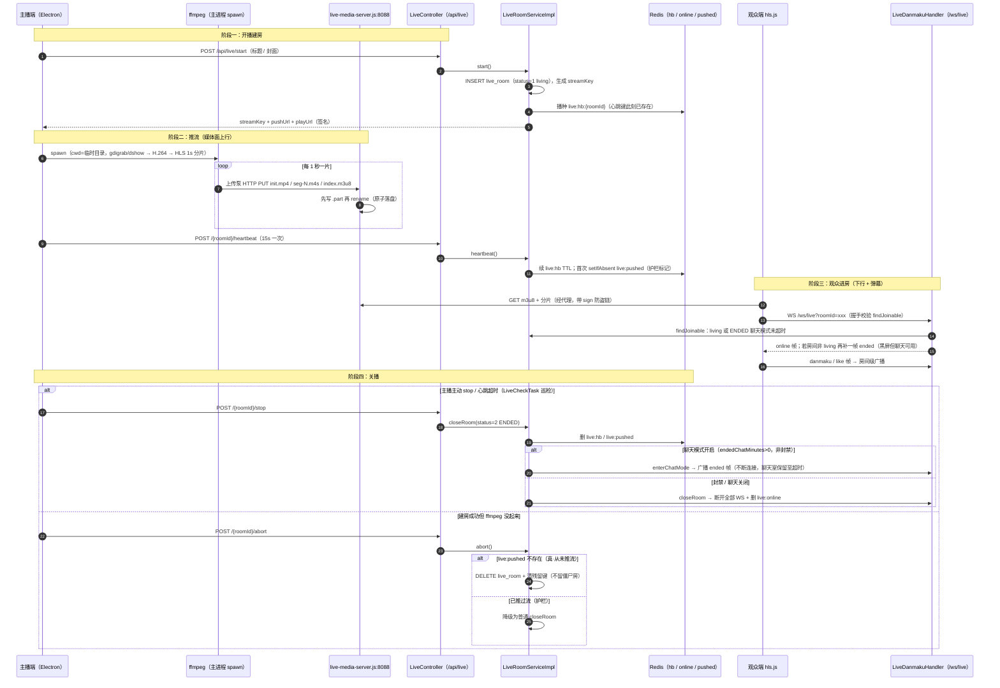
```mermaid
sequenceDiagram
    autonumber
    participant AN as 主播端（Electron）
    participant FF as ffmpeg（主进程 spawn）
    participant MS as live-media-server.js:8088
    participant LC as LiveController（/api/live）
    participant LS as LiveRoomServiceImpl
    participant RD as Redis（hb / online / pushed）
    participant VW as 观众端 hls.js
    participant DH as LiveDanmakuHandler（/ws/live）

    Note over AN,LC: 阶段一：开播建房
    AN->>LC: POST /api/live/start（标题 / 封面）
    LC->>LS: start()
    LS->>LS: INSERT live_room（status=1 living），生成 streamKey
    LS->>RD: 播种 live:hb:{roomId}（心跳键此刻已存在）
    LS-->>AN: streamKey + pushUrl + playUrl（签名）

    Note over AN,MS: 阶段二：推流（媒体面上行）
    AN->>FF: spawn（cwd=临时目录，gdigrab/dshow → H.264 → HLS 1s 分片）
    loop 每 1 秒一片
        FF->>MS: 上传泵 HTTP PUT init.mp4 / seg-N.m4s / index.m3u8
        MS->>MS: 先写 .part 再 rename（原子落盘）
    end
    AN->>LC: POST /{roomId}/heartbeat（15s 一次）
    LC->>LS: heartbeat()
    LS->>RD: 续 live:hb TTL；首次 setIfAbsent live:pushed（护栏标记）

    Note over VW,DH: 阶段三：观众进房（下行 + 弹幕）
    VW->>MS: GET m3u8 + 分片（经代理，带 sign 防盗链）
    VW->>DH: WS /ws/live?roomId=xxx（握手校验 findJoinable）
    DH->>LS: findJoinable：living 或 ENDED 聊天模式未超时
    DH-->>VW: online 帧；若房间非 living 再补一帧 ended（黑屏但聊天可用）
    VW->>DH: danmaku / like 帧 → 房间级广播

    Note over AN,RD: 阶段四：关播
    alt 主播主动 stop / 心跳超时（LiveCheckTask 巡检）
        AN->>LC: POST /{roomId}/stop
        LC->>LS: closeRoom(status=2 ENDED)
        LS->>RD: 删 live:hb / live:pushed
        alt 聊天模式开启（endedChatMinutes>0，非封禁）
            LS->>DH: enterChatMode → 广播 ended 帧（不断连接，聊天室保留至超时）
        else 封禁 / 聊天关闭
            LS->>DH: closeRoom → 断开全部 WS + 删 live:online
        end
    else 建房成功但 ffmpeg 没起来
        AN->>LC: POST /{roomId}/abort
        LC->>LS: abort()
        alt live:pushed 不存在（真·从未推流）
            LS->>LS: DELETE live_room + 清残留键（不留僵尸房）
        else 已推过流（护栏）
            LS->>LS: 降级为普通 closeRoom
        end
    end
```

**要点**
- **上行选 HTTP PUT 而不是 RTMP/SRT**：省掉流媒体服务器的协议栈与转码，切片落盘即上传，服务端只做
  「收文件 + 发文件」；代价是延迟比 RTMP 高，靠 `-hls_time 1` + 播放器 `liveSyncDurationCount 2` 把端到端延迟压到几秒。
- **心跳键与 pushed 键必须分开**：心跳键在 `start()` 建房时就种，分不清「推流端真跑过」和「建完房没起来」；
  `live:pushed` 只在推流端首次调 `heartbeat()` 时 `setIfAbsent`，是 `abort` 删房的安全护栏（详见《[已踩坑](已踩坑.md)》第 10 条）。
- **ENDED 聊天模式**：主播关播（非封禁）后房间不立即消失，广播一帧 `ended` 让前端黑屏提示、但**不断弹幕连接**，
  聊天室保留 `im.live.ended-chat-minutes`（默认 60）分钟，由 `LiveCheckTask` 巡检到期后再彻底关房；
  封禁（`status=3`）不进聊天模式，立即断开全部连接。
- **弹幕到期清理靠连接注册表驱动**：巡检遍历 `LiveDanmakuService.openRoomIds()`（本机内存表）再点查 DB，
  而非扫全库——重启安全，也不会为早已无人的房间空跑。
- 房间状态机 `living=1 / ended=2 / banned=3`；`findJoinable` 是弹幕握手与进房的统一判定口
  （living 直接进，ended 看聊天模式是否超时，banned / 超时 / 不存在一律返回 `null`）。
