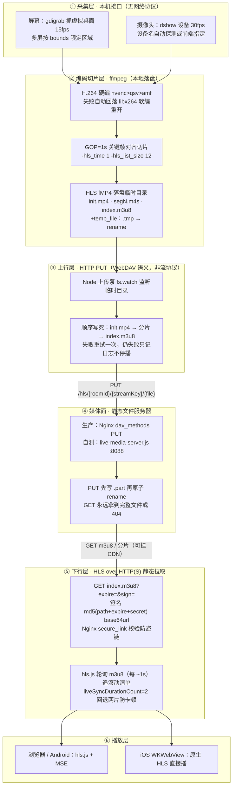
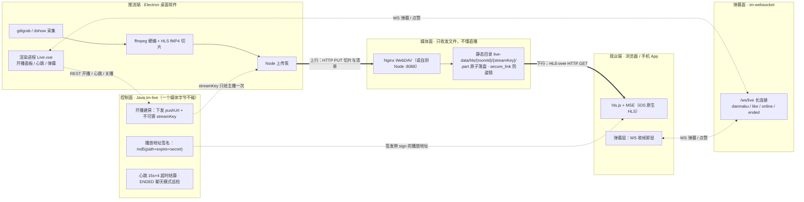
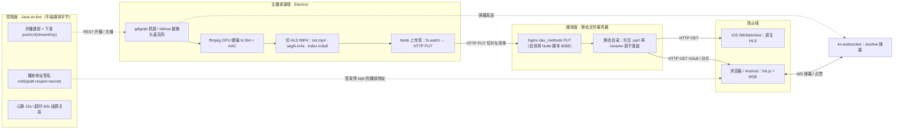
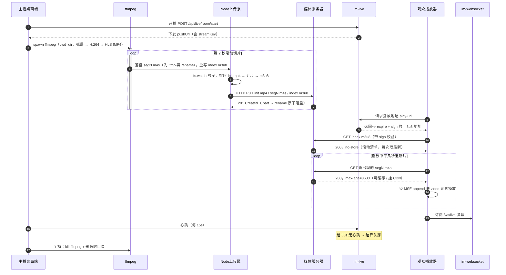

# 实现方案 腾讯云

| 方案                                                   | 产品                 | 适合场景                                                     | 延迟                                  | Web 端能力                                                   | 开发量 | 计费核心                                                     |
| ------------------------------------------------------ | -------------------- | ------------------------------------------------------------ | ------------------------------------- | ------------------------------------------------------------ | ------ | ------------------------------------------------------------ |
| 方案 1：标准云直播 CSS（推荐纯观看，无连麦）           | 云直播 CSS           | 网站直播、培训、发布会、OBS 推流，观众只看，不上麦           | 标准 HLS：10~30s快直播 WebRTC：<200ms | WebRTC 网页开播（TXLivePusher），TCPlayer 播放器播放         | 低     | **按直播 CDN 流量计费**，转码可选付费；主播上行不走你的服务器 |
| 方案 2：TRTC 互动直播（有连麦 / 问答）                 | TRTC 实时音视频 + IM | 直播间观众连麦、讲师答疑、多人上麦互动                       | <300ms                                | TUILiveKit / TUIPusher+TUIPlayer 含 UI 组件，Vue/React 直接嵌入 | 中     | **按时长计费**（房间内音视频时长），旁路直播可输出 CDN 给大量观众看 |
| 方案 3：低代码直播间（快速上线，几乎不用写音视频底层） | TRTC TUILiveKit      | 快速搭建完整直播间：弹幕、点赞、连麦、房间管理，直接嵌入网站 | 同上                                  | 开箱 UI 组件，一行代码嵌入 Web 页面                          | 极低   | TRTC 时长计费                                                |

## 腾讯云三方案选型前必须核实的九件事

1. **资质是前置条件，与用不用云无关**：国内上线直播需 ICP 备案 + 属地广电/文化部门许可
   （经营性直播涉及《网络文化经营许可证》）；云厂商只提供管道，资质与内容责任在运营主体。
   没资质先谈技术是空谈。
2. **内容审核是强制项且单独计费**：CSS 有直播审核（鉴黄/暴恐/政治），TRTC 需接内容安全 API；
   不开审核 = 平台连带责任。自建方案同样逃不掉（抽帧送审 + 人工巡审）。
3. **播放/推流地址必须开鉴权**：URL 时间戳防盗链 + 推流鉴权（A/B/C 方式）。
   裸地址上线被刷流量是按 CDN 单价无上限计费的，这是真实破产案例而非理论风险。
4. **表里「WebRTC 网页开播」要加兼容性注脚**：浏览器推流依赖 getDisplayMedia/getUserMedia + WebRTC，
   iOS Safari 与部分国产内置浏览器支持参差，摄像头推流在 iOS Web 端长期受限（通常要跳小程序或 App）。
   **纯观看端兼容性好，开播端不是**——选方案前先把目标用户的浏览器矩阵列出来。
5. **计费是叠加的，不是二选一**：CSS 流量费之外，转码、录制、截图、审核逐项单计；
   TRTC 时长费之外，「旁路直播」转 CDN 再叠一层 CSS 流量费。
   混合架构（上麦走 TRTC、纯观众走 CDN）是大直播间标准做法，但账单是两份。
6. **延迟档位按钱排序**：能忍 3~5s 选 HTTP-FLV 性价比最高；要弹幕同步体验选快直播 WebRTC（<200ms）但单价更贵；
   HLS 只留给 iOS Safari 兜底；互动连麦才需要 TRTC 的 <300ms。先定延迟预算再选产品，反过来选会多花钱。
7. **弹幕不在 CSS 里**：方案 1 不自带弹幕/点赞/礼物，需另配 TIM 或自建 WS。
   **本项目已有完整 IM 与群聊体系，弹幕自建零边际成本**——这是选方案 1 时表里没写的隐藏优势。
8. **量级决定计费模式**：月流量小按量付费；稳定大流量切「月 95 带宽计费」能省一个数量级。
   开发期先用免费额度（TRTC 每月赠时长、CSS 赠流量）验证链路，别一上来就包月。
9. **录制回放另算存储**：CSS 录制落 VOD 按存储 + 流量再计一次；自建则本项目 MinIO/本地存储现成。

# 自己实现

## 0. 先看清手里已有的牌

本项目已经有一套「把一台电脑的屏幕实时搬到别人屏幕上」的完整链路
（见《其他控制软件和远程会议实现原理.md》第三段），直播与它的技术重合度极高：

| 直播需要 | 本项目已有 | 复用方式 |
|---|---|---|
| 屏幕/摄像头采集 | `im-remote-agent` 的 `ScreenCapturer` / `H264Capturer` | Agent 直接当「屏幕直播推流端」 |
| H.264 硬编 | ffmpeg gdigrab + nvenc/qsv/amf，不满足回落 JPEG | 推流编码现成 |
| H.264 解码 | 控制端 WebCodecs `AvcDecoder` | 观众端解码现成 |
| 实时双向通道 | `im-websocket` WS + dispatch 推送 | 信令、弹幕、帧分发共用 |
| 房间与成员 | `im-group` / `im-conversation` | 直播间 = 群，观众 = 成员，弹幕 = 群消息 |
| 鉴权 | sa-token | 开播/关播/房管接口 |
| 回放存储 | `im-file` 的 FileStorage（local/minio） | 录制文件落地 |
| 空闲回收 | `RemoteIdleCheckTask` 模式 | 空房间回收 |

结论：**MVP 不需要引入任何新中间件**，缺的只有「一对多分发」和「GOP 缓存」两块。

## 1. 方案 A（推荐 MVP）：浏览器开播 + 服务端 fan-out（SFU-lite）

数据面只转发不解码，服务端不做媒体计算：Web 前端用 **WebRTC** 采集摄像头，发给媒体服务器（推荐，现代浏览器原生）

```
主播浏览器                          服务端(im-live)                观众浏览器
getDisplayMedia/getUserMedia 采集
   ↓
WebCodecs VideoEncoder 编 H.264
（强制每秒 1 个关键帧）
   ↓
帧打包(key/delta + pts) ──WS──→  房间转发器 ──WS──→  WebCodecs VideoDecoder → 画 canvas
                                 （只 copy 字节，        AudioDecoder → AudioContext
                                  不解码不转码）          音频为主时钟做音画同步
```

- **推流端**：`getDisplayMedia`（屏幕）或 `getUserMedia`（摄像头）→ `VideoEncoder`
  （H.264，强制每秒 1 个关键帧便于随时进房）→ 帧带 pts 与 key 标记经 WS 上行。
  Electron 桌面端可改走 agent 的 ffmpeg 硬编推「屏幕直播」，绕开浏览器编码能力差异。
- **服务端**：房间表（内存 ConcurrentHashMap + Redis 记在线数，同 `AgentRegistry` 模式）；
  转发器收到帧遍历房间观众 WS 发送——**只 copy 字节不解码**；
  GOP 缓存保留最近一个 IDR（+ SPS/PPS），新观众握手完成立即补发，否则要黑屏等到下一个关键帧。
- **观众端**：WS 收帧 → `VideoDecoder` → `VideoFrame` 直接画 canvas（复用 Remote.vue 的贴屏思路）；
  音频帧同理解码送 AudioContext，按 pts 对齐。
- **音频（与视频同链路，采集/编码/播放各有讲究）**：
  采集——`getUserMedia({ audio: true })` 取麦克风；系统/标签页声音靠 `getDisplayMedia` 授权弹窗里勾「分享音频」
  （Chrome/Edge 支持，平台差异大），两路可合并成一个 `MediaStream` 一起送编码；
  编码——WebCodecs `AudioEncoder` 编 **Opus**（实时首选：低延迟、抗丢包，语音音乐通吃；AAC 更通用但延迟偏高），
  每帧带 `timestamp`（pts），与视频帧走同一房间转发器、按 track 标记区分音视频；
  服务端——同样只 copy 字节不解码；音频帧小且能独立解码，不必像视频那样缓存 GOP，新观众从最新音频帧直接续上；
  播放与音画同步——观众端 `AudioDecoder` 解码后送 `AudioContext` 排队播放，**以音频为主时钟**
  （人耳对音频卡顿远比视频丢帧敏感），视频按 pts 对齐、追不上就丢帧，抖动缓冲（jitter buffer）吸收网络波动；
  坑——观众端 `AudioContext` 受浏览器自动播放策略限制，须在进房点击等交互后 `resume()`；主播本地监听要开
  `echoCancellation` 防啸叫；纯屏幕分享无麦克风时音频轨可能缺失，需容错。
- **弹幕**：直播间建一个群会话，弹幕就是群消息；未读/离线那一套全不用开（直播弹幕不需要离线补发）。
- **延迟**：单跳 WS，局域网 ~100ms、公网 ~200~500ms。
- **规模上限（诚实账）**：fan-out 出带宽 = 码率 × 在线观众。2 Mbps × 50 人 = 100 Mbps 持续，单机扛得住；
  × 1000 人 = 2 Gbps，自建不现实。**方案 A 的边界是每房间几十到一两百人**。

## 2. 方案 B（上千观众）：RTMP 推流 + SRS/ffmpeg 转 HLS / HTTP-FLV

```
主播(OBS) →【RTMP推流】→ SRS中转站 → 输出HLS / HTTP-FLV → 观众网页播放
```

- 推流端用 OBS 或 agent 的 ffmpeg 推 RTMP 到媒体服务器；
  **媒体服务器不要自己用 Java 写**，部署 SRS（或 nginx-rtmp），Java 只做事：
  房间管理、鉴权签名、接收 SRS 的 on_publish/on_play 回调更新房间状态。
- SRS 转 HTTP-FLV（2~5s 延迟，Web 端 flv.js 播放）+ HLS（10~30s，iOS Safari 兜底）。
- 观众侧从 WS 收帧变成 HTTP 拉流，服务端带宽压力转嫁给 CDN/静态分发；弹幕仍走自建 WS。
- 运维对象从「一个 Spring Boot」变成「Spring Boot + SRS + 存储」，是自建路线真正的成本拐点。

## 3. 共通关键工程点

1. **关键帧对齐**：编码器强制周期 IDR；服务端 GOP 缓存；观众花屏/进房时发 `request-keyframe`
   信令让主播端立即出 I 帧。
2. **音画同步**：所有帧带统一 pts（毫秒，开播时 0 起算）；观众端按 pts 渲染或交 `<video>`/AudioContext 对齐，
   不按到达顺序播放。
3. **弱网降级**：观众下行拥塞时丢 P 保 I（丢到只剩关键帧也能看幻灯片）；
   主播上行由 `VideoEncoder` 的 bitrateMode + 实测 RTT 动态调码率。
4. **主播断线续接**：房间保留 30~60s 宽限，重连后 pts 续接而非重开，观众无感；超时才结算关播（复用空闲回收任务）。
5. **合规与审核**：服务端对关键帧抽样落盘 + 接第三方审核 API（或腾讯云内容安全），巡审台看实时抽帧；
   录制文件保留期按监管要求配置。
6. **录制回放**：方案 A 在服务端把转发帧顺路 mux 成 fMP4/FLV 落盘（spawn ffmpeg，本项目有先例）；
   方案 B 直接用 SRS 录制。

## 4. 推荐路线

1. **MVP（1~2 周）**：方案 A + 群消息弹幕，房间 ≤ 百人；验证采集/编码/分发/渲染全链路。
2. **加固**：GOP 缓存、弱网降级、断线续接、录制回放、巡审抽帧。
3. **放量**：单房间观众破百或总出带宽逼近服务器上限时，切方案 B（SRS）或整体迁腾讯云 CSS——
   **自建媒体服务器到千人规模的运维与带宽成本会反超云**，这笔账与
   《其他控制软件和远程会议实现原理.md》1.8 节的中继成本是同一笔。

## 5. 自建 vs 腾讯云：一句话决策

- 要资质合规省心、千人以上观看、不想运维媒体服务器 → 腾讯云（方案 1 纯看 / 方案 2 连麦 / 方案 3 抢时间）。
- 要内网可用、零流量费、与现有 IM/远控能力复用、规模在百人内 → 自建方案 A。
- 两者不互斥：弹幕与房间管理永远自建（已有 IM），媒体分发按规模在「WS fan-out → SRS → 云 CSS」三档间升档。

---

# 定案：本地软件开播 + 浏览器/手机 App 观看 + 百人房间（抖音模式）

## 0. 结论先行

> 本项目**实际落地的既不是"方案A"（WS 帧分发 + WebCodecs），也不是"方案B"（SRS）**

**推流端用 Electron + 已捆绑的 ffmpeg 硬编 → 切 HLS(fMP4) 小片 → Nginx 静态分发 → 观看端一个 `<video>` + hls.js（iOS 原生直播），
房间/弹幕/礼物全部复用现有 IM。Java 不碰一个媒体字节。**

选 HLS 而不是前面方案 A 的 WS 帧分发，不是因为它先进，而是因为它是**唯一在三种观看端都能播的格式**（见 §1）。

## 1. 为什么不用 WS 帧分发（方案 A）做这个场景

| 硬约束 | WS + WebCodecs | HLS over HTTP |
|---|---|---|
| 手机 App = Android WebView / iOS WKWebView | WebCodecs 在 WebView 里可用性参差；**iOS WKWebView 长期不支持 MSE**（17.1+ 才有 ManagedMediaSource） | **iOS 原生支持 HLS**，`<video src="x.m3u8">` 直接播；Android/桌面用 hls.js |
| 百人 fan-out | 200 Mbps 持续从 JVM 出，背压/GC 风险高 | Nginx sendfile 发静态文件，百人千人一个样 |
| 能不能挂 CDN | 不能（长连接有状态，CDN 无法缓存） | 能，而且挂上后源站只服务回源那**一份**流 |
| 录制回放 | 要额外 mux | 切片天然可存，拼一下就是回放 |

一句话：**WS 帧分发适合内网、低延迟、少量观众（远控那种）；抖音模式要的是兼容性与可扩容，那是 HTTP 静态分发的地盘。**

## 2. 架构与数据流

抖音真实骨架是：主播 App → RTMP/SRT 推流 → 边缘接入 → 中心转码（多码率）→ CDN 分发 FLV/HLS/WebRTC → 播放器，弹幕走独立长连接。
自建百人房间把中间两层压缩成一台 Nginx：

```
【推流端】Electron 桌面软件                【服务端】                    【观看端】
屏幕 gdigrab ─┐                                    ┌→ 浏览器（hls.js）
摄像头 dshow ─┼→ ffmpeg 硬编 H.264+AAC          │
麦克风 dshow ─┘   │                              ├→ Android App WebView（hls.js）
                    └─ 切 HLS(fMP4) 小片 ─PUT─→ Nginx 静态目录 ─HTTP─┼→ iOS App WKWebView（原生 HLS）
                                                  │                    └→ 可挂 CDN（放量时）
              开播/关播/房间信息 ─REST─→ im-live（Java）
              弹幕/点赞/礼物  ←──WS──→ im-websocket（直播间 = 群）
```

**主播上行只需 2~6 Mbps（一份流），这是本地软件开播最大的优势；下行百人压力全在服务端分发层。**

## 3. 推流端：Electron + 已捆绑的 ffmpeg

### 3.1 已有资产（不用重写）

| 需要 | 现状 | 位置 |
|---|---|---|
| ffmpeg 可执行文件 | ✔ 已捆绑并随安装包分发 | `electron/bin/ffmpeg.exe` → `resources/ffmpeg/` |
| 硬编器探测与回落 | ✔ nvenc>qsv>amf>libx264 | `electron/main.js#detectEncoder` / `resolveFfmpegPath()` |
| 屏幕采集命令 | ✔ gdigrab 实跑过 | `im-remote-agent` 的 `H264Capturer` |
| spawn ffmpeg + 进度解析 + mux 落盘 | ✔ | `electron/recorder.js`（录屏）、`main.js#setupVideoCompress` |
| 老显卡 nvenc 版本坑 | ✔ 已踩过 | ffmpeg 构建版本必须匹配驱动（见已踩坑记录） |

缺的只有四样，**没有一样是媒体编解码**：开播面板 UI、切片上传/推流命令、`im-live` 房间接口、`Live.vue` 播放页。

### 3.2 采集与混流

- 屏幕直播：`-f gdigrab -framerate 25 -i desktop`（可选 `-offset_x/-offset_y/-video_size` 框选区域）
- 摄像头 + 屏幕画中画：`filter_complex "[0:v][1:v]overlay=W-w-20:20"`
- 纯摄像头（抖音典型形态）：`-f dshow -i video="USB Camera":audio="麦克风"`
- 多音源混音（麦克风 + 系统声音）：`-filter_complex amix=inputs=2:duration=first`

### 3.3 编码参数（直播专用，与录屏不同）

```
-c:v h264_nvenc -preset medium -rc vbr -cq 23 -b:v 0 -maxrate 2500k -bufsize 5000k
-pix_fmt yuv420p -g 50 -keyint_min 50 -sc_threshold 0 -bf 0 -profile:v high
-c:a aac -b:a 128k -ar 44100 -ac 2
```

几个参数为何不能省：
- `-g 50 -keyint_min 50 -sc_threshold 0`：**固定 GOP = 2 秒**。直播切片必须每片以 IDR 开头，否则切片边界花屏；`sc_threshold 0` 禁止场景切换提前插 I 帧，保证切片时长可预测。
- `-bf 0`：禁用 B 帧。B 帧引入重排序延迟，直播不要。
- `-maxrate/-bufsize`：约束峰值，避免画面剧烈变化时码率飙升把主播上行打爆。
- `-pix_fmt yuv420p` + `-profile:v high`：播放器兼容性底线（yuv444 很多解码器不认）。

码率档位（抖音同量级）：

| 档位 | 分辨率/帧率 | 视频码率 | 百人房间下行 |
|---|---|---|---|
| 流畅 | 720p / 25fps | 1.5 Mbps | 150 Mbps |
| 高清（推荐起步） | 720p / 30fps | 2.5 Mbps | 250 Mbps |
| 超清 | 1080p / 30fps | 4.5 Mbps | 450 Mbps |

### 3.4 切片与上传：ffmpeg 一条命令直接 PUT

```bash
ffmpeg -f gdigrab -framerate 25 -i desktop -f dshow -i audio="麦克风" \
  -c:v h264_nvenc -preset medium -rc vbr -cq 23 -b:v 0 -maxrate 2500k -bufsize 5000k \
  -pix_fmt yuv420p -g 50 -keyint_min 50 -sc_threshold 0 -bf 0 -profile:v high \
  -c:a aac -b:a 128k -ar 44100 \
  -f hls -hls_time 2 -hls_list_size 6 -hls_segment_type fmp4 \
  -hls_flags independent_segments+delete_segments+program_date_time \
  -hls_fmp4_init_filename init.mp4 -hls_segment_filename "seg_%05d.m4s" \
  -method PUT "http://push.example.com/push/live/ROOM/index.m3u8"
```

（Windows 下把 `\` 续行换成 `^` 或写成一行，由 Electron 主进程 `spawn` 时直接传参数数组。）

- `-method PUT`：ffmpeg 原生把每个切片 **HTTP PUT 到服务器**，Nginx 开 `dav_methods PUT` 就能收。
  **这一条省掉了整个媒体服务器**：不用 SRS、不用自己写上传器、不用管断点续传。
- `-hls_time 2 -hls_list_size 6`：2 秒一片、播放列表只留 6 片（滑窗 12 秒），`delete_segments` 自动删旧片，磁盘不涨。
- `-hls_segment_type fmp4`：用 fMP4 而非 TS，浏览器 MSE 与 iOS 都认，且后续升 LL-HLS 不用换封装。
- 录制回放：用 `-f tee` 同时开第二路输出全量 MP4（或保留全量切片），落到 `im-file` 的 FileStorage（local/minio）。
- 抽帧巡审：第三路 `-vf fps=1/30 -q:v 5` 每 30 秒一张 JPEG，送审核 API / 巡审台。

### 3.5 什么时候换成 SRS

需要下面任一项时，把 `-method PUT` 换成 `-f flv rtmp://server/live/ROOM`，服务端部署 SRS：
延迟要 < 3s（HTTP-FLV）、要多码率转码、要 WebRTC 连麦、要千以上观众。
SRS 是单二进制，Java 侧只需接它的 `on_publish/on_play/on_unpublish` HTTP 回调更新房间状态。

### 3.6 SRS 部署与集成（方案 B 落地）

> 承接 §3.5：当延迟要 <3s、要多码率、要连麦或要上千观众时，从当前的「HLS 切片 + `-method PUT`」（方案 A，见 §10/§11）切到 SRS（方案 B）。**SRS 本身是开源项目**（MIT 许可、GitHub `ossrs/srs`、约 28.5K Star、C++ 编写、当前稳定版 6.x），不用自己写媒体服务器，Java 仍旧一个媒体字节都不碰。

**（1）开源选型**：主流开源流媒体服务器对比——

| 方案 | 语言 | 协议 | GB28181 | 延迟 | 定位 |
|---|---|---|---|---|---|
| **SRS** | C++ | RTMP/HLS/HTTP-FLV/WebRTC/SRT | ✗ | FLV~500ms、RTC<300ms | 互联网直播标杆，中文文档极好、Docker 一键、集群成熟 → **本项目首选** |
| ZLMediaKit | C++ | +RTSP/GB28181 | ✓ | RTC 100~500ms | 多协议全能网关，内置 FFmpeg 转码，有 Java SDK，安防强 |
| MediaMTX | Go | RTSP/RTMP/HLS/LL-HLS/WebRTC/SRT | ✗ | 中 | 单文件零依赖，一行命令起服务，适合快速原型 |
| nginx-rtmp | C | RTMP/HLS | ✗ | 高 | 上古神器，FLV 弱，仅推荐学习 |
| Janus | C | WebRTC(SFU) | ✗ | <300ms | WebRTC 专用，连麦/会议 |

选 SRS 的理由：直播（RTMP 推 → HLS/FLV 分发）是它的主场，`http_hooks` 回调与本项目「Java 只管账」天然契合；要 GB28181 接安防或 C++/Java 深度嵌入再考虑 ZLMediaKit。

**（2）部署**（Docker 一键）：

```bash
docker run --rm -d --name srs \
  -p 1935:1935 -p 1985:1985 -p 8080:8080 -p 8000:8000/udp \
  -v /data/srs/conf:/usr/local/srs/conf \
  -v /data/srs/dvr:/usr/local/srs/objs/nginx/html/dvr \
  ossrs/srs:6 ./objs/srs -c conf/live.conf
```

| 端口 | 用途 |
|---|---|
| 1935 | RTMP 推流（ffmpeg / OBS 推这里） |
| 1985 | HTTP API（管理、查流状态） |
| 8080 | HTTP Server：HTTP-FLV / HLS 播放、WebRTC(WHEP)、控制台 |
| 8000/udp | WebRTC 媒体（连麦才需要） |

国内拉镜像慢换 `registry.cn-hangzhou.aliyuncs.com/ossrs/srs:6`。

**（3）配置** `conf/live.conf`（RTMP + HLS + 录制 + 回调）：

```nginx
listen              1935;
http_server { enabled on; listen 8080; dir [pwd]; crossdomain on; }
http_api    { enabled on; listen 1985; }

vhost __defaultVhost__ {
    hls {
        enabled on; hls_fragment 2; hls_window 12;
        hls_path ./objs/nginx/html; hls_cleanup on;   # 2s 一片、留 12s 滑窗、自动删旧片
    }
    dvr {                                              # 录制回放，替代方案A 的 spawn ffmpeg 录制
        enabled on; dvr_plan session;
        dvr_path ./objs/nginx/html/dvr/[app]/[stream]-[timestamp].flv;
    }
    http_hooks {                                       # ★ 与 Java 集成的关键
        enabled on;
        on_publish   http://127.0.0.1:8080/api/live/srs/on_publish;
        on_unpublish http://127.0.0.1:8080/api/live/srs/on_unpublish;
        on_play      http://127.0.0.1:8080/api/live/srs/on_play;
        on_stop      http://127.0.0.1:8080/api/live/srs/on_stop;
    }
}
```

**（4）推流端改造**（本项目改动极小）：`electron/live.js` 把 §3.4 的 `-f hls -method PUT` 输出段换成 `-f flv` 推 RTMP，采集/编码（gdigrab、nvenc、多屏 offset）全不动——

```bash
ffmpeg -re -f gdigrab -i desktop -c:v libx264 -c:a aac -f flv \
  "rtmp://srs-host:1935/live/{roomId}?sign={签名}&expire={ts}"
```

stream 名直接用 roomId，鉴权签名挂在 query，交给 `on_publish` 回调校验。OBS 主播填同一地址。

**（5）播放端**（按延迟选协议，前端在现有 hls.js 上加档）：

| 协议 | 地址 | 前端库 | 延迟 | 场景 |
|---|---|---|---|---|
| HTTP-FLV | `http://srs:8080/live/{roomId}.flv` | flv.js | 1~3s | Web 主力 |
| HLS | `http://srs:8080/live/{roomId}.m3u8` | hls.js（已用） | 6~15s | iOS Safari 兜底、大规模分发 |
| WebRTC | WHEP `http://srs:8080/rtc/v1/whep/?app=live&stream={roomId}` | 原生 | <300ms | 连麦/互动 |

**（6）Java（`im-live`）集成**：SRS 每个事件 POST 一段 JSON 到回调，**Java 返回 body 整数 `0` 放行、非 `0` 拒绝**（鉴权就在这步）：

```java
@PostMapping("/api/live/srs/on_publish")           // 主播推流：校验签名 + 置直播中
public Integer onPublish(@RequestBody SrsHookReq r) {
    boolean ok = liveRoomService.verifyPushSign(r.getStream(), r.getParam()); // param="sign=..&expire=.."
    if (ok) liveRoomService.markLiving(r.getStream());
    return ok ? 0 : 1;                              // 非 0 → SRS 断流
}
@PostMapping("/api/live/srs/on_unpublish")         // 主播断流：结算房间
public Integer onUnpublish(@RequestBody SrsHookReq r) {
    liveRoomService.closeRoom(r.getStream());       // status=ENDED, endTime=now
    return 0;
}
// on_play / on_stop：观众进/出 → 在线人数增减（比 Redis 心跳更准）
```

`SrsHookReq` 字段：`action, client_id, ip, vhost, app, stream, param, page_url`。房间状态改由 SRS 事件驱动后，§4.1 第 2 条的「15s 心跳 / 60s 超时结算」可弱化为兜底；推流鉴权复用现有 streamKey/签名，播放鉴权用 `on_play` 或 SRS 前置 Nginx `secure_link_md5`（同 §4.2）。

**（7）弹幕不变**：仍走自建 `im-websocket`（`/ws/live`），SRS 只管音视频流。

**（8）迁移与成本**：改动点 = 推流参数 PUT→RTMP + 前端加 flv.js + `im-live` 加 3 个回调，其余（房间/签名/弹幕）全复用。运维对象从「一个 Spring Boot」变成「**Spring Boot + SRS + DVR 存储**」——即 §2 说的成本拐点；到千人级带宽成本反超云时，直接迁腾讯云 CSS。想少写配置可用 SRS 团队的一体化方案 **Oryx**（含 SRS + 转码 + 录制 + WebRTC + 管理界面）。

## 4. 服务端：Java 只做事，Nginx 只发文件

### 4.1 `im-live` 模块职责（不碰媒体字节）

1. 开播接口 `POST /api/live/room/start`：sa-token 鉴权 → 建房（雪花 ID）→ **同时建一个群会话**（弹幕容器）
   → 下发推流地址 + 推流密钥（带过期时间）。
2. 关播/心跳：主播端每 15s 心跳，超时 60s 自动结算（复用 `RemoteIdleCheckTask` 的定时器模式）。
3. 播放地址签发 `GET /api/live/room/{id}/play-url`：返回带 `expire` + `sign` 的 m3u8 地址（校验进房权限/是否被禁）。
4. 房间列表/在线人数/封面标题：常规 CRUD，在线数走 Redis。**已结束且关播超过 `ended-room-visible-minutes`（默认 60 分钟）的房间不在列表返回**，避免大厅堆满早就散场的历史场次（直播中/已封禁不受限；房间详情与「我的直播」仍可按 id 取到，只隐藏列表）。
5. 录制索引与回放地址：复用 `im-file`。
6. 巡审：抽帧图片列表 + 封禁/断播接口（断播 = 删掉服务器上的 m3u8，播放器自然停）。

### 4.2 Nginx：推流口与播放口必须分开

```nginx
# 推流口：只允许主播 PUT，密钥写在路径里
location /push/live/ {
    allow 1.2.3.4;            # 推流端出口 IP；不固定则改用校验推流密钥的 auth_request
    deny  all;
    limit_except PUT { deny all; }
    dav_methods PUT DELETE MKCOL;
    create_full_put_path on;
    client_max_body_size 20m;
    alias /data/live/;
}

# 播放口：签名鉴权 + 禁止缓存 m3u8 + 允许跳域
location ~ ^/live/.+\.(m3u8|m4s|mp4)$ {
    secure_link $arg_sign,$arg_expire;
    secure_link_md5 "$uri$arg_expire$live_secret";
    if ($secure_link = "") { return 403; }
    if ($secure_link = "0") { return 410; }   # 过期

    add_header Cache-Control "no-cache";
    add_header Access-Control-Allow-Origin *;  # hls.js 跳域拉流必需
    alias /data/live/;
}
```

签名由 Java 用同一把 `live_secret` 算（`md5(uri + expire + secret)`），有效期给 6~12 小时（一场直播内不用续签）。
**m3u8 必须 `no-cache`（否则观众停在旧列表上），切片反而应该可缓存（挂 CDN 就靠它）。**

## 5. 观看端：一个 video 标签，两条分支

```js
const video = document.querySelector('video')
const url = await fetchSignedPlayUrl(roomId)      // Java 签发的带 sign/expire 地址
if (video.canPlayType('application/vnd.apple.mpegurl')) {
  video.src = url                                  // iOS / Safari：原生 HLS，不需 hls.js
} else if (Hls.isSupported()) {
  const hls = new Hls({ liveDurationInfinity: true, maxBufferLength: 6 })
  hls.loadSource(url); hls.attachMedia(video)
}
```

- `maxBufferLength` 调小（默认 30s）才能把延迟压在低位；代价是弱网容易卡顿。
- Android App（WebView）走 hls.js 分支；iOS App（WKWebView）走原生分支——**这就是选 HLS 的回报**：一套代码两种引擎。
- WebView 里要确认两件事：硬件解码已开（Android `mediaPlaybackRequiresUserGesture=false`、允许自动播放），
  以及页面跑在 HTTPS 下（否则混合内容拦截 m3u8）。
- 播放器控件自己做：清晰度切换（多码率时）、全屏、音量；弹幕层用 `position:absolute` 盖在 video 上。

## 6. 弹幕/点赞/礼物：全部复用现有 IM

- 直播间 = 一个群会话（开播时自动建，关播不解散）；弹幕 = 群消息，**关掉未读计数与离线补发**（直播弹幕没有补发语义）。
- 点赞/礼物：新建一个轻消息类型（或自定义消息），走同一条 WS 推送，前端做飘屏动画。
- 房管/禁言：复用群成员角色与黑名单能力。
- 弹幕频率限制：单用户 1 条/秒、房间总量限流，否则百人房弹幕会把 WS 打成风暴。

## 7. 百人房间的带宽账（三种部署形态）

以高清档 2.5 Mbps、100 人同时在线计：下行 = **250 Mbps 持续**，1 小时 = **112 GB**。

| 部署形态 | 带宽成本 | 流量成本（1 小时） | 适用 |
|---|---|---|---|
| 局域网/内网直播 | 千兆 LAN 轻松 | **¥0** | 企业培训、内网发布会、演示 |
| 自建公网（服务器直发） | 250 Mbps 固定带宽 ≈ ¥2.0 万/月 | 按量 ¥0.8/GB ≈ **¥90** | 不建议：机器与账单都吃不住 |
| 自建源站 + CDN | 源站只服务回源**一份**流（2.5 Mbps） | CDN 单价 ¥0.2~0.4/GB ≈ **¥22~45** | **公网百人以上正解** |

两个结论：
1. **内网直播自建是零成本的**，这是相对腾讯云最硬的优势；
2. **公网直播必须挂 CDN**，否则 250 Mbps 固定带宽比直接把流交给云 CSS 贵得多。
   挂了 CDN 后自建与云的差价只剩运维人力，而 Nginx 发静态文件几乎不需运维。

（单价取大陆云厂商公开价目量级，与前文 1.8 节同一口径。）

## 8. 延迟档位选择

| 档位 | 做法 | 端到端延迟 | 观看端兼容 |
|---|---|---|---|
| 标准 HLS | `-hls_time 2` + 默认缓冲 | 8~15s | 全平台（iOS 原生） |
| 短切片 HLS | `-hls_time 1` + `maxBufferLength: 3~6` | **3~6s** | 全平台，**MVP 推荐落这一档** |
| LL-HLS | 分片 part + preload hint（ffmpeg 6+ 与播放器配合） | 2~4s | 支持面较窄，MVP 不上 |
| HTTP-FLV | SRS + flv.js | 2~5s | 仅 Android/桌面（靠 MSE，iOS WKWebView 不行） |
| WebRTC | SRS WebRTC / TRTC | <1s | 连麦、拍卖、考试监督才需要 |

直播带弹幕的场景，3~6s 已经够用（观众感知不到，弹幕靠时间戳对齐而不是靠画面同步）。

## 9. 落地顺序

1. **链路验证（几天）**：手动跑一条 §3.4 的 ffmpeg 命令 PUT 到本机 Nginx，浏览器用 hls.js 播出来。
   这一步不写任何 Java，先确认「采集 → 硬编 → 切片 → 静态分发 → 播放」全通。
2. **MVP（1~2 周）**：`im-live` 房间接口 + Electron 开播面板（选源/预览/码率档位/开播按钮）+ `Live.vue` 播放页
   + 弹幕接群消息。单码率、短切片 HLS、百人房间。
3. **加固**：签名鉴权与防盗链、断推重连（房间宽限 60s）、录制回放落 MinIO、抽帧巡审、在线人数与房间列表。
4. **放量**：挂 CDN；需要 <3s 或多码率或连麦时上 SRS；千人以上重新算一次自建 vs 云 CSS 的账。

## 10. 落地实现：与实际代码对齐的部署配置

> 本节是 `im-live` 模块 + Electron 推流桥 + `Live.vue` 真正落地后的**可部署**配置，
> 与 §4 的设计草图有两处关键修正，按本节为准。

### 10.1 两处必须知道的修正

1. **弹幕不再复用群消息，改走独立 `/ws/live` 通道**（§4.1/§6 的「直播间=群会话」草图作废）。
   理由：观众成群成员要写两张表、直播间会话会进所有观众会话列表且 `is_deleted` 被新弹幕重置、
   群消息每条要落库发号推离线，而弹幕是可丢弃的临时消息。独立通道不落库、不发号、断线即忘。
   REST 接口实际是 `/api/live/start`、`/api/live/{roomId}/stop`、`/api/live/{roomId}/heartbeat`、
   `/api/live/{roomId}`、`/api/live/page`、`/api/live/mine`（无 `/room`、无单独 `/play-url`，播放地址随详情下发）。
2. **只有 m3u8 做 `secure_link` 签名，分片不签**（§4.2 草图把 `m4s|mp4` 也签了，实际会全线 403）。
   原因：hls.js 解析 m3u8 里的分片是按相对路径解析的，**不会把播放列表 URL 上的 `?expire=&sign=` 带到分片请求**，
   于是每个分片都缺签名被判非法。分片改由路径里**不可猜的 `streamKey`** 兜底——它每场随机生成、关播即置空作废，
   等价于一场一密的能力凭证；`streamKey` 只在开播响应里给主播一次，绝不出现在列表接口。

### 10.2 签名编码：base64url，不是十六进制

`ngx_http_secure_link_module` 把 `secure_link_md5` 指定的串做 MD5 后，**按 base64url（无 `=` 填充）编码**再与 URL 上的
`sign` 比对。后端 `LiveRoomServiceImpl.signedPlayUrl` 因此用
`Base64.getUrlEncoder().withoutPadding().encodeToString(md5(path+expire+secret))`；
若误用十六进制（`md5DigestAsHex`），`secure_link` 永远对不上、播放口一律 403。

### 10.3 磁盘与 URL 的对应

- 推流口与播放口共用同一份磁盘目录，Nginx `root /data;`，于是 URI `/live/...` 落到 `/data/live/...`。
- 每场直播的目录：`/data/live/{roomId}/{streamKey}/`，里面是 `index.m3u8` + `init.mp4` + `seg0.m4s…`（滚动，只留最近 6 片）。
- 后端 `push-base-url` / `play-base-url` 都填到 `.../live` 这一层，例如：

| `im.live` 配置 | 示例值 | 说明 |
|---|---|---|
| `push-base-url` | `http://127.0.0.1:8088/live` | 桌面端主进程逐片 PUT 的目标前缀（内网口） |
| `play-base-url` | `https://live.example.com/live` | 观众端 m3u8 前缀，签名 path 即由此抠出 |
| `sign-secret` | 一串随机长字符串 | 必须与 Nginx `secure_link_md5` 里的 secret **逐字一致** |

### 10.4 推流口（WebDAV PUT，内网）

```nginx
server {
    listen 8088;
    server_name _;
    root /data;                       # URI /live/... → 磁盘 /data/live/...

    location /live/ {
        # ★ 只对内网/推流端出口开放；不固定 IP 就把它关在防火墙内网段里
        allow 127.0.0.1;
        # allow 203.0.113.0/24;       # 推流端公网出口（如固定）
        deny  all;

        limit_except PUT { deny all; } # 推流口只收 PUT
        dav_methods PUT DELETE;
        create_full_put_path on;       # {roomId}/{streamKey}/ 多级目录不存在时自动创建
        dav_access user:rw group:r all:r;

        client_max_body_size 32m;      # 单个分片上限
        client_body_temp_path /data/nginx/body_tmp;
    }
}
```

桌面端 `electron/live.js` 用 ffmpeg 采集屏幕/摄像头 → H.264+AAC → 切 HLS(fMP4) 落本地临时目录，
再由文件监听泵逐个 `fetch(PUT)` 到 `push-base-url/{roomId}/{streamKey}/{文件名}`（分片先传、m3u8 最后传）。

### 10.5 播放口（签名防盗链 + 静态分发 + 跨域）

```nginx
server {
    listen 443 ssl;
    server_name live.example.com;
    root /data;

    # HLS 相关 MIME（m4s 常缺，补齐；m3u8/mp4 多数发行版已内置）
    types {
        application/vnd.apple.mpegurl m3u8;
        video/iso.segment             m4s;
        video/mp4                     mp4;
    }

    location /live/ {
        # 跨域：观看端（浏览器 hls.js / App WebView）与播放口不同源时必需
        add_header Access-Control-Allow-Origin  * always;
        add_header Access-Control-Allow-Methods "GET, HEAD, OPTIONS" always;
        if ($request_method = OPTIONS) { return 204; }
        limit_except GET HEAD OPTIONS { deny all; }   # 播放口只读

        # —— m3u8：签名鉴权 + 绝不缓存 ——
        location ~ \.m3u8$ {
            secure_link $arg_sign,$arg_expire;
            # ★ secret 与 im.live.sign-secret 逐字一致；变量用 ${} 包住防止与后面的字面量粘连
            secure_link_md5 "${uri}${arg_expire}把这里换成你的 sign-secret";
            if ($secure_link = "") { return 403; }   # 签名缺失/被篡改
            if ($secure_link = "0") { return 410; }  # 已过期
            add_header Cache-Control "no-store, must-revalidate" always;
            add_header Access-Control-Allow-Origin * always;
        }

        # —— 分片：靠路径里不可猜的 streamKey 兜底（hls.js 不会把 m3u8 的 query 带过来，无法用同一套 sign）——
        location ~ \.(m4s|mp4|ts)$ {
            add_header Cache-Control "public, max-age=3600" always;   # 分片不可变，可长缓存/挂 CDN
            add_header Access-Control-Allow-Origin * always;
        }
    }
}
```

> `add_header` 不跨层继承：嵌套 `location` 里若写了任何 `add_header`，父层的就全失效，
> 所以 CORS 头在每个嵌套块里都重复了一遍——这不是冗余，是 Nginx 的继承规则要求的。

### 10.6 起播链路自检

1. 桌面端开播 → 后端返回 `pushUrl`/`streamKey` → `electron/live.js` 起 ffmpeg，几秒内 `/data/live/{roomId}/{streamKey}/` 出现分片并被 PUT 上去；
2. 观众进房 → `GET /api/live/{roomId}` 拿到带 `sign/expire` 的 `playUrl` → hls.js 拉 m3u8（过 `secure_link`）→ 拉分片（过 `streamKey` 路径）；
3. 弹幕连 `wss://…/ws/live?roomId=X&satoken=…`（握手把 token 挂 query，升级请求带不了自定义头）；
4. 主播端每 `heartbeat-seconds`（默认 15s）心跳续期，超时 `heartbeat-seconds × heartbeat-timeout-factor`（默认 60s）服务端自动结算关房、`streamKey` 置空，旧播放地址随即失效。

---

## 11. 本机实现原理：用 Node 脚本替代 Nginx（局域网自测）

> 生产按 §10 部署 Nginx。本节解决「本机没有 Nginx、只想在局域网里把开播→观看跑通」的自测场景，
> 对应实现文件 `electron/live-media-server.js`（零依赖，仅用 Node 内置 `http`/`fs`/`path`）。

### 11.1 为什么 `npm run dev` 顶不了

直播的控制面与媒体面彻底分离：Java 后端只管房间状态、播放地址签名、弹幕 WS，**一个媒体字节都不碰**；
真正收发流媒体的是一个独立的 HTTP 文件服务器（生产用 Nginx）。而 `npm run dev` 起的是 im-ui 的 Vite
前端页面服务器——只发页面、把 `/api`、`/ws` 代理到后端 8080，**既不接收 ffmpeg 的 PUT 落盘，也没有 m3u8
静态分发与 `secure_link` 签名**。所以它替代不了流媒体服务器：缺了它，开播时 ffmpeg 的 PUT 无处可去、
分片无处落盘，`im.live` 配得再对也跑不通。本节方案是——**流媒体服务器仍用 `live-media-server.js`（收 PUT、存分片），
但播放侧借 Vite 的 proxy 把 `/hls` 同源转发过去**，于是播放地址跟随前端访问地址，省掉写死局域网 IP 的麻烦（见 11.2）。

### 11.2 数据流（局域网多机观看）

```
本机 electron/live.js（ffmpeg 切 HLS 片）──HTTP PUT──►  live-media-server.js（本机 :8088，落盘 electron/live-data/hls/…）
                                                                   │
手机 / 别的电脑（观众，hls.js）◄──HTTP GET m3u8 + 分片──────────────┘
弹幕仍走后端  wss://…/ws/live?roomId=X （不经过本脚本）
```

- **推流走 `127.0.0.1`**：ffmpeg 与流媒体服务器同在本机，`push-base-url=http://127.0.0.1:8088/hls` 恒不受 DHCP 换 IP 影响。
- **播放走前端同源**：`play-base-url=/hls`（相对路径），前端 `livePlayBase()` 按访问源补全（Web 同源、Electron 用 `127.0.0.1:8088`），
  开发期由 `vite.config.js` 的 `proxy['/hls'] → http://localhost:8088` 转发。于是**播放地址永远跟随前端访问地址，换网/换 IP 零改动**，
  且与页面同源、复用 dev server 的 https 证书，不触发 mixed content。
- **前缀用 `/hls` 不用 `/live`**：`/live`、`/live/:roomId` 是前端直播页路由，proxy 配 `/live` 会劫持页面导航。
- **不校验签名**：后端 `signedPlayUrl` 下发的 `?expire=&sign=` 被脚本忽略；防盗链仍由路径里不可猜的
  `streamKey`（每场随机、关播作废）兜底，等价于一场一密的能力凭证。
- 路径契约与后端逐字对齐：开播下发 `pushUrl = {push-base-url}/{roomId}/{streamKey}/index.m3u8`，
  `electron/live.js` 去掉文件名得到 `baseDir`，逐片 `PUT {baseDir}/{文件名}`；脚本按同一 path 落盘与回读。

### 11.3 代码：`electron/live-media-server.js`

```javascript
'use strict'
/**
 * 本机直播流媒体服务器（Nginx 的局域网自测替身）。
 *
 * 直播架构里控制面与媒体面彻底分离：Java 后端只管房间状态、播放地址签名、弹幕 WS，
 * 一个媒体字节都不碰；真正收发流媒体的是一个独立的 HTTP 文件服务器（生产用 Nginx，
 * 见 md/直播.md §10）。本机自测没有 Nginx 时，这个零依赖脚本顶上：
 *   - PUT /hls/{roomId}/{streamKey}/{file} → 落盘 live-data/hls/…（先写 .part 再原子 rename）
 *   - GET /hls/{roomId}/{streamKey}/{file} → 静态返回（带 CORS、Range，m3u8 不缓存）
 *
 * 与 Nginx 方案的差异：局域网自测不校验签名——后端下发的 ?expire=&sign= 被忽略，
 * 防盗链仍由路径里不可猜的 streamKey 兜底（每场随机、关播作废）。上生产请换回 §10 的 Nginx。
 *
 * 用法：node electron/live-media-server.js     （可选 PORT=xxxx 覆盖端口，默认 8088）
 * 配套：im.live.push-base-url=http://127.0.0.1:8088/hls（本机推流，与 DHCP 换 IP 无关）；
 *       play-base-url=/hls（相对路径，观众经前端同源代理拉流，IP 免配）
 */
const http = require('http')
const fs = require('fs')
const path = require('path')

const PORT = Number(process.env.PORT || 8088)
const ROOT = path.join(__dirname, 'live-data') // URI /hls/… → ROOT/hls/…（与 Nginx root /data 同构）
const URL_PREFIX = '/hls/'

// 与 electron/live.js 的 contentTypeOf、Nginx 播放侧 types 保持一致
const MIME = {
  '.m3u8': 'application/vnd.apple.mpegurl',
  '.m4s': 'video/iso.segment',
  '.mp4': 'video/mp4',
  '.ts': 'video/mp2t'
}

function contentTypeOf(file) {
  return MIME[path.extname(file).toLowerCase()] || 'application/octet-stream'
}

// 观众端（hls.js / WebView）与播放口不同源，CORS 头必给
function setCors(res) {
  res.setHeader('Access-Control-Allow-Origin', '*')
  res.setHeader('Access-Control-Allow-Methods', 'GET, HEAD, PUT, OPTIONS')
  res.setHeader('Access-Control-Allow-Headers', 'Content-Type, Range')
  res.setHeader('Access-Control-Expose-Headers', 'Content-Length, Content-Range')
}

/** 把 URL path 安全映射到磁盘绝对路径；越界（../ 目录穿越）返回 null */
function resolveSafe(pathname) {
  const rel = pathname.replace(/^\/+/, '')
  const abs = path.resolve(ROOT, rel)
  const rootAbs = path.resolve(ROOT)
  if (abs !== rootAbs && !abs.startsWith(rootAbs + path.sep)) return null
  return abs
}

function send(res, code, body) {
  res.writeHead(code, { 'Content-Type': 'text/plain; charset=utf-8' })
  res.end(body)
}

const server = http.createServer((req, res) => {
  setCors(res)
  // 只取 pathname：播放地址带的 ?expire=&sign= 在自测下被忽略（不校验签名）
  const url = new URL(req.url, `http://${req.headers.host || 'localhost'}`)
  const pathname = url.pathname

  if (!pathname.startsWith(URL_PREFIX)) return send(res, 404, 'not found')
  const abs = resolveSafe(pathname)
  if (!abs) return send(res, 403, 'forbidden')

  // 预检
  if (req.method === 'OPTIONS') {
    res.writeHead(204)
    return res.end()
  }

  // 推流口：PUT 落盘。先写 {file}.part 收完再 rename，保证 GET 永远看到完整文件或 404
  if (req.method === 'PUT') {
    const part = abs + '.part'
    fs.mkdirSync(path.dirname(abs), { recursive: true })
    const ws = fs.createWriteStream(part)
    req.pipe(ws)
    ws.on('finish', () => {
      fs.rename(part, abs, (err) => {
        if (err) {
          console.warn('[media] rename 失败:', err.message)
          return send(res, 500, 'write failed')
        }
        console.log('[media] PUT', pathname)
        res.writeHead(201) // electron/live.js 判 ok||201||204 为成功
        res.end()
      })
    })
    ws.on('error', (err) => {
      console.warn('[media] 写盘失败:', err.message)
      send(res, 500, 'write failed')
    })
    return
  }

  // 播放口：GET/HEAD 静态返回，支持单段 Range（MSE/部分播放器会发）
  if (req.method === 'GET' || req.method === 'HEAD') {
    fs.stat(abs, (err, stat) => {
      if (err || !stat.isFile()) return send(res, 404, 'not found')
      const type = contentTypeOf(abs)
      // m3u8 滚动更新绝不缓存；分片不可变可长缓存
      res.setHeader('Cache-Control', abs.endsWith('.m3u8') ? 'no-store, must-revalidate' : 'public, max-age=3600')
      const range = req.headers.range
      if (range) {
        const m = /bytes=(\d*)-(\d*)/.exec(range)
        let start = m && m[1] ? parseInt(m[1], 10) : 0
        let end = m && m[2] ? parseInt(m[2], 10) : stat.size - 1
        if (isNaN(start) || start < 0) start = 0
        if (isNaN(end) || end >= stat.size) end = stat.size - 1
        if (start > end) {
          res.writeHead(416, { 'Content-Range': `bytes */${stat.size}` })
          return res.end()
        }
        res.writeHead(206, {
          'Content-Type': type,
          'Content-Range': `bytes ${start}-${end}/${stat.size}`,
          'Accept-Ranges': 'bytes',
          'Content-Length': end - start + 1
        })
        if (req.method === 'HEAD') return res.end()
        fs.createReadStream(abs, { start, end }).pipe(res)
        return
      }
      res.writeHead(200, { 'Content-Type': type, 'Content-Length': stat.size, 'Accept-Ranges': 'bytes' })
      if (req.method === 'HEAD') return res.end()
      fs.createReadStream(abs).pipe(res)
    })
    return
  }

  return send(res, 405, 'method not allowed')
})

// 监听 0.0.0.0：局域网里的手机/别的电脑才连得进来（只听 localhost 就只能本机看）
server.listen(PORT, '0.0.0.0', () => {
  console.log('[media] 直播流媒体服务器已启动（Nginx 局域网自测替身）')
  console.log(`[media] 监听 http://0.0.0.0:${PORT}   落盘根目录 ${ROOT}`)
  console.log(`[media] 后端 im.live：push-base-url=http://127.0.0.1:${PORT}/hls、play-base-url=/hls（前端同源，IP 免配）`)
  console.log('[media] 仅局域网自测：不校验签名、无 HTTPS；生产请改用 md/直播.md §10 的 Nginx')
})
```

### 11.4 后端配置（`im.live`）

`application.yml` 已给本机默认值（仍可用环境变量覆盖）：

```yaml
im:
  live:
    enabled: ${IM_LIVE_ENABLED:true}
    push-base-url: ${IM_LIVE_PUSH_BASE_URL:http://127.0.0.1:8088/hls}   # 本机推流，IP 无关
    play-base-url: ${IM_LIVE_PLAY_BASE_URL:/hls}                        # 相对路径，前端同源补全
    sign-secret: ${IM_LIVE_SIGN_SECRET:im-live-dev-secret-change-me}    # 自测不校验，保持默认即可
    ended-room-visible-minutes: ${IM_LIVE_ENDED_ROOM_VISIBLE_MINUTES:60} # 已结束房间在列表的可见时长（分钟），超时长不显示
```

★ **这两个默认值不含任何会变动的局域网 IP，换网/换 WiFi 都不用改**：
- `push-base-url` 用 `127.0.0.1`——推流端（ffmpeg）与流媒体服务器同在本机，回环地址恒定。
- `play-base-url` 用相对路径 `/hls`——观众端由前端 `livePlayBase()`（`im-ui/src/utils/env.js`）按当前访问源补全，
  开发期经 `vite.config.js` 的 `proxy['/hls'] → http://localhost:8088` 转发到本机脚本。手机用什么 IP 打开前端，
  播放就自动走那个 IP，无需在后端写死。
- 生产环境把 `play-base-url` 配成绝对地址（`https://live.你的域名/hls`，与 §10 Nginx 的 location 一致），
  前端检测到 `http(s)` 开头即直接使用、不再拼接；签名 `path` 仍是 `/hls/...`，与 Nginx `secure_link_md5 "$uri..."` 逐字对应。
- `ended-room-visible-minutes`（默认 60）：已结束房间在大厅列表的可见时长。关播超过它的房间不再出现在 `GET /api/live/page`
  的结果里，免得观众翻到一堆早就散场的历史场次；直播中 / 已封禁的房间、以及房间详情与「我的直播」面板都不受此限。配 `0` 或负数则关闭该过滤。
  实现见 `LiveRoomServiceImpl.page()`：在分页条件上叠一层「非已结束 OR endTime 为空 OR endTime ≥ 现在−阈值」，与 status 过滤是 AND 关系。

### 11.5 起播步骤与自检

1. **建表**：执行 `sql/im_schema.sql` 里的 `CREATE TABLE im_live_room`（未建时后端巡检会持续报
   `Table 'im_db.im_live_room' doesn't exist`，并把 error.log 刷得飞快）。
2. **起流媒体服务器**：`node electron/live-media-server.js`（监听 `0.0.0.0:8088`，落盘 `electron/live-data/hls/`）。
3. **重启后端**加载 `im.live` 新值（`java -jar` 需重新 package；IDE 重启读源码 yml；或用环境变量覆盖）。
4. **起前端**：`npm run dev`（默认 https，vite proxy 已含 `/hls`）；手机与本机同一 WiFi，用控制台打印的
   `Network: https://<本机IP>:5173/` 打开。若自签证书 `SAN` 不匹配报警，先 `npm run gen:cert` 再重启 dev server。
5. **自检**：桌面端开播 → 几秒内 `electron/live-data/hls/{roomId}/{streamKey}/` 出现 `init.mp4`/`segN.m4s`/`index.m3u8`
   → 手机进房，播放器请求 `https://<本机IP>:5173/hls/{roomId}/{streamKey}/index.m3u8`（经 vite proxy 落到本机 8088）→ 出画面
   → 弹幕连 `/ws/live`。脚本控制台打印每条 `PUT`；浏览器 Network 面板可看到 `/hls/...` 的 m3u8 与分片请求。

### 11.6 边界与生产迁移

- 本脚本仅供**局域网自测**：无签名防盗链、无 HTTPS、单端口、无 CDN。上生产务必换回 §10 的 Nginx
  （`secure_link` 签名 + 推流/播放分口 + 可挂 CDN），并把 `sign-secret` 改成随机长串经环境变量注入。
- **磁盘**：`electron/live-data/` 会随直播累积（单场分片滚动只留最近 6 片，但多场会叠加）；自测完可整目录删除，
  建议加入 `.gitignore` 避免媒体文件进版本库。
- **端口占用**：8088 若被占，用 `PORT=xxxx node electron/live-media-server.js` 换端口，并同步改 `vite.config.js`
  的 `proxy['/hls'].target` 与 `im.live.push-base-url`（`play-base-url=/hls` 是相对路径，不受端口影响）。

---

# 实现原理

## 上行 / 下行协议和采集

> 一句话：本项目客户端播放走 HLS，但**上行不是 RTMP/SRT 这类连续推流协议，而是普通 HTTP PUT 上传文件**——采集用 ffmpeg 的本机采集接口（gdigrab/dshow，不走网络），编成 HLS fMP4 分片落盘后逐个 PUT 到媒体服务器；下行才是标准 HLS over HTTP(S) 静态拉取。即：**上行是「上传」，下行是「HLS」**。

### 协议选型一览

| 环节 | 选择 | 具体参数 / 端点 | 为什么不用别的 |
|---|---|---|---|
| 屏幕采集 | **gdigrab**（Windows GDI 抓虚拟桌面） | `-f gdigrab -framerate 15`；多屏选某屏时用 `-offset_x/-offset_y/-video_size` 按 bounds 限定区域 | 本机采集零依赖；不需要 NDI/SDI 那类采集卡协议 |
| 摄像头采集 | **dshow**（DirectShow 设备） | `-f dshow -framerate 30 -i video={设备名}`，设备名来自前端 payload 或 `-list_devices` 自动探测第一个视频设备 | Windows 原生驱动栈，免装运行时 |
| 编码 | H.264 硬编（**nvenc > qsv > amf**，运行期失败自动回落 libx264 软编重开）+ AAC | `-g fps -keyint_min fps -sc_threshold 0`（GOP=1s，与切片对齐），`-hls_time 1 -hls_list_size 12`（12×1s=12s 滑窗） | 硬编不占 CPU；1s 片比 2s 片延迟降约 3~5s，代价是码率开销略涨 ~10% |
| 切片容器 | **HLS fMP4**（本地落盘临时目录） | `init.mp4` + `seg%d.m4s` + 滚动重写的 `index.m3u8`；ffmpeg 开 `+temp_file` 先写 `.tmp` 再 rename，上传泵只认正式名 | fMP4 比 TS 省空间且是 iOS/Android 通吃的分段格式 |
| **上行** | **HTTP PUT（WebDAV 语义）**，文件级上传，非流协议 | `PUT /hls/{roomId}/{streamKey}/{file}`；生产 = Nginx `dav_methods PUT`，自测 = `live-media-server.js`(:8088) 先写 `.part` 再原子 rename | ffmpeg 原生只会把 HLS 写本地或经 HTTP POST 连续推流，做不出「一段一个对象」的静态文件；PUT 落盘后播放侧就是纯静态拉取，控制面/媒体面彻底分离，Java 一个媒体字节都不碰 |
| **下行** | **HLS over HTTP(S)**（静态文件 GET） | `GET /hls/{roomId}/{streamKey}/index.m3u8?expire=&sign=`；签名 = md5(path+expire+secret) 的 base64url，由 Nginx `secure_link` 校验防盗链（自测媒体服务器忽略签名）；浏览器/Android 用 hls.js+MSE，iOS WKWebView 用原生 HLS | HTTP 静态分发可挂 CDN、百人千人一个样；WS 帧分发（方案 A）在 iOS WebView 播不了且挂不了 CDN |
| 弹幕/点赞 | WebSocket（独立于媒体链路） | `/ws/live?roomId=&satoken=`，帧协议 danmaku/like/ping ↔ online/system/notice/pong/ended/error | 弹幕要低延迟长连接，与 6s 级的媒体分发天然解耦 |
| 控制面 | REST + sa-token | 开播建房下发 pushUrl（含不可猜 streamKey，关播置空）、心跳 15s×4 超时结算、播放地址签名 | 只传指令不传媒体 |

### 上行写入的三个硬规则（electron/live.js 上传泵）

1. **上传顺序写死**：`init.mp4` → 分片 → `index.m3u8`。init.mp4 存解码必需的 codec 信息，缺它所有分片都解不了码；m3u8 必须最后传，因为它引用的分片要先就位。
2. **双端原子写**：推流端 `+temp_file`（`.tmp` → rename），服务端 PUT 先写 `.part` 收完再 rename——GET 永远看到完整文件或 404，读不到半截。
3. **失败不中断推流**：单文件 PUT 失败重试一次，仍失败只记日志；观众端 hls.js 会自动重试拉取，偶发丢一片最多卡那几秒，不值得停播。

### 流程图（采集 → 编码 → 上行 → 下行 → 播放，全链路协议标注）



### 架构图（四层分工：谁碰媒体字节、谁只发指令）



> 两张图的分工：**流程图**回答「一帧画面从屏幕到观众眼睛经过哪些协议」；**架构图**回答「四个面各自碰什么、不碰什么」——粗箭头是媒体字节流向（PUT 上行 / HLS GET 下行），细虚线全是控制与信令（REST/WS），媒体流全程不过 JVM。

## HLS 实现原理

> 一句话：HLS 把「实时直播流」降维成「一串关键帧对齐的 fMP4 静态小文件 + 一个不断被重写的滚动清单」，用 HTTP 静态文件的能力承载直播——推流端生产并 PUT 上传文件，媒体面只是「能收 PUT 的静态服务器」，观众端追着滚动的 m3u8 清单不停下载播放，控制面（Java）全程不碰媒体字节。下面用「流程图 + 时序图 + 关键代码」拆开讲。

### 流程图（组件与数据流）



### 时序图（一次直播：开播 → 推流 → 播放 → 关播）



### 关键代码

**① 推流端：ffmpeg 把采集流切成 HLS(fMP4)**（`electron/live.js`）

```javascript
const args = [
  '-hide_banner', '-loglevel', 'warning',
  ...inputArgs,                                // gdigrab 抓屏 / dshow 摄像头麦克风
  '-vf', `scale=-2:${height}`, '-r', String(fps),
  ...enc.args,                                 // 硬编优先 nvenc>qsv>amf，回落 libx264
  '-pix_fmt', 'yuv420p',
  '-g', String(gop), '-keyint_min', String(fps), '-sc_threshold', '0', // 固定 GOP，切片落在关键帧
  '-c:a', 'aac', '-b:a', '128k', '-ac', '2', '-ar', '44100',
  '-f', 'hls',
  '-hls_time', '2',                            // 2 秒一片
  '-hls_segment_type', 'fmp4',                 // fMP4：浏览器 MSE 与 iOS 都认
  '-hls_fmp4_init_filename', 'init.mp4',       // 初始化段(#EXT-X-MAP)，缺它全解不了码
  '-hls_segment_filename', path.join(dir, 'seg%d.m4s'),
  '-hls_flags', 'independent_segments+delete_segments+omit_endlist+temp_file',
  '-hls_list_size', '6',                       // 清单只留 6 片 = 12s 滑窗，旧片自动删
  playlist
]
// cwd 必设：init.mp4 是相对名，不设会落到 Electron 工作目录，上传泵找不到 → 观众黑屏
const proc = spawn(ffmpegPath, args, { windowsHide: true, cwd: dir })
```

要点：`-hls_flags` 里 `temp_file` 让分片先写 `.tmp` 再 rename（原子写，见 ②）；`delete_segments` + `-hls_list_size 6` 构成 12 秒滑窗让磁盘不涨；`-g / -keyint_min / -sc_threshold 0` 保证切片边界正好是关键帧、每片可独立解码。

**② 上传泵：原子写 + `init.mp4 → 分片 → m3u8` 顺序**（`electron/live.js` 的 `startUploader`，精简）

```javascript
// fs.watch 只报「文件变了」不报「写完」；靠 ffmpeg +temp_file（.tmp→rename）保证看到正式名即完整
async function pump() {
  // init.mp4 每轮主动探测：Windows 的 fs.watch 偶发漏掉这种一次性小文件的 create 事件
  if (!initSent && fs.existsSync(path.join(dir, 'init.mp4'))) pending.add('init.mp4')
  // 顺序写死：init.mp4 最先 → 分片 → index.m3u8 最后（清单引用的分片要先就位）
  let name = pending.has('init.mp4') ? 'init.mp4'
           : ([...pending].find(n => n !== 'index.m3u8') ?? [...pending][0])
  pending.delete(name)
  const ok = await putFile(`${baseDir}/${name}`, path.join(dir, name), contentTypeOf(name))
  if (ok && name === 'init.mp4') initSent = true
}
```

**③ 容错：单个分片上传失败不停播**（`electron/live.js` 的 `putFile`）

```javascript
async function putFile(targetUrl, filePath, contentType) {
  let data
  try { data = fs.readFileSync(filePath) } catch { return false } // 可能已被 delete_segments 清掉
  for (let attempt = 0; attempt < 2; attempt++) {                 // 失败重试一次
    try {
      const res = await fetch(targetUrl, {
        method: 'PUT',
        headers: contentType ? { 'Content-Type': contentType } : undefined,
        body: data
      })
      if (res.ok || res.status === 201 || res.status === 204) return true
    } catch { /* 网络抖动，重试 */ }
  }
  return false // 仍失败只记日志、不中断：hls.js 会自动重拉，偶发一片失败最多卡那几秒
}
```

**④ 媒体面：PUT 原子落盘 + 差异化缓存**（`electron/live-media-server.js`，生产为 Nginx）

```javascript
// PUT：先写 {file}.part 收完再 rename，避免观众 GET 到半截文件
// GET 缓存——m3u8 滚动更新须 no-store 每次取最新；分片内容不变可 max-age=3600 缓存/挂 CDN
res.setHeader('Cache-Control',
  name.endsWith('.m3u8') ? 'no-store, must-revalidate' : 'public, max-age=3600')
```

### 关键设计点（为什么这么设计）

| 设计 | 原理 |
|---|---|
| **原子写（.tmp / .part → rename）** | fs.watch 不保证「写完」、GET 也可能读到半截；rename 是原子的，看到正式名即内容完整 |
| **上传顺序 init → 分片 → m3u8** | init.mp4 存解码必需的 codec 信息，缺它所有分片解不了码；m3u8 引用的分片要先就位，故最后传 |
| **GOP 对齐关键帧** | 切片必须落在 IDR 帧，否则片头不是完整帧无法解码；`-sc_threshold 0` 禁止场景切换插帧打乱节奏 |
| **主播只推一份流（2~6Mbps）** | 上行一份，百人下行压力全在服务端静态分发层（Nginx sendfile，百人千人一个样） |
| **宁可卡几秒不停播** | 单片 PUT 失败不中断推流，交给 hls.js 自动重拉，避免因偶发抖动停整场 |
| **延迟换兼容与扩容** | 切片 2s × 播放器缓 2~3 片 + 上传 + 缓冲 ≈ 6~15s；换来三端兼容 + 可挂 CDN。要低延迟走 §3.6 的 SRS |

> 播放端原理：桌面 / Android 用 hls.js 拉 m3u8、下分片，经 **MSE** 把 fMP4 append 进 video 元素的 SourceBuffer；iOS 原生支持 HLS，直接播 m3u8（这正是选 HLS 而非方案A WebCodecs 的决定性原因——iOS WKWebView 长期不支持 MSE）。弹幕走独立的 im-websocket `/ws/live` 长连接，与音视频链路解耦。

